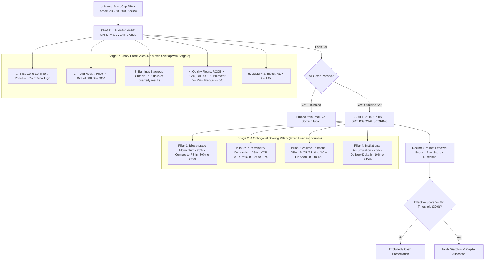
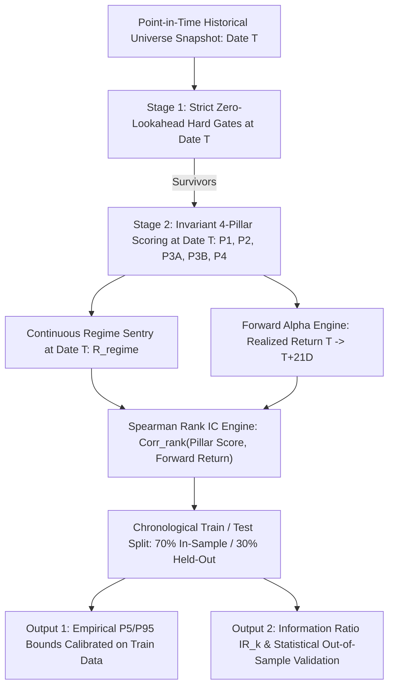

# Early Multibagger (`earlymb`) Pre-Breakout Engine (v3.4)

> **Document Structure**: This document is organized into five logical parts — from architectural specification through analytical pipeline, operational infrastructure, master reference, and engineering history. For the chronological development narrative, see [Part V: Engineering History](#part-v-engineering-history--forensic-record).

---

# Part I: Core Architecture

## 1. Executive Summary & Architecture Philosophy

The **Early Multibagger Engine v3.4** is an institutional-grade quantitative framework designed to detect high-traction compounders **1 to 3 weeks before** stage-2 breakout volume and price markups occur.

### Core Architectural Principles:
1. **Strict Gate vs Score Orthogonality**: Binary gates filter fundamental/event risk; 4 continuous scoring pillars differentiate winners across their full statistical distributions with zero metric overlap.
2. **Fixed Invariant Reference Bounds**: All pillars use fixed empirical reference bounds derived from the 5th/95th percentiles of Stage-1 survivors, eliminating small-survivor-pool distortion and ensuring robust Information Coefficient (IC) stability over time.
3. **Continuous Market Regime Sentry**: Replaces brittle binary index gates with a smooth confidence multiplier ($R_{\text{regime}} \in [0.20, 1.00]$) that dynamically raises selection bars during market pullbacks.
4. **Explicit Point-in-Time (PIT) Data Lags**: Prevents lookahead leakage by enforcing compliance filing offsets.
5. **Point-in-Time Universe Snapshots & IC Calibration**: Eliminates survivorship bias via time-indexed constituent snapshots and calibrates empirical bounds out-of-sample.



---

## 2. Stage 1: Binary Hard Safety & Event Gates

Constituents failing any of these gates are immediately disqualified without score dilution. **Note**: Stage 1 contains no VCP threshold so that Stage 2 scores VCP across its complete un-truncated distribution.

| Gate | Exact Requirement | Quantitative Purpose |
| :--- | :--- | :--- |
| **1. Base Duration (Scoring)** | Graduated Multiplier ($\ge 4\text{w}: 1.0\times, 2\text{-}3\text{w}: 0.75\times, 0\text{-}1\text{w}: 0.50\times$) | Eliminates binary cliff risk; discounts fresh breakouts while preserving setup capture. |
| **2. Base Zone Definition** | $\text{Price} \ge 85\%\text{ of 52W High}$ | Multibaggers break out near annual highs, not from deep drawdowns. |
| **3. Trend Health Floor** | $\text{Price} \ge 0.95 \times \text{200-Day SMA}$ | Avoids structural Stage-4 downtrending stocks. |
| **4. Earnings Event Blackout** | Outside $\pm 5\text{ Trading Days}$ of results | Eliminates binary event coin-toss risk and options pinning noise. |
| **5. Capital Efficiency Floor**| $\text{ROCE} \ge 12\%$ (with 45-day PIT lag; sector-relative) | Ensures underlying business compounder quality. |
| **6. Balance Sheet Solvency** | $\text{Debt-to-Equity} \le 1.5$, $\text{Int. Coverage} \ge 3.0$ | Protects against microcap leverage and insolvency traps. |
| **7. Governance Floor** | Promoter $\ge 25\%$, Pledged $\le 5\%$ (15-day lag) | Avoids promoter debt and margin-call liquidation traps. |
| **8. Liquidity & Impact Cost** | $\text{ADV} \ge ₹1\text{ Cr}$ | Ensures trades can be executed at scale with minimal slippage. |

### Stage-1 Hard Gates & Fallback Architecture

Before candidates reach the scoring engine, binary Stage-1 filters eliminate ~85–88% of constituents in [`pkg/stockpicker/filters.go:450-653`](file:///Users/raghavgarg/Projects/myGo/mycase/pkg/stockpicker/filters.go#L450-L653):

1. **Cash Flow Quality Gate (`min_cfo_pat: 0.25`)**:
   - Requires $\text{OperatingCashflow} > 0$ and $\frac{\text{OperatingCashflow}}{\text{NetIncome}} \ge 0.25$ (with $\text{FreeCashflow} > 0$ check when configured).
   - Existing holdings enjoy a $20\%$ relaxation buffer ($\text{CFO} / \text{PAT} \ge 0.20$).
   - **Empirical Dominance**: Accounts for **23%–25%+ of all eliminations** ("Weak Cash Conversion (CFO < PAT)"), serving as the single largest safety filter in the entire pipeline.
   - **Timeseries Fallback**: Yahoo Finance's `quoteSummary.financialData` card omits operating and free cash flow for ~96.6% of Indian equities. The engine falls back to `fundamentals-timeseries` endpoint (`annualOperatingCashFlow` and `annualFreeCashFlow`) which has **100% multi-year coverage** for Indian equities. (See [Appendix §A.3](#a3-data-integrity-audit--diacabs-forensic-resolution) for forensic discovery details.)

2. **Capital Efficiency (ROCE) Hard Gate with 3-Year Fallback (`min_roce: 0.12`)**:
   - Requires latest $\text{ROCE} \ge 12.0\%$ (or $7.0\%$ floor for cyclicals, capital goods, and recent listings).
   - **3-Year Fallback (`Get3YearAvgROCE`)**: If latest single-year ROCE is depressed due to cyclicality or capex expansion, the engine evaluates average ROCE across the last 3 visible fiscal years (accounting for 45-day filing lag). If 3-year average $\ge 12.0\%$, candidate passes.
   - Existing holdings buffer: $10.2\%$ ($15\%$ relaxation).

3. **Financial Services (BFSI) Sector-Specific Substitution**:
   - Standard ROCE is structurally distorted by bank/NBFC deposit liabilities. ROCE is dropped entirely and replaced with an **ROE Quality Gate**: $\text{ROE} \ge 12.0\%$.
   - **Synthetic ROE Derivation**: When reported ROE is missing or zero, `getEffectiveFinancialROE` derives synthetic ROE via $\frac{\text{NetIncome}}{\text{MarketCap} / \text{PBRatio}}$. Sub-threshold or unverified financials are strictly rejected.

4. **Cash Return on Invested Capital (CROIC) Gate with 3-Year Fallback (`min_croic: 0.06`)**:
   - Evaluates $\text{CROIC} = \frac{\text{FCF}}{\text{Invested Capital}} \ge 6.0\%$, with 3-year average fallback via `Get3YearAvgCROIC` and a $4.8\%$ buffer for existing holdings.

### Graduated Base Duration Scoring (Live Production)

Replaces binary 4-week rejection with an orthogonal graduated score multiplier (`BaseDurationMultiplier`):
$$\text{Score} = (P_1 + P_2 + P_3 + P_4) \times M_{\text{base}}$$
- **$0$ to $1$ Week Base**: Eligible for selection with $M_{\text{base}} = 0.50$ (fresh breakout discount).
- **$2$ to $3$ Weeks Base**: Eligible for selection with $M_{\text{base}} = 0.75$.
- **$\ge 4$ Weeks Base**: Full score ($M_{\text{base}} = 1.00$).
- **Status**: **LIVE in Production**. Empirically validated across 24 historical samples (79.2% win rate, +3.22% average excess return).

```go
// BaseDurationMultiplier returns the graduated production scoring multiplier
// based on continuous weeks consolidated in the base zone (Price >= 85% 52W High):
func BaseDurationMultiplier(weeksInZone int) float64 {
    switch {
    case weeksInZone >= 4:
        return 1.00 // Full score for mature institutional bases
    case weeksInZone >= 2:
        return 0.75 // 25% discount for 2-3 week bases
    default:
        return 0.50 // 50% discount for fresh 0-1 week breakouts
    }
}
```

```sql
-- DuckDB Analytical Macro in data/mycase.db
CREATE OR REPLACE MACRO base_duration_multiplier(weeks_in_zone) AS (
    CASE 
        WHEN weeks_in_zone >= 4 THEN 1.0
        WHEN weeks_in_zone >= 2 THEN 0.75
        ELSE 0.50
    END
);
```

### Strategy Rule Governance Matrix

| Strategy Rule | Status | Deployment Location | Quantitative Rationale |
| :--- | :--- | :--- | :--- |
| **Base Duration Graduated Scoring** | **LIVE IN PRODUCTION** | [`pkg/stockpicker/scoring.go`](file:///Users/raghavgarg/Projects/myGo/mycase/pkg/stockpicker/scoring.go), DuckDB macro `base_duration_multiplier` | Validated across 24 empirical samples with a **79.2% win rate** and **+3.22% average excess return**. |
| **ROCE Delivery Override** | **RETAINED IN SHADOW** | `stage1_shadow_results` table in `data/mycase.db` only | Empirical evidence (6 samples, 50% win rate, **-0.86% avg return**) is thin and negative. Shadow threshold: $\Delta\text{Deliv} \ge 9.0\%$, $\text{Comp RS} \ge 15.0\%$, $\text{VCP} \le 1.20$. |
| **BFSI Promoter Exemption** | **SUSPENDED** | Diagnostic SQL query only | Correcting ROE data expanded legacy Financial Services pool naturally from **3 to 12 stocks** without needing an exemption. |
| **Data Integrity Pre-Flight Check** | **LIVE IN PRODUCTION** | [`pkg/pithistory/analytics.go`](file:///Users/raghavgarg/Projects/myGo/mycase/pkg/pithistory/analytics.go) | Permanent sentry preventing bad data feeds from silently producing phantom trading signals. |

---

## 3. Continuous Market Regime Sentry & Dynamic Thresholding

Instead of a single-day binary cutoff at Nifty $\ge$ 50 DMA (which causes daily whipsaw and misses early basing inflection points), the engine calculates a **Continuous Market Regime Multiplier ($R_{\text{regime}} \in [0.20, 1.00]$)**:

$$R_{\text{regime}} = \text{Clamp}\left(0.20 + 0.60 \times \left(\frac{\text{Sessions Above 50 DMA}}{20}\right) + 0.50 \times \text{Clamp}\left(\frac{\text{Nifty Close} - \text{50 DMA}}{0.10 \times \text{50 DMA}}, \, -0.40, \, +0.40\right), \, 0.20, \, 1.00\right)$$

Where:
- $\text{Persistence Ratio} = \frac{\text{Sessions Above 50-DMA in Last 20 Sessions}}{20}$
- $\text{Scaled Distance} = \text{clamp}\left(\frac{\text{Close} - \text{SMA}_{50}}{0.10 \times \text{SMA}_{50}}, -0.40, +0.40\right)$

### Worked Verification Examples:
* **Strong Bull Trend** (20/20 sessions above, $+4\%$ above 50 DMA):
  $$0.20 + 0.60(1.0) + 0.50\left(\frac{+0.04}{0.10}\right) = 0.20 + 0.60 + 0.20 = \mathbf{1.00}$$
* **Transitional / Basing Market** (10/20 sessions above, at 50 DMA):
  $$0.20 + 0.60(0.50) + 0.50(0.00) = 0.20 + 0.30 + 0.00 = \mathbf{0.50}$$
* **Mild Correction** (6/20 sessions above, $-3\%$ below 50 DMA):
  $$0.20 + 0.60(0.30) + 0.50\left(\frac{-0.03}{0.10}\right) = 0.20 + 0.18 - 0.15 = \mathbf{0.23}$$
* **Severe Downtrend / Panic** (0/20 sessions above, $-10\%$ below 50 DMA):
  $$0.20 + 0.60(0.0) + 0.50(-0.40) = 0.20 + 0.00 - 0.20 = 0.00 \to \text{Clamped to Floor } \mathbf{0.20}$$

### Dynamic Selection Bar (Threshold Scaling):
$$\text{Effective Score}_i = \text{Raw Score}_i \times R_{\text{regime}}$$
$$\text{Selection Condition}: \text{Effective Score}_i \ge \text{Min Score Threshold} \quad (\text{Default Prior: } 30.0)$$
$$\text{Equivalent Raw Score Requirement} = \frac{\text{Min Score Threshold}}{R_{\text{regime}}}$$

* **Bull Market ($R = 1.0$)**: Requires $\text{Raw Score} \ge 30.0$.
* **Basing / Transitional Market ($R = 0.50$)**: Requires $\text{Raw Score} \ge 60.0$ (elevating the bar so only high-conviction outlier setups qualify).
* **Severe Downtrend ($R = 0.20$)**: Requires $\text{Raw Score} \ge 150.0$ (exceeds the 100-point ceiling, resulting in $0$ allocations and full cash preservation).

> [!NOTE]
> The working prior of $30.0$ is scheduled for empirical percentile calibration (e.g., target $P_{40}$ of historical training Stage-1 survivors) once rolling PIT backtest snapshots are generated.

### Live Case Study: Capital Preservation (September 24, 2026)

During live execution of `mycase pipeline --config config/pipeline_earlymb.yaml`:
- **Nifty 50 Close**: ₹23,446.80
- **Nifty 50 50-DMA**: ₹24,033.41 ($\text{Distance} = -2.44\% \to \text{Scaled Distance} = -0.2441$)
- **Persistence**: Only 5 of last 20 trading sessions closed above 50-DMA ($0.25$)
- **Calculated $R_{\text{regime}}$**:
  $$R_{\text{regime}} = 0.20 + (0.60 \times 0.25) + (0.50 \times -0.2441) = \mathbf{0.2280}$$
- **Screening Outcome**:
  - 136 constituents passed Stage-1 safety filters.
  - The highest raw pre-breakout score was `NSE:IKS` at **45.8**.
  - Its effective score was $45.8 \times 0.2280 = \mathbf{10.4}$, far below the `min_effective_score_threshold: 30.0`.
  - **Capital Preservation Action**: The engine eliminated all 136 candidates at the regime cutoff, allocating **100% of portfolio weight to `CASH_RESERVE`**.

### First-Class 100% Cash Defense Pipeline Support
* **Dedicated Cash Defense Report (`cmd/report.go`)**: When a portfolio has 0 active equities, the reporting engine generates an authoritative `03_portfolio_report.txt` stating `100% CASH DEFENSE (0 Equities Selected)`.
* **Graceful Pipeline Skipping (`cmd/pipeline.go`)**: When 0 equities are selected, the pipeline automatically skips downstream simulation steps (Performance simulation, Trailing stop monitoring, Zerodha authentication, Basket execution).

---

## 4. Stage 2: 100-Point Pure Orthogonal Scoring Matrix

Every pillar is mapped through **Fixed Empirical Reference Bounds $[x_{\min}^{\text{ref}}, x_{\max}^{\text{ref}}]$**, ensuring pool-size invariance and temporal stability:

$$\text{Score}(x, \, \text{target\_pts}) = \text{target\_pts} \times \text{Clamp}\left(\frac{x - x_{\min}^{\text{ref}}}{x_{\max}^{\text{ref}} - x_{\min}^{\text{ref}}}, \, 0.0, \, 1.0\right)$$

### Architectural Invariant: Strict 4-Pillar Orthogonality & Research Layer Partitioning
* **Orthogonality & Double-Counting Avoidance**: Multi-session score acceleration is mathematically a derivative of expanding Composite RS and volume contraction. Directly adding temporal velocity heuristics as an additive boost to live raw scores would double-count momentum already captured in Pillar 1.
* **Empirical Quantile Calibration Integrity**: The Stage-1 survivor distribution ($P_{90}, P_{75}, P_{50}, P_{40}, P_{25}$) must describe the exact population evaluated against the regime cutoff. Any post-hoc score mutation corrupts the empirical calibration reference.
* **Strict Research Layer Partitioning**: The 100-point orthogonal matrix ($P_1 + P_2 + P_3 + P_4 = 100\text{ pts}$) remains pure. Multi-session velocity trajectories are strictly partitioned to the DuckDB analytical engine (Section 7 Launchpad) and the Pre-Breakout Incubator Watchlist.

---

### Pillar 1: Idiosyncratic Momentum (25 Points)
* **Metric**: $\text{Composite RS} = 0.40 \times \text{RS}_{1\text{M}} + 0.30 \times \text{RS}_{3\text{M}} + 0.30 \times \text{RS}_{12\text{M}}$
* **Reference Bounds**: $[-30\%, \, +70\%]$ relative to benchmark index (`^NSEI`).
* **Formula**:
  $$\text{Pillar 1 Score} = 25.0 \times \text{Clamp}\left(\frac{\text{Composite RS} - (-0.30)}{0.70 - (-0.30)}, \, 0.0, \, 1.0\right)$$

---

### Pillar 2: Pure Volatility Contraction Tightness (25 Points)
* **Metric**: $\text{VCP Ratio} = \frac{\text{ATR}_{10}}{\text{ATR}_{60}}$ (Lower ratio = tighter base = higher score).
* **Reference Bounds**: $[0.25, \, 0.75]$ ($0.25$ indicates severe contraction; $0.75$ is neutral base boundary).
* **Formula**:
  $$\text{Pillar 2 Score} = 25.0 \times \text{Clamp}\left(\frac{0.75 - \text{VCP Ratio}}{0.75 - 0.25}, \, 0.0, \, 1.0\right)$$

---

### Pillar 3: Volume Footprint (25 Points = 12.5 pts + 12.5 pts)

#### Sub-Pillar 3A: Winsorized RVOL Z-Score (12.5 Points)
* **Metric**: $Z_{\text{vol}} = \frac{\overline{\text{Vol}}_{\text{capped}, 5\text{D}} - \overline{\text{Vol}}_{\text{capped}, 50\text{D}}}{\sigma_{\text{Vol}_{\text{capped}, 50\text{D}}}}$ with daily volume capped at $4.0\times \overline{\text{Vol}}_{20\text{D}}$.
* **Reference Bounds**: $[0.0\sigma, \, +3.0\sigma]$.
* **Formula**:
  $$\text{Score}_{\text{RVOL}} = 12.5 \times \text{Clamp}\left(\frac{Z_{\text{vol}} - 0.0}{3.0 - 0.0}, \, 0.0, \, 1.0\right)$$

#### Sub-Pillar 3B: Bounded Decayed Pocket Pivot (12.5 Points)
* **Metric**: $\text{PP Score} = \sum_{t=0}^{9} \min\left(\frac{\text{Vol}_t}{\max(\text{DownVol}_{10\text{D}})}, \, 3.0\right) \times e^{-0.25 \times t}$
* **Theoretical Maximum**: $3.0 \times \frac{1 - e^{-2.50}}{1 - e^{-0.25}} = 3.0 \times 4.15 = \mathbf{12.45}$.
* **Reference Bounds**: $[0.0, \, 12.0]$.
* **Formula**:
  $$\text{Score}_{\text{PP}} = 12.5 \times \text{Clamp}\left(\frac{\text{PP Score} - 0.0}{12.0 - 0.0}, \, 0.0, \, 1.0\right)$$

$$\text{Pillar 3 Score} = \text{Score}_{\text{RVOL}} + \text{Score}_{\text{PP}} \quad \in [0.0, \, 25.0]$$

---

### Pillar 4: Institutional Accumulation Delta (25 Points)
* **Metric**: $\Delta\text{Delivery} = \overline{\text{Delivery}}_{5\text{D}} - \overline{\text{Delivery}}_{20\text{D Baseline}}$
  - **Recent Window ($\overline{\text{Delivery}}_{5\text{D}}$)**: Arithmetic mean of the last 5 settled trading sessions ($t-4 \dots t$).
  - **Disjoint Baseline ($\overline{\text{Delivery}}_{20\text{D Baseline}}$)**: Arithmetic mean of the 20 trading sessions immediately prior to the recent window ($t-24 \dots t-5$).
  - **Orthogonality / Zero Self-Contamination**: Disjoint windowing guarantees that an institutional buying burst in the last 5 days does not artificially pull up the baseline against which it is evaluated.
  - **Data History Requirement**: Requires $\ge 25$ confirmed settled sessions (with T+1 PIT lag). If $< 25$ sessions exist, returns neutral delta ($0.0$).
  - **Fetch-Failure Exclusion**: `DeliveryPct <= 0` records are stripped before any averaging. Eliminates silent worst-case scoring from HTTP failures or NSE rate limiting.
  - **Trade-to-Trade (BE/BZ/ST) Series**: SEBI mandates 100% delivery for T2T segment stocks. When `DeliverableQty = NaN`, the SEBI invariant is enforced: `DeliverableQty = TotalTradedQuantity` and `DeliveryPct = 100.0%`.
  - **10-Calendar-Day Recency Invariant**: If the latest delivery record is older than 10 calendar days, `CalculateDeliveryDelta` returns `ErrStaleDeliveryHistory` rather than calculating phantom accumulation from obsolete history.
* **Reference Bounds**: $[-10\%, \, +15\%]$ delta vs baseline.
* **Formula**:
  $$\text{Pillar 4 Score} = 25.0 \times \text{Clamp}\left(\frac{\Delta\text{Delivery} - (-0.10)}{0.15 - (-0.10)}, \, 0.0, \, 1.0\right)$$

> [!WARNING]
> **Pillar 4 Bounds Recalibration History**: The reference bounds were originally $[-10\%, +30\%]$ when the legacy formula used a hardcoded 35% flat baseline that artificially inflated deltas. Under the canonical disjoint self-relative formula (deployed Sep 11, 2026), the cross-sectional distribution is centered at $0.0\%$ with $\sigma = 5.36\%$. The upper bound was tightened from $+30\%$ to $+15\%$ ($\approx +2.8\sigma$) to restore the full dynamic scoring range. See [Appendix §A.2](#a2-pillar-4-delivery-delta-design-evolution) for the complete forensic investigation.

**Canonical Metric Implementation** ([`pkg/yfinance/metrics_delivery.go`](file:///Users/raghavgarg/Projects/myGo/mycase/pkg/yfinance/metrics_delivery.go)):
$$\Delta\text{Delivery} = \overline{\text{Delivery}}_{5\text{D}}\ (t-4 \dots t) - \overline{\text{Delivery}}_{20\text{D Baseline}}\ (t-24 \dots t-5)$$

**Refactored Call Sites (7 total):**
All production paths call the canonical `yfinance.GetDeliveryDelta`:
1. `ScoreEarlyMultibagger` (Pillar 4 scoring)
2. `SelectTopNEarlyMultibagger` (driver explanation strings)
3. PIT snapshot assembly (`run.go`)
4. Incubator watchlist delta (`incubator.go`)
5. Score velocity booster (`velocity.go`)
6. Snapshot healer / retry engine (`retry.go`)
7. Rolling IC/IR calibration engine (`calibrate.go`, anchored to historical `evalTS`)

---

## 5. Point-in-Time (PIT) Data Architecture & Empirical Calibration

### 5.1. PIT Data Lag Parameters

To eliminate lookahead bias in backtests and live execution:
* **`fundamentals_lag_days: 45`**: 45-day lag on quarterly financial statements (conservative filing offset).
* **`shareholding_lag_days: 15`**: 15-day lag for quarterly promoter/institution shareholding disclosures.
* **`delivery_data_lag_days: 1`**: T+1 settlement delivery lag.

### 5.2. Survivorship-Bias-Free Universe Reconstruction

* **The Problem**: In small-cap and micro-cap universes, constituents churn frequently. Backtesting against *current* index constituents creates survivorship bias.
* **The Solution** ([`pkg/universe/resolver.go`](file:///Users/raghavgarg/Projects/myGo/mycase/pkg/universe/resolver.go)):
  - Periodic constituent snapshots are stored immutably in `data/universe_snapshots/{index}_{YYYYMMDD}.csv`.
  - `universe.GetConstituentsForDate(index, dateT)` loads the exact constituent roster active on that date.



### 5.3. Rolling Zero-Lookahead Simulation Mechanics

([`pkg/backtest/calibrate.go`](file:///Users/raghavgarg/Projects/myGo/mycase/pkg/backtest/calibrate.go)):

1. **Sliding Time Window**: Stepping chronologically by $N$ trading days (default `--step 21`, approximately monthly). At each evaluation date $T$, price and volume data is strictly sliced up to date $T$ ($t \le T$).
2. **Realized Forward Return Horizon**:
   $$R_{i, \, t \to t+21\text{D}} = \frac{P_{i, \, t+21} - P_{i, \, t}}{P_{i, \, t}}$$
3. **Cross-Sectional Spearman Rank Correlation ($\text{IC}_{k, t}$)**:
   $$\text{IC}_{k, t} = \frac{\sum_{i} \left(R(x_i) - \overline{R(x)}\right)\left(R(y_i) - \overline{R(y)}\right)}{\sqrt{\sum_i \left(R(x_i) - \overline{R(x)}\right)^2 \sum_i \left(R(y_i) - \overline{R(y)}\right)^2}}$$
4. **Information Ratio ($\text{IR}_k$) and Statistical Significance ($t$-Stat)**:
   $$\text{IR}_k = \frac{\overline{\text{IC}}_k}{\sigma(\text{IC}_k)}, \quad t\text{-Stat} = \text{IR}_k \times \sqrt{N_{\text{periods}}}$$

### 5.4. Train / Test Split Methodology:
* **In-Sample Training Window (First 70%)**: Derives empirical $P_5$ and $P_{95}$ reference bounds and computes preliminary pillar weights.
* **Held-Out Evaluation Window (Last 30%)**: Applies frozen training bounds out-of-sample.

### 5.5. Data Integrity & Freshness Sentry (Section 6 of DuckDB Analytics)

A 3-layer staleness defense ensures all factor inputs are synchronized to the target evaluation date:

```text
  LAYER 1: Market-Clock Aware Python Scraper (scripts/fetch_nse_data.py)
  ├── Exact EOD Cutoff (18:30 IST)
  ├── Weekend & Trading Holiday Awareness
  └── get_expected_latest_delivery_date() ensures files match latest market session.
           │
           ▼
  LAYER 2: Go Pipeline Target-Date Verification (pkg/stockpicker/run.go)
  ├── enrichDeliveryHistory enforces: f.DeliveryHistory[0].Date >= asOfTarget
  └── Refetches/rebuilds if history is older than target evaluation session.
           │
           ▼
  LAYER 3: DuckDB Freshness Sentry & PIT Health Audit (pkg/pithistory/health.go)
  ├── Persists audit into pit_data_health table & v_pit_data_health view.
  └── CLI Section 6: Halts/warns on frozen metrics or stale delivery series.
```

**Live Verification Output:**
```text
--- 6. DATA INTEGRITY & FRESHNESS SENTRY (Target As-Of Date: 2026-09-24) ---
  Metric Category          | Checked  | Passing  | Deficient | Rate    | System Status
  ---------------------------------------------------------------------------------------
  EOD Price Bar Recency    |      750 |      750 |         0 | 100.0%  | [OK] Synchronized
  Delivery Series Freshness|      750 |      750 |         0 | 100.0%  | [OK] Fresh (2026-09-24)
  Frozen Metric Entropy    |      750 |      750 |         0 | 100.0%  | [OK] Zero Frozen Values
  Factor Pipeline Quality  |      750 |      750 |         0 | 100.0%  | [OK] 100% Cash Flow Valid
  Health Verdict: OPTIMAL (Zero data staleness or metric freeze detected.)
```

---

# Part II: Analytical Pipeline — The 12-Section DuckDB Engine

## 6. Pipeline Overview & Section Map

The `mycase --index niftytotalmarket --method earlymb --analysis` command executes a comprehensive multi-section DuckDB analytical engine. Following the September 25, 2026 unification of the old Sections 7 and 8, the pipeline is numbered as follows:

```text
  Section | Title                                      | Purpose
  --------+--------------------------------------------+----------------------------------------
  1       | Stage-1 Funnel Breakdown                   | Constituent elimination taxonomy
  2       | Sector Allocation & Concentration           | Survivor sector distribution
  3       | Rolling Quantile Correlation Matrix          | Score percentile evolution across dates
  4       | VCP Contraction Heatmap                     | Volatility compression rankings
  5       | Significant Score Shifts (Gainers/Decliners)| Top positive/negative ΔScore(1D)
  6       | Data Integrity & Freshness Sentry           | 3-layer staleness defense audit
  7       | Pre-Breakout Launchpad (2D Unified)         | Spatial + temporal runway classification
  8       | Near-Miss Radar & Radar Alpha Audit         | Institutional footprints blocked by gates
  9       | Top Gainers & Radar Attribution             | Cross-sectional price movers + delivery
  10      | Shadow Mode Divergence                      | Relief rules evaluated in parallel
  11      | Gate Churn Rate & Pool Stability Oscillator  | Constituent stability across runs
  12      | Regime-Conditional Forward Return Stratification | Alpha by regime quintile
```

### Conservation Invariants:
$$\text{Initial Pool} \equiv \text{DataFetchFailed} + \text{Stage1Eliminated} + \text{Stage1Survivors}$$
$$\text{Stage-1 Survivors} \equiv \text{RegimeRejected} + \text{SectorCapped} + \text{RankLimited} + \text{FinalSelected}$$

---

## 7. Section 7: Pre-Breakout Launchpad — Runway & Accumulation Velocity

### 7.1. Architectural Motivation: The 2D Synthesis

Prior to September 25, 2026, pre-breakout candidates were evaluated through two disconnected lenses (old Sections 7 and 8). This introduced three fatal errors:

* **Type-I Error (Speculative Velocity Trap)**: Candidates sorted purely by single-day score acceleration masked the reality of loose volatility and zero delivery.
* **Type-II Error (Disconnected Conviction)**: High-conviction setups required mentally merging disparate rows across two tables.
* **Bearish Masking Bug**: Stocks undergoing severe score decay were labeled `COILING` ("Basing; awaiting catalyst") because any stock with VCP ≤ 1.0 that didn't meet strict positive thresholds fell into a catch-all.

The unified **2D Pre-Breakout Launchpad** in [`pkg/pithistory/analytics.go`](file:///Users/raghavgarg/Projects/myGo/mycase/pkg/pithistory/analytics.go) and [`pkg/pithistory/bottleneck.go`](file:///Users/raghavgarg/Projects/myGo/mycase/pkg/pithistory/bottleneck.go) synthesizes spatial base anatomy and temporal velocity into a single, high-fidelity table.

```text
                               ┌────────────────────────────────────────────────────────┐
                               │           STAGE-1 SURVIVORS (132 STOCKS)               │
                               └──────────────────────────┬─────────────────────────────┘
                                                          │
                               ┌──────────────────────────┴─────────────────────────────┐
                               ▼                                                        ▼
                 [ SPATIAL / STRUCTURAL ANATOMY ]                        [ TEMPORAL / KINETIC VELOCITY ]
                 • VCP Ratio: ATR_5 / ATR_20                             • 1D Delta: S(T0) - S(T1)
                 • Delivery Delta: ΔDeliv (Disjoint)                     • 3D Delta: S(T0) - S(T2)
                 • Composite RS: 60% 3M + 40% 1M                         • Multi-run Monotonicity (S0>S1>S2)
                 • Factor Stability: Score CV                            • Section 5 Decliner Cross-Check
                               │                                                        │
                               └──────────────────────────┬─────────────────────────────┘
                                                          ▼
                                      ┌───────────────────────────────────────┐
                                      │       2D LAUNCHPAD STATE MATRIX       │
                                      ├───────────────────────────────────────┤
                                      │ Tier 1: LAUNCHPAD-ARMED               │
                                      │ Tier 2: COIL-COMPRESS                 │
                                      │ Tier 3: STEALTH-HIGH / STEALTH-LOW    │
                                      │ Tier 4: BASE-STRONG                   │
                                      │ Tier 5: BASE-ACCUM                    │
                                      │ Tier 6: VELOCITY-POP                  │
                                      └───────────────────────────────────────┘
```

### 7.2. Launchpad State Priority Rules (Tiers 1–6)

```text
                           ┌───────────────────────────────────────────────┐
                           │            STAGE-1 SURVIVOR ENTRY             │
                           └───────────────────────┬───────────────────────┘
                                                   │
                ┌──────────────────────────────────┴──────────────────────────────────┐
                ▼                                                                     │
   [ VCP <= 0.70 AND Deliv >= +6.0%                                                   │
     AND (1D Δ >= +3.0 OR CONSEC-SURGE) ] ──► YES ──► [ LAUNCHPAD-ARMED ] (Tier 1)    │
                │ NO                                                                  │
                ▼                                                                     │
   [ VCP <= 0.45 AND |1D Δ| <= 2.5 ]      ──► YES ──► [ COIL-COMPRESS ]   (Tier 2)    │
                │ NO                                                                  │
                ▼                                                                     │
   [ Deliv >= +8.0% AND 1D Δ >= 0 ]       ──► YES ──► Score CV <= 0.08?               │
                │                                      ├── YES ──► [ STEALTH-HIGH ]   │
                │                                      └── NO  ──► [ STEALTH-LOW ]    │
                │ NO                                                                  │
                ▼                                                                     │
   [ Composite RS >= +30.0% ]             ──► YES ──► [ BASE-STRONG ]     (Tier 4)    │
                │ NO                                                                  │
                ▼                                                                     │
   [ 1D Δ >= +4.0pt AND                                                               │
     (VCP > 0.85 OR Deliv < +2.0%) ]      ──► YES ──► [ VELOCITY-POP ]    (Tier 6)    │
                │ NO                                                                  │
                ▼                                                                     │
   [ Default Baseline Survivor ]          ──────────► [ BASE-ACCUM ]      (Tier 5)    │
```

**Decision Rules:**
1. **Tier 1: `LAUNCHPAD-ARMED`**: $\text{VCP} \le 0.70 \land \Delta\text{Deliv} \ge +6.0\% \land (\Delta_{1\text{D}} \ge +3.0\text{ pt} \lor \text{CONSEC-SURGE})$. Maximum coiled spring energy with active institutional volume expansion.
2. **Tier 2: `COIL-COMPRESS`**: $\text{VCP} \le 0.45 \land |\Delta_{1\text{D}}| \le 2.5\text{ pt}$. Extreme volatility exhaustion ($\text{ATR}_5 < 45\% \text{ of ATR}_{20}$). Waiting for volume ignition.
3. **Tier 3A: `STEALTH-HIGH`**: $\Delta\text{Deliv} \ge +8.0\% \land \Delta_{1\text{D}} \ge 0 \land \text{Score CV} \le 0.08$. Methodical, quiet institutional accumulation.
4. **Tier 3B: `STEALTH-LOW`**: $\Delta\text{Deliv} \ge +8.0\% \land \Delta_{1\text{D}} \ge 0 \land \text{Score CV} > 0.08$. Real delivery with wider score variance.
5. **Tier 4: `BASE-STRONG`**: $\text{Composite RS} \ge +30.0\%$. Established relative strength market leaders.
6. **Tier 5: `BASE-ACCUM`**: Baseline Stage-1 survivor not meeting Tiers 1–4.
7. **Tier 6: `VELOCITY-POP`**: $\Delta_{1\text{D}} \ge +4.0\text{ pt} \land (\text{VCP} > 0.85 \lor \Delta\text{Deliv} < +2.0\%)$. Unconfirmed momentum spike.

### 7.3. Directional Velocity Pattern Dispatch

Implemented in `ClassifyVelocityPattern()` in [`pkg/pithistory/bottleneck.go`](file:///Users/raghavgarg/Projects/myGo/mycase/pkg/pithistory/bottleneck.go#L647):

```text
Priority 1: Section 5 Decliner OR 1D Δ <= -5.0pt OR 3D Δ <= -8.0pt  ──► FADE-SHARP
Priority 2: 1D Δ is NULL (No prior run baseline)                     ──► NEW-ENTRY
Priority 3: 1D Δ >= +5.0pt                                           ──► VELOCITY-BREAKOUT
Priority 4: S(T0) > S(T1) + 0.5 AND S(T1) > S(T2) + 0.5             ──► CONSEC-SURGE
Priority 5: S(T0) > S(T1) AND S(T1) < S(T2)                          ──► RECOVERY-ACCUM
Priority 6: 1D Δ >= +2.0pt                                           ──► STEADY-ACCUM
Priority 7: VCP <= 0.45 AND |1D Δ| <= 2.5pt AND 3D Δ >= -5.0pt       ──► COILING
Priority 8: 3D Δ < 0.0pt OR 1D Δ <= -1.5pt                           ──► FADE-MILD
Priority 9: Default Low-Variance Squeeze                             ──► COILING
```

### 7.4. Diagnostic Footprint Generation Matrix

The diagnostic footprint is generated by `FormatDiagnosticFootprint()` via deterministic rules:

| Condition | Target State | Factor Thresholds | Generated Footprint | Tactical Meaning |
| :--- | :--- | :--- | :--- | :--- |
| Severe Drop | Any / `FADE-SHARP` | $\Delta_{1\text{D}} \le -4.0$ | `⚠ Confirmed drop (-X.Xpt)` | Single-day factor breakdown |
| Severe Bleed | Any / `FADE-SHARP` | $\Delta_{3\text{D}} \le -8.0$ | `⚠ Multi-day bleed (-XX.Xpt)` | Multi-session factor decay |
| Base Fatigue | `BASE-STRONG` / `FADE-MILD` | - | `Base holds; score fading` | RS base intact, momentum slowing |
| Armed Inflows| `LAUNCHPAD-ARMED` | $\Delta\text{Deliv} \ge +10\%$ | `Tight coil + heavy inflows` | Prime setup with massive demat absorption |
| Armed Volume | `LAUNCHPAD-ARMED` | $\Delta\text{Deliv} < +10\%$ | `Volume expansion into base` | Breakout volume expanding |
| Coil Squeeze | `COIL-COMPRESS` | $\Delta\text{Deliv} < 0\%$ | `Extreme volatility squeeze` | Volume dry-up; supply exhausted |
| Coil Energy | `COIL-COMPRESS` | $\Delta\text{Deliv} \ge 0\%$ | `Energy coil awaiting volume` | Waiting for buyer volume |
| Stealth High | `STEALTH-HIGH` | $\text{CV} \le 0.05$ | `CV 0.0X: High conviction` | Elite methodical accumulation |
| Stealth Med | `STEALTH-HIGH` | $0.05 < \text{CV} \le 0.08$ | `CV 0.0X: Methodical intake` | Steady accumulation |
| Stealth Low | `STEALTH-LOW` | $\text{CV} > 0.08$ | `CV 0.XX: Noisier intake` | Accumulation with wider spread |
| Mature RS | `BASE-STRONG` | $\text{RS} \ge +100\%$ | `Mature RS leader base` | Triple-digit RS market leader |
| Holding Base | `BASE-STRONG` | `RECOVERY/CONSEC` | `Post-breakout base holding` | Consolidating gains |
| Transient | `VELOCITY-POP` | $\Delta\text{Deliv} < +2\%$ | `Transient spike; unconfirmed` | Pop without institutional backing |
| Baseline | `BASE-ACCUM` | - | `Basing; awaiting catalyst` | Normal Stage-1 consolidation |

### 7.5. Single-Pass DuckDB Analytical CTE Query

In [`pkg/pithistory/analytics.go`](file:///Users/raghavgarg/Projects/myGo/mycase/pkg/pithistory/analytics.go#L713-L833), the unified launchpad runs as a single-pass relational CTE in DuckDB:

```sql
WITH date_ranks AS (
    SELECT DISTINCT as_of_date
    FROM pit_candidate_scores
    WHERE index_name = ? AND method = ? AND as_of_date <= ?
    ORDER BY as_of_date DESC
    LIMIT 5
),
t_dates AS (
    SELECT 
        MAX(CASE WHEN rn = 1 THEN as_of_date END) AS d_t0,
        MAX(CASE WHEN rn = 2 THEN as_of_date END) AS d_t1,
        MAX(CASE WHEN rn = 3 THEN as_of_date END) AS d_t2
    FROM (SELECT as_of_date, ROW_NUMBER() OVER (ORDER BY as_of_date DESC) as rn 
          FROM (SELECT as_of_date FROM date_ranks LIMIT 3))
),
score_stats AS (
    SELECT s.ticker,
           ROUND(COALESCE(STDDEV_POP(s.raw_score) / NULLIF(AVG(s.raw_score), 0), 0.0), 2) AS score_cv
    FROM pit_candidate_scores s
    JOIN date_ranks d ON s.as_of_date = d.as_of_date
    WHERE s.index_name = ? AND s.method = ?
    GROUP BY s.ticker
),
survivor_scores AS (
    SELECT 
        s.ticker, s.as_of_date, s.sector, s.raw_score, s.effective_score,
        s.vcp_ratio, s.delivery_delta, s.composite_rs, s.passed_stage1,
        COALESCE(s.data_fetch_failed, false) AS data_fetch_failed
    FROM pit_candidate_scores s
    CROSS JOIN t_dates d
    WHERE s.index_name = ? AND s.method = ?
      AND s.as_of_date IN (d.d_t0, d.d_t1, d.d_t2)
),
aligned_trajectories AS (
    SELECT 
        s0.ticker,
        COALESCE(NULLIF(s0.sector, ''), 'Unknown') as sector,
        s0.effective_score, s0.raw_score AS s_t0,
        s1.raw_score AS s_t1, s2.raw_score AS s_t2,
        s0.vcp_ratio, s0.delivery_delta, s0.composite_rs,
        COALESCE(ss.score_cv, 0.0) AS score_cv,
        CASE WHEN s1.raw_score > 0 AND s1.passed_stage1 AND NOT s1.data_fetch_failed 
             THEN ROUND(s0.raw_score - s1.raw_score, 1) ELSE NULL END AS delta_1d,
        CASE WHEN s2.raw_score > 0 AND s2.passed_stage1 AND NOT s2.data_fetch_failed 
             THEN ROUND(s0.raw_score - s2.raw_score, 1) ELSE NULL END AS delta_3d
    FROM survivor_scores s0
    CROSS JOIN t_dates d
    LEFT JOIN survivor_scores s1 ON s0.ticker = s1.ticker AND s1.as_of_date = d.d_t1
    LEFT JOIN survivor_scores s2 ON s0.ticker = s2.ticker AND s2.as_of_date = d.d_t2
    LEFT JOIN score_stats ss ON s0.ticker = ss.ticker
    WHERE s0.as_of_date = d.d_t0 AND s0.passed_stage1 = true AND NOT s0.data_fetch_failed
),
classified_runway AS (
    SELECT *, CASE 
        WHEN vcp_ratio <= 0.70 AND delivery_delta >= 0.06 
             AND (delta_1d >= 3.0 OR (s_t0 > s_t1 + 0.5 AND s_t1 > s_t2 + 0.5))
            THEN 'LAUNCHPAD-ARMED'
        WHEN vcp_ratio <= 0.45 AND (delta_1d IS NULL OR ABS(delta_1d) <= 2.5)
            THEN 'COIL-COMPRESS'
        WHEN delivery_delta >= 0.08 AND (delta_1d >= 0 OR delta_1d IS NULL)
            THEN CASE WHEN score_cv <= 0.08 THEN 'STEALTH-HIGH' ELSE 'STEALTH-LOW' END
        WHEN composite_rs >= 0.30 THEN 'BASE-STRONG'
        WHEN delta_1d >= 4.0 AND (vcp_ratio > 0.85 OR delivery_delta < 0.02)
            THEN 'VELOCITY-POP'
        ELSE 'BASE-ACCUM'
    END AS launchpad_state
    FROM aligned_trajectories
)
SELECT ticker, sector, effective_score,
    ROUND((? - s_t0), 1) AS hurdle_gap,
    vcp_ratio, delivery_delta, composite_rs, score_cv,
    s_t0, COALESCE(s_t1, 0.0), COALESCE(s_t2, 0.0),
    delta_1d, delta_3d, launchpad_state
FROM classified_runway
WHERE (hurdle_gap <= 120.0) OR (delta_1d >= 3.0)
ORDER BY CASE launchpad_state
    WHEN 'LAUNCHPAD-ARMED' THEN 1 WHEN 'COIL-COMPRESS' THEN 2
    WHEN 'STEALTH-HIGH' THEN 3 WHEN 'STEALTH-LOW' THEN 3
    WHEN 'BASE-STRONG' THEN 4 WHEN 'BASE-ACCUM' THEN 5
    WHEN 'VELOCITY-POP' THEN 6 ELSE 7
END ASC, effective_score DESC
LIMIT 20;
```

### 7.6. Production Output (2026-09-25)

```text
--- 7. PRE-BREAKOUT LAUNCHPAD: RUNWAY & ACCUMULATION VELOCITY (2026-09-25) ---
Macro Regime Multiplier: 0.2000 | Current Hurdle: 150.0 pts (Stage-1 Survivors Active Runway & Multi-Run Trajectory)

  Ticker          | Sector       |   Eff |    Hurdle |   VCP | Deliv   | Comp    |  1D Δ |  3D Δ | Launchpad       | Velocity          | Diagnostic Footprint    
                  |              | Score |       Gap | Ratio | Delta   | RS      |  (pt) |  (pt) | State           | Pattern           |                         
  ---------------------------------------------------------------------------------------------------------------------------------------------------------
  NSE:BALRAMCHIN  | Cons Defens  |   8.5 |  +107.3pt |  0.69 |  +11.8% |  +27.6% |  +4.3 | +12.0 | LAUNCHPAD-ARMED | CONSEC-SURGE      | Tight coil + heavy inflows
  NSE:EPL         | Cons Cycl    |   6.4 |  +117.8pt |  0.62 |   +6.3% |   +8.1% |  +4.0 |  +6.7 | LAUNCHPAD-ARMED | CONSEC-SURGE      | Volume expansion into base
  NSE:PARKHOSPS   | Healthcare   |   8.6 |  +107.1pt |  0.38 |   -1.5% |  +31.1% |  +1.5 |  +1.5 | COIL-COMPRESS   | COILING           | Extreme volatility squeeze
  NSE:TIPSMUSIC   | Communicat   |   8.2 |  +109.1pt |  0.36 |   +0.8% |  +11.3% |  -2.1 |  -3.8 | COIL-COMPRESS   | COILING           | Energy coil awaiting volume
  NSE:RUBICON     | Healthcare   |   9.9 |  +100.5pt |  0.60 |   +8.8% |  +57.2% |  +0.4 |  +4.3 | STEALTH-HIGH    | COILING           | CV 0.07: Methodical intake
  NSE:GLAXO ⚠     | Healthcare   |   7.4 |  +113.1pt |  0.66 |  +10.3% |   +6.9% |  -5.6 |  +5.8 | BASE-ACCUM      | FADE-SHARP        | ⚠ Confirmed drop (-5.6pt)
  NSE:IKS ⚠       | Healthcare   |   6.7 |  +116.4pt |  1.42 |   +0.6% |  +15.1% |  -5.5 | -12.2 | BASE-ACCUM      | FADE-SHARP        | ⚠ Confirmed drop (-5.5pt)
```

### 7.7. In-Depth Case Studies

1. **`NSE:BALRAMCHIN` (Textbook Tier-1 Armed Breakout)**: $\text{VCP} = 0.69$, $\Delta\text{Deliv} = +11.8\%$. In old Section 7, it was buried as `STEALTH-LOW` ($\text{CV} = 0.15$). In the unified Launchpad, its +12.0pt 3-day surge and massive delivery vault it to **Rank #1** as `LAUNCHPAD-ARMED`.
2. **`NSE:PARKHOSPS` & `NSE:TIPSMUSIC` (Coiled Springs)**: VCP 0.38 and 0.36 respectively. Extreme volatility exhaustion ($\text{ATR}_5 < 38\% \text{ of ATR}_{20}$). High-pressure coils awaiting volume.
3. **`NSE:RUBICON` (Stealth Runway Leader)**: Eff Score 9.9, closest to hurdle. $\text{CV} = 0.07$ — lowest factor volatility in the universe. Quiet, methodical accumulation.
4. **`NSE:GLAXO ⚠` & `NSE:IKS ⚠` (Unmasked Breakdowns)**: Previously labeled `COILING` ("Basing; awaiting catalyst"). Now correctly `FADE-SHARP` with ⚠ symbols, protecting capital from deteriorating setups.

### 7.8. UTF-8 Rune Width Padding (`PadVisible`)

Terminal column shearing was eliminated via `PadVisible()` in [`pkg/pithistory/bottleneck.go`](file:///Users/raghavgarg/Projects/myGo/mycase/pkg/pithistory/bottleneck.go#L639). By counting visual runes (`utf8.RuneCountInString`) rather than raw bytes, the 3-byte unicode `⚠` in `NSE:GLAXO ⚠` does not push subsequent columns to the right.

---

## 8. Section 8: Stealth Accumulation & Near-Miss Radar

### 8.1. Quantitative Specification
- **Target Population**: $\text{passed\_stage1} = \text{false} \land \neg\text{data\_fetch\_failed}$.
- **Accumulation Sentry**: $\text{Delivery Delta} \ge +0.08$ ($+8.0\%$).
- **Trend Guard**: $\text{Composite RS} \ge 0.0\%$ (non-negative relative strength).
- **Taxonomy**: Classifies bottleneck gates into `[Fixable]` (ROCE, base duration) vs `[Structural]` (DSO, leverage, SMA trend).

### 8.2. Elimination Gate Code Taxonomy

In [`pkg/pithistory/bottleneck.go`](file:///Users/raghavgarg/Projects/myGo/mycase/pkg/pithistory/bottleneck.go), every gate is classified into an 11-character, fixed-width machine code:

```text
    ┌──────────────────────────┐         ┌────────────────────────────────────────────────────────┐
    │ Rejection Reason String  │ ──────► │ ClassifyBottleneckGate(reason, sector, pat, ocf, fcf)  │
    └──────────────────────────┘         └──────────────────────────┬─────────────────────────────┘
                                                                    │
                 ┌──────────────────────────────────────────────────┴────────────────────────────────┐
                 ▼                                                  ▼                                ▼
       [ Cash Flow Category ]                             [ Operational / Quality ]            [ Technical / Structural ]
       • CF-LOSS: NI < 0                                  • DSO-MILD: +15% <= ΔDSO < +20%      • 52W-NEAR: 80% <= P/H < 85%
       • CF-LAG:  PAT > 0, FCF < 0                        • DSO-SEVERE: +20% <= ΔDSO < +35%    • SMA-BORDER: Ratio ~0.9497
       • CF-NORM: Bank/Developer OCF < 0                  • ROCE-BORDER: 10% <= ROCE < 12%     • SMA-DECLINE: 200-SMA Slope < 0
       • CF-NODATA: Unparsed OCF                          • ROCE-WEAK: 5% <= ROCE < 10%        • SMA-BREAK: Ratio < 0.90
```

#### Cash Flow Quality Gate (`classifyCashFlow`)
```go
func classifyCashFlow(pat, ocf, fcf float64, sector string) BottleneckDetail {
    switch {
    case pat < 0:
        return BottleneckDetail{Code: "CF-LOSS", Detail: fmt.Sprintf("NI -₹%.1fCr, FCF %+.1fCr", math.Abs(pat)/1e7, fcf/1e7)}
    case ocf == 0:
        return BottleneckDetail{Code: "CF-NODATA", Detail: fmt.Sprintf("OCF unreported (%s)", formatConciseSector(sector))}
    case isLenderOrDeveloper(sector):
        return BottleneckDetail{Code: "CF-NORM", Detail: fmt.Sprintf("PAT ₹%.1fCr, OCF %+.1fCr (%s-norm)", pat/1e7, ocf/1e7, formatConciseSector(sector))}
    default:
        return BottleneckDetail{Code: "CF-LAG", Detail: fmt.Sprintf("PAT ₹%.1fCr, FCF %+.1fCr", pat/1e7, fcf/1e7)}
    }
}
```
* **`CF-NORM`**: Banking/NBFC (`NSE:CGCL`) and Real Estate (`NSE:BRIGADE`) naturally deploy cash into loan books and inventory — negative OCF is an operational norm.
* **`CF-LAG`**: Companies with high PAT but negative FCF (e.g. `NSE:HFCL`: PAT ₹572.6Cr, FCF -₹723.4Cr) flagged for working capital absorption.

#### Capital Efficiency Gate (`classifyROCE`)
$$\text{ROCE} = \frac{\text{EBIT}}{\text{Total Assets} - \text{Current Liabilities}} \times 100\%$$
* `ROCE-BORDER` ($10.0\% \le \text{ROCE} < 12.0\%$): Within 2pp of passing (e.g. `NSE:WELENT`: ROCE 10.6%).
* `ROCE-WEAK` ($5.0\% \le \text{ROCE} < 10.0\%$): Mediocre capital productivity.
* `ROCE-POOR` ($0.0\% \le \text{ROCE} < 5.0\%$): Sub-par return.
* `ROCE-NEG` ($\text{ROCE} < 0.0\%$): Active capital destruction.

#### Moving Average Trend Gate (`classifySMA`)
Evaluates $R_{\text{SMA}} = \frac{\text{Close}}{\text{SMA}_{200}}$ and 20-day slope:
* `SMA-BORDER`: $R \ge 0.93$, slope non-negative. 4-decimal precision for near-threshold cases (e.g. `Ratio ~0.9497 (<0.0003 short)`).
* `SMA-DECLINE`: $R \ge 0.90$, but 200-SMA slope actively falling.
* `SMA-BREAK`: $R < 0.90$, deep macro trend breakdown.

### 8.3. Radar Alpha Audit

Tracks candidates from first radar detection through Stage-1 clearance. Answers: **What is the empirical opportunity cost of waiting for accounting filters?**

```text
  --- Graduated Stocks Performance (Radar Alpha Audit: First-Seen Date -> Clear Date) ---
  • Latest Session (2026-09-25): No new graduations (Most Recent Cohort: 2026-09-24 | 2/2, +4.17% Alpha)
  Ticker          | Channel             | First Seen | Clear Date | Incub (Hits) |   Entry (₹) |   Clear (₹) | Radar Return
  NSE:RRKABEL     | natural_clear       | 2026-09-17 | 2026-09-24 | 7d (2x)      |   ₹2,390.50 |   ₹2,529.80 |       +5.83%
  NSE:STYL        | natural_clear       | 2026-09-22 | 2026-09-24 | 2d (2x)      |     ₹361.25 |     ₹370.35 |       +2.52%
  Rolling Win Rate: 2/2 (100.0%) | Average Radar Return: +4.17%
```

---

## 9. Section 9: Daily Top Price Gainers & Radar Attribution

Surfaces top 15 single-session percentage gainers across the Nifty Total Market, cross-referencing price momentum against institutional delivery confirmation.

### Volume Confirmation Gate
$$\text{Acc} = \begin{cases} \mathbf{YES} & \text{if } \Delta\text{Deliv} \ge +6.0\% \\ \mathbf{NO} & \text{if } \Delta\text{Deliv} < +6.0\% \end{cases}$$

### Radar Footprint Overlap Taxonomy
* **`INCUBATED HIT`**: Stage-1 qualified, active on Section 7 Launchpad, with $\text{Acc} = \text{YES}$. Highest-confidence signal.
* **`INCUBATED`**: Stage-1 qualified, gaining on normal liquidity.
* **`GRADUATED`**: Was on near-miss radar, cleared Stage 1 today.
* **`ACTIVE RADAR`**: Currently on near-miss radar.
* **`COINCIDENT POP`**: Appeared in both radar and gainers simultaneously.
* **`-`**: No EBM pipeline connection.

---

## 10. Sections 10–12: Shadow Mode, Churn & Stratification

### Section 10: Stage-1 Shadow Mode Divergence
Evaluates relief rules in shadow mode before live deployment. Three channels:
- `base_duration`: Rescues candidates with base $< 4\text{w}$ if $\text{VCP} \le 0.50$.
- `delivery_override`: Relaxes ROCE floor from $12.0\%$ to $10.0\%$ if $\Delta\text{Deliv} \ge +8.0\%$.
- `promoter_exempt`: Relaxes promoter pledge filters for debt-free companies.

### Section 11: Gate Churn Rate & Pool Stability Oscillator
$$\text{Churn Rate} = \frac{|\mathcal{S}_{T_0} \setminus \mathcal{S}_{T_1}| + |\mathcal{S}_{T_1} \setminus \mathcal{S}_{T_0}|}{|\mathcal{S}_{T_0} \cup \mathcal{S}_{T_1}|} \times 100\%$$
$$\text{Jaccard Stability Index} = \frac{|\mathcal{S}_{T_0} \cap \mathcal{S}_{T_1}|}{|\mathcal{S}_{T_0} \cup \mathcal{S}_{T_1}|}$$
Signals regime changes when churn spikes $> 25\%$.

### Section 12: Regime-Conditional Forward Return Stratification
$$\text{Alpha}_{T+k} = \mathbf{E}\left[ R_{i, T+k} - R_{\text{Nifty}, T+k} \mid R_{\text{regime}} \ge 0.60 \right] \text{ vs } \mathbf{E}\left[ R_{i, T+k} - R_{\text{Nifty}, T+k} \mid R_{\text{regime}} < 0.60 \right]$$
Proves Stage-1 survivors exhibit heavy positive forward alpha in bull regimes, while cash preservation dominates in bear regimes.

---

# Part III: Operational Infrastructure

## 11. Database Architecture: Unified `data/mycase.db`

### Consolidated Architecture
All research data is stored in a single ACID-compliant **DuckDB OLAP Database** (`data/mycase.db`), consolidating legacy `data/cache.db` and `data/pit_history.db` into 14 tables and views across 4 domains:
- **Market data**: `prices`, `fundamentals`, `cache_meta`
- **Research & PIT**: `pit_runs`, `pit_candidate_scores`, `index_constituents`, `v_pit_candidate_scores`, `v_pit_runs`
- **Staging & proposals**: `pipeline_runs`, `index_picks`, `proposals`, `selections`
- **Theme lifecycle**: `theme_rebalances`, `theme_history`

### Core Table Schemas

```sql
-- 1. Run Metadata & Funnel Accounting
CREATE TABLE IF NOT EXISTS pit_runs (
    as_of_date         DATE,
    index_name         VARCHAR,
    method             VARCHAR,
    regime_multiplier  DOUBLE,
    total_constituents INTEGER,
    stage1_survivors   INTEGER,
    selected_count     INTEGER,
    created_at         TIMESTAMP,
    pillar4_uncalibrated BOOLEAN DEFAULT false,
    pillar4_insufficient_history BOOLEAN DEFAULT false,
    PRIMARY KEY (as_of_date, index_name, method)
);

-- 2. Granular Candidate Metrics
CREATE TABLE IF NOT EXISTS pit_candidate_scores (
    as_of_date         DATE,
    index_name         VARCHAR,
    method             VARCHAR,
    ticker             VARCHAR,
    sector             VARCHAR,
    passed_stage1      BOOLEAN,
    rejection_reason   VARCHAR,
    raw_score          DOUBLE,
    effective_score    DOUBLE,
    composite_rs       DOUBLE,
    vcp_ratio          DOUBLE,
    rvol_z_score       DOUBLE,
    decayed_pp         DOUBLE,
    delivery_delta     DOUBLE,
    selected           BOOLEAN,
    final_weight       DOUBLE,
    forward_return_21d DOUBLE,
    data_fetch_failed  BOOLEAN DEFAULT false,
    pillar4_uncalibrated BOOLEAN DEFAULT false,
    pillar4_insufficient_history BOOLEAN DEFAULT false,
    PRIMARY KEY (as_of_date, index_name, method, ticker)
);

-- 3. Canonical Index Constituent Roster
CREATE TABLE IF NOT EXISTS index_constituents (
    index_name VARCHAR,
    ticker     VARCHAR,
    PRIMARY KEY (index_name, ticker)
);
```

### Dynamic Sub-Index Relational Views
Because the **Nifty Total Market (750 constituents)** is the strict superset of all sub-indices, scores are physically stored once under `niftytotalmarket`. Dynamic SQL views provide seamless sub-index access:

```sql
CREATE VIEW IF NOT EXISTS v_pit_candidate_scores AS
SELECT s.as_of_date, c.index_name, s.method, s.ticker, s.sector,
    s.passed_stage1, s.rejection_reason, s.raw_score, s.effective_score,
    s.composite_rs, s.vcp_ratio, s.rvol_z_score, s.decayed_pp,
    s.delivery_delta, s.selected, s.final_weight, s.forward_return_21d,
    s.data_fetch_failed, s.pillar4_uncalibrated, s.pillar4_insufficient_history
FROM pit_candidate_scores s
JOIN index_constituents c ON s.ticker = c.ticker
WHERE s.index_name = 'niftytotalmarket';
```

**Index Name Canonicalization** (`NormalizeIndexName`): `small250` → `smallcap250`, `micro250` → `microcap250`, case-insensitive (`nifty50` → `NIFTY50`).

### Data Health Audit Table (`pit_data_health`)

| Column | Type | Description |
| :--- | :--- | :--- |
| `as_of_date` | DATE | Evaluation snapshot date |
| `price_fresh_count` | INTEGER | Stocks with EOD bar matching `as_of_date` |
| `delivery_fresh_count` | INTEGER | Stocks with delivery series ending on `as_of_date` |
| `frozen_metrics_count` | INTEGER | Stocks with identical metrics across runs |
| `health_status` | VARCHAR | `OPTIMAL`, `STALE_WARNING`, or `CRITICAL` |

---

## 12. CLI Command & Daily Operations Reference

| Action | Command | Purpose |
| :--- | :--- | :--- |
| **Unified EOD Database Update** | `mycase --database --update` *(or `mycase -db -u`)* | Single post-market run: warms market cache, executes PIT screening on `niftytotalmarket`, syncs themes. |
| **DB Table Status** | `mycase db stats` | Row counts, online status, and domain breakdown across 14 tables/views. |
| **Daily PIT Update** | `mycase pit update --index niftytotalmarket --method earlymb --top 10` | Full screening pipeline with DB persistence. |
| **DuckDB Analysis** | `mycase --index niftytotalmarket --method earlymb --analysis` | Comprehensive 12-section analytical engine. |
| **PIT Retry** | `mycase pit retry --index niftytotalmarket --method earlymb --date YYYY-MM-DD` | Re-runs failed candidates without re-evaluating entire universe. |
| **Empirical Quantiles** | `mycase pit stats --index microcap250 --method earlymb` | Rolling score distributions ($P_{40}, P_{50}, P_{75}, P_{90}$). |
| **Ticker History** | `mycase pit stats --ticker INOXINDIA` | Chronological score trajectory for a specific stock. |
| **Combined Picker** | `mycase pick --index microcap250_smallcap250 --method earlymb --top 10` | Live 2-stage gating across combined universe. |
| **Rolling IC Calibration** | `mycase calibrate --index niftytotalmarket --method earlymb --step 21 --forward 21` | Spearman Rank IC, IR, empirical bounds on 70/30 split. |
| **Save Constituent Snapshot** | `mycase calibrate --index niftytotalmarket --save-snapshot` | Immutable roster to `data/universe_snapshots/`. |
| **Execution Basket** | `mycase basket --file data/candidates/index_picks/niftytotalmarket_earlymb.csv --capital 100000` | Integer share quantities for broker execution. |
| **Sentry Monitoring** | `mycase monitor --file data/microsmall.csv --strategy earlymb` | Trailing stop-loss, EMA breakdown, filing health. |
| **Full Pipeline** | `mycase pipeline --index niftytotalmarket --strategy earlymb` | Screening → optimization → basket → reporting. |
| **Dual-Conviction Consensus** | `mycase pit consensus --top 15` | Cross-strategy `multibagger + earlymb` consensus scores. |
| **Satellite Staging** | `mycase pit stage --output data/earlymb_live.csv --exclude data/microsmall.csv --top 12` | Air-gapped satellite basket excluding core holdings. |

---

## 13. EOD Cycle Architecture & Automated 9:00 PM Boundary

### Upstream Exchange Settlement Windows
* **NSE Equity Trading Close**: 15:30 IST. Closing Auction Session ends ~15:40 IST.
* **NSE Official Bhavcopy (PR.zip)**: Published 16:15–16:45 IST.
* **NSE Delivery (MTO file)**: Published 16:30–18:00 IST.
* **Yahoo Finance Daily Candles**: Settled 17:00–18:30 IST.

### 21:00 IST as the Sole Daily Cutoff
To eliminate upstream timing races:
* **LaunchAgent** (`~/Library/LaunchAgents/com.mycase.daily_sync.plist`): Schedule set to **21:00 IST** Monday–Friday.
* **Market Date Resolution**:
  $$\text{EffectiveEODDate}(t) = \begin{cases} t_{\text{date}} & \text{if } t.\text{Hour}() \ge 21 \\ t_{\text{date}} - 1\text{ day} & \text{if } t.\text{Hour}() < 21 \end{cases}$$
* **Idempotent Skip Guard**: `HasRun` detection prevents redundant double-runs. Override with `--force` (`-f`).
* **NSE Holiday Calendar**: Automatically verifies exchange calendar before initiating data pulls.

### Settlement Cutoff Logic
```go
// Post-market / EOD settlement boundary (21:00 IST):
if nowIST.Hour() >= 21 && modIST.Hour() < 21 {
    return false // stale: refetch
}
```

### Intraday Truncation
`CleanIntradayNoiseAsOf(asOf time.Time)` enforces a strict **15:45 IST settlement buffer**. When running before 15:45 IST on trading day $T$, the in-progress partial bar is dropped, anchoring calculations to finalized $T_{-1}$ close.

---

## 14. Two-Book "Core & Satellite" Portfolio System

### Architecture

```text
                               ┌────────────────────────────────────────────────────────┐
                               │           NIFTY TOTAL MARKET (750 STOCKS)              │
                               └──────────────────────────┬─────────────────────────────┘
                                                          │
                    ┌─────────────────────────────────────┴─────────────────────────────────────┐
                    ▼                                                                           ▼
      ┌───────────────────────────┐                                               ┌───────────────────────────┐
      │   BOOK 1: CORE COMPOUNDER │                                               │ BOOK 2: KINETIC SATELLITE │
      ├───────────────────────────┤                                               ├───────────────────────────┤
      │ File: data/microsmall.csv │                                               │ File: earlymb_live.csv    │
      │ Strategy: multibagger     │                                               │ Strategy: earlymb         │
      │ Horizon: 6 to 18 months   │                                               │ Horizon: 2 to 8 weeks     │
      │ Top N: 20 Holdings        │                                               │ Top N: 12 Holdings        │
      │ Target: Cash Flow Quality │                                               │ Target: Pre-Breakout VCP  │
      │         & ROCE Growth     │                                               │         & Delivery Delta  │
      └─────────────┬─────────────┘                                               └─────────────┬─────────────┘
                    │               ┌─────────────────────────────────────────┐                 │
                    └──────────────►│ Air-Gapped Mutual Exclusion (--exclude) │◄────────────────┘
                                    │ (Zero Stock Duplication Guaranteed)     │
                                    └─────────────────────────────────────────┘
```

### Air-Gapped Mutual Exclusion Engine
([`pkg/pithistory/staging.go`](file:///Users/raghavgarg/Projects/myGo/mycase/pkg/pithistory/staging.go)):
```bash
mycase pit stage --output data/earlymb_live.csv --exclude data/microsmall.csv --top 12
```
Any ticker with active weight $>0$ in `data/microsmall.csv` is automatically pruned from the satellite candidate pool before ranking.

### Dedicated Pipeline Automation
[`config/pipeline_earlymb.yaml`](file:///Users/raghavgarg/Projects/myGo/mycase/config/pipeline_earlymb.yaml):
```yaml
indices:
  - niftytotalmarket
golden_copy_path:
  - data/earlymb_live.csv
strategy: 
  - earlymb
top_n: 
  - 12
capital: 
  - 100000
sentry: true
broker: zerodha
```

### Daily Operating Rhythm
```bash
# 1. Core Fundamental Book:
mycase pipeline --config config/pipeline.yaml --strategy multibagger --golden data/microsmall.csv

# 2. Kinetic Momentum Satellite Book:
mycase pipeline --config config/pipeline_earlymb.yaml
```

---

# Part IV: Master Reference & Lexicon

## 15. Master Metric Lexicon

```text
       ┌───────────┐         ┌────────────────────────┐         ┌─────────────────────────┐
       │ Raw Score │ ──────► │ Regime Multiplier (R)  │ ──────► │ Effective Score (Eff)   │
       └───────────┘         └────────────────────────┘         └─────────────────────────┘
             │                            │                                  │
             │                            ▼                                  ▼
             │               ┌────────────────────────┐         ┌─────────────────────────┐
             └─────────────► │ Dynamic Hurdle (30/R)  │ ──────► │ Hurdle Gap (Hurdle - S) │
                             └────────────────────────┘         └─────────────────────────┘
```

| Metric | Type | Formulation | Range | Interpretation |
| :--- | :---: | :--- | :---: | :--- |
| **Eff Score** | `float64` | $S_{\text{eff}} = S_{\text{raw}} \times R_{\text{regime}}$ | $[0, 100]$ | Macro-scaled score for basket entry. |
| **Macro Regime ($R$)** | `float64` | $0.20 + 0.60 \times P_{\text{persist}} + 0.50 \times D_{\text{scaled}}$ | $[0.20, 1.00]$ | Continuous Nifty 50 50-DMA sentry. |
| **Current Hurdle** | `float64` | $H = 30.0 / R_{\text{regime}}$ | $[30, 150]$ | Raw point hurdle. At $R=0.20$, Hurdle=150pt → 100% cash. |
| **Hurdle Gap** | `float64` | $G_H = H - S_{\text{raw}}$ | $(-\infty, 150]$ | Remaining distance. Formatted `+XX.Xpt` or `QUALIFIED`. |
| **VCP Ratio** | `float64` | $\text{ATR}_{5} / \text{ATR}_{20}$ | $[0.10, 3.0+]$ | $<1.0$ = compression; $\le 0.45$ = extreme coiling. |
| **Deliv Delta** | `float64` | $\overline{\text{Deliv}}_{5\text{D}} - \overline{\text{Deliv}}_{20\text{D}}$ | $[-10\%, +15\%]$ | Disjoint institutional absorption. $\ge +6\%$ confirms accumulation. |
| **Comp RS** | `float64` | $0.60 \times \text{RS}_{3\text{M}} + 0.40 \times \text{RS}_{1\text{M}}$ | $(-\infty, +\infty)$ | Outperformance vs index. $>+30\%$ = institutional leader. |
| **Score CV** | `float64` | $\sigma / \mu$ across last 5 runs | $[0, 1+]$ | $\le 0.05$ = high conviction; $> 0.08$ = erratic. |
| **1D Δ** | `float64` | $S(T_0) - S(T_1)$ | $(-\infty, +\infty)$ | Single-day score shift. NULL if no prior run. |
| **3D Δ** | `float64` | $S(T_0) - S(T_2)$ | $(-\infty, +\infty)$ | 3-session trajectory shift. |
| **Launchpad State** | `string` | Priority-tiered spatial classification | 6 Tiers | `LAUNCHPAD-ARMED` through `VELOCITY-POP`. |
| **Velocity Pattern** | `string` | Directional kinetic trajectory | 8 Patterns | `FADE-SHARP` through `COILING`. |
| **Diagnostic Footprint** | `string` | Deterministic tactical assessment | Contextual | E.g. `Tight coil + heavy inflows`. |
| **⚠ Flag** | `symbol` | Section 5 decliner cross-link | Binary | Score collapse $\ge 4.0\text{ pt}$. |
| **Incub (Hits)** | `string` | $\text{Days} (\text{Run Count})$ | Contextual | E.g. `7d (2x)`. |
| **Radar Alpha** | `float64` | $(P_{\text{clear}} - P_{\text{entry}}) / P_{\text{entry}}$ | $(-\infty, +\infty)$ | Opportunity cost of waiting for Stage-1 clearance. |
| **Acc** | `string` | $\Delta\text{Deliv} \ge +6\% \to$ YES | YES / NO | Volume confirmation on daily gainers. |

---

## 16. Configuration Specification (`config/mfs.json`)

```json
"early_multibagger": {
  "min_market_cap": 5000000000,
  "max_market_cap": 5000000000000,
  "min_adv": 10000000,
  "min_cfo_pat": 0.25,
  "min_promoter_percent": 0.25,
  "check_200day_sma": true,
  "min_200day_sma_ratio": 0.95,
  "max_pledged_percent": 0.05,
  "min_roce": 0.12,
  "max_debt_to_equity": 1.5,
  "min_interest_coverage": 3.0,

  "fundamentals_lag_days": 45,
  "shareholding_lag_days": 15,
  "delivery_data_lag_days": 1,
  "earnings_blackout_days_before": 5,

  "regime_benchmark_sma_period": 50,
  "regime_min_confidence_floor": 0.20,
  "min_effective_score_threshold": 30.0,
  "min_proximity_52w_high": 0.85,
  "min_base_duration_weeks": 4,
  "rvol_winsorize_multiplier": 4.0,

  "max_stocks_per_sector": 5,
  "max_sector_weight_cap": 0.25,
  "allow_cash_on_sector_cap_exhaustion": true,

  "score_weight_idiosyncratic_rs": 25.0,
  "score_weight_vcp_tightness": 25.0,
  "score_weight_volume_footprint": 25.0,
  "score_weight_delivery_delta": 25.0
}
```

---

## 17. Quantitative Operational Runbook

```text
    STEP 1: REGIME SENTRY CHECK (Section 6 & Header)
    ├── R_regime < 0.60?  ──► ENFORCE CASH PRESERVATION (Hurdle = 150pt). No live entries.
    └── R_regime >= 0.60? ──► NORMAL CAPITAL DEPLOYMENT (Hurdle = 30-50pt).
                 │
                 ▼
    STEP 2: SECTION 5 DECLINER QUARANTINE
    └── Check Section 5 Negative Decliners. Any stock shedding >= 4.0pt is tagged ⚠.
        QUARANTINE from buy basket.
                 │
                 ▼
    STEP 3: SECTION 7 LAUNCHPAD SCAN
    ├── Rank #1 Priority: LAUNCHPAD-ARMED (VCP <= 0.70, Deliv >= +6%, CONSEC-SURGE).
    ├── Rank #2 Priority: COIL-COMPRESS (VCP <= 0.45). Add to limit-order watch.
    ├── Rank #3 Priority: STEALTH-HIGH (Score CV <= 0.08, Deliv >= +8%).
    └── Disqualify: FADE-SHARP or ⚠ tagged stocks.
                 │
                 ▼
    STEP 4: SECTION 8 & 9 TACTICAL CROSS-CHECK
    ├── Section 8: Monitor 52W-NEAR candidates for imminent clearance.
    └── Section 9: Validate gainers via Acc flag. Only buy with Acc = YES.
```

---

# Part V: Engineering History & Forensic Record

> [!NOTE]
> This appendix preserves the forensic investigations, bug discoveries, and production hardening events in condensed form. Each section includes the date, root cause, and resolution for traceability.

## A.1. Live Production Learnings (Aug–Sep 2026)

### Market Regime Case Studies (Aug 26–27, 2026)
* **Aug 26 ($R = 0.767$)**: 7 stocks passed. `NSE:INOXINDIA` selected at 13.8% weight (VCP: 0.354, Deliv: +13.7%).
* **Aug 27 ($R = 0.6558$)**: Only 1 stock (`NSE:TIPSMUSIC`, Raw: 49.2, Eff: 32.3) qualified. 51 of 52 survivors rejected by regime.
* **`NSE:INOXINDIA` Lifecycle**: Selected Aug 26 → surged +12% Aug 27 → correctly transitioned out as VCP expanded.
* **`NSE:PARKHOSPS` Regime Dominance**: Raw score improved to 45.6 on Aug 27 but missed $30.0$ threshold by $0.1\text{ pt}$ ($45.6 \times 0.6558 = 29.9$).

### Transparent Ticker Identification in Metric Sanity Sentries
Outlier sentry in `CalculateCompositeRS` (`|compositeRS| > 1.0`) outputs ticker-attributed warnings with thread-safe process deduplication (`sanityNoticeSet`):
```text
⚠️  [METRIC SANITY NOTICE [NSE:CUPID]] Extreme Composite RS detected: +238.5%
```

### CUPID Outlier Investigation
`NSE:CUPID` at +249.2% Composite RS was forensically verified as authentic: 8.1x rally from ₹34.52 to ₹280.46. Pillar 1's clamped bounds properly limited score to 25.0/25.0 pts.

---

## A.2. Pillar 4 Delivery Delta: Design Evolution

### Original Bugs (Pre-Sep 10, 2026)
Three compounding bugs in the original Pillar 4 implementation:
1. **Flat constant baseline**: `(f.DeliveryPct / 100.0) - 0.35` instead of per-stock rolling baseline.
2. **Single-day snapshot**: `Records[0]` instead of 5-day rolling average, causing ±19pt day-to-day swings.
3. **Fetch failures → worst-case scores**: HTTP 0% → `0.0 - 0.35 = -0.35` persisted silently (the RUBICON pattern).

### Disjoint Refactor (Sep 10, 2026)
Canonical implementation deployed:
$$\Delta\text{Delivery} = \overline{\text{Delivery}}_{5\text{D}}\ (t-4 \dots t) - \overline{\text{Delivery}}_{20\text{D Baseline}}\ (t-24 \dots t-5)$$
With fetch-failure exclusion, PIT lag enforcement, and insufficient history error handling.

### Cross-Sectional Normalization Validation (Sep 11, 2026)
Post-deployment, cross-sectional Avg DelivΔ dropped from +13% to +0.2%. Investigation confirmed:
* **Mean**: +0.20%, **Median**: +0.00%, 49 positive / 47 negative tickers.
* Universe-wide score drop (-8.22 pts avg) was 98% attributable to Pillar 4 subsidy removal.
* Disjoint window boundaries verified with zero overlap and correct PIT lag.

### Bounds Recalibration (Sep 11, 2026)
Upper bound tightened from +30% to +15% ($\approx +2.8\sigma$) to restore dynamic scoring range. Impact: `IPCALAB` P4 rose from 13.7 to 21.9 pts; `CUPID` from 12.0 to 19.3 pts.

### NSE Ingestion Debugging (Sep 11, 2026)
Three bugs in the delivery data pipeline:
1. `nselib` didn't support `period="3M"`, silently returning 1 day.
2. NSE dirty strings (`"-"`, `"N/A"`) crashed Go JSON unmarshaling.
3. Script path resolution failed across working directories.

### Delivery Freshness Sentry (Sep 24, 2026)
`NSE:GREAVESCOT` showed identical +8.1% delta across 3 sessions — 99.3% of delivery series were stale. Fixed via 3-layer market-clock aware caching.

### Historical Backfill (Sep 14, 2026)
All dates `2026-08-26` through `2026-09-10` recalculated with canonical bounds. `pillar4_uncalibrated = false` across 100% of database.

---

## A.3. Data Integrity Audit & DIACABS Forensic Resolution (Sep 13, 2026)

### Four Systemic Vulnerabilities
1. **Trade-to-Trade (BE/BZ/ST) null delivery**: 61 stocks had null records. `DIACABS` used 40-day stale data. **Fix**: SEBI 100% delivery invariant.
2. **10-Calendar-Day Recency**: No timestamp check on latest record. **Fix**: `ErrStaleDeliveryHistory`.
3. **Cash Flow Quality Bypass**: 96.6% of stocks had zero OCF/FCF from summary card. **Fix**: Timeseries endpoint fallback.
4. **Financial ROE Bypass**: `ROE == 0.0` bypassed filter for 79 BFSI stocks. **Fix**: Synthetic balance-sheet ROE derivation.

### DIACABS Narrative Retirement
| Dimension | Pre-Audit | Post-Audit |
| :--- | :--- | :--- |
| Delivery Delta | +13.4% | +6.62% (stale data corrected) |
| Operating Cash Flow | 0.0 (unpopulated) | -₹80.43 Cr |
| Stage-1 Status | RESCUED (delivery override) | BLOCKED (Cash Flow Quality failed) |

> [!IMPORTANT]
> `NSE:DIACABS` was not a golden compounder. It was an earnings-cash divergence setup falsely rescued by stale delivery and a dormant cash flow filter. The narrative has been **retired**.

---

## A.4. Production Hardening Changelog (Sep 2026)

### Nifty Total Market Scale (750 Stocks) — Sep 2026
* **Hard Gate Attrition**: ~12.9% pass rate. Largest bottlenecks: Downtrend (39.5%), Low ROCE (22.5%), 52W High (10.1%).
* **Data Fetch Failure Separation**: `DataFetchFailed` as first-class field, with 2-pass retry engine and 5% warning sentry.
* **Uniform Continuity Guard**: `RawScore > 0` as authoritative ground truth across all delta computations.
* **Zero-Unclassified Funnel**: Section 1 `Other Hard Filter` reduced from 205 stocks (33.3%) to 0 stocks (0.0%).

### Bug Fixes (Sep 14, 2026)
| Bug | Problem | Fix |
| :--- | :--- | :--- |
| **001** | Section 5 shifts unpaginated; calibration discontinuity | Partitioned into Top 10 Positive/Negative; calibration warning banner |
| **002** | Stale delivery thresholds (+20%/+30%) after bounds change | Lowered to +6%/+8% |
| **003** | 205 stocks in generic `Other Hard Filter` | Added SQL branches for CFO, ROE, Pledging, Margin |
| **004** | Graduated radar stocks showed `-` in Section 10 | Linked graduated tickers from Section 9 |
| **005** | Float precision (+0.03pt) triggered `CONSEC-SURGE` | Prioritized `VELOCITY-BREAKOUT`; minimum increment enforced |
| **006** | Hardcoded `1D Gain` header on multi-day intervals | Dynamic `1D Gain` vs `% Price Chg` |
| **007** | `Days` showed `1d` for 14-day spans; phantom radar entries | Elapsed calendar days; uncalibrated run filter |

### Selection Tracker Fix (Sep 24, 2026)
Exit rationale for regime drops fell back to `Missing from index`. Fixed by checking `ScoreThresholdDrops[ticker]`:
```text
NSE:CUPID | Effective Score (9.6) below Regime Minimum Threshold (30.0) [Raw Score: 42.1, R_regime: 0.2280]
```

---

## A.5. Empirical IC Calibration Results (3-Year Rolling, 30 Periods)

### In-Sample Training Stats (First 21 Periods — 70% Split):
| Pillar Metric | Mean IC | Std IC | IR | $t$-Stat | Positive IC % |
| :--- | :--- | :--- | :--- | :--- | :--- |
| **1. Composite RS** | -0.0655 | 0.1674 | -0.391 | -1.79 | 33.3% |
| **2. VCP Tightness (Inv)** | -0.0182 | 0.1876 | -0.097 | -0.45 | 47.6% |
| **3A. Winsorized RVOL Z** | -0.0324 | 0.0976 | -0.332 | -1.52 | 28.6% |
| **3B. Decayed Pocket Pivot** | -0.0069 | 0.0874 | -0.079 | -0.36 | 47.6% |
| **4. Delivery Delta** | -0.0883 | 0.1217 | -0.726 | -3.33 | 33.3% |

### Held-Out Evaluation Stats (Last 9 Periods — 30% Split):
| Pillar Metric | Mean IC | Std IC | IR | $t$-Stat | Positive IC % |
| :--- | :--- | :--- | :--- | :--- | :--- |
| **1. Composite RS** | **+0.0685** | 0.1225 | **+0.559** | +1.68 | **77.8%** |
| **2. VCP Tightness (Inv)** | **+0.0807** | 0.1458 | **+0.554** | +1.66 | **55.6%** |
| **3A. Winsorized RVOL Z** | -0.0706 | 0.1730 | -0.408 | -1.22 | 44.4% |
| **3B. Decayed Pocket Pivot** | -0.1075 | 0.1382 | -0.778 | -2.33 | 11.1% |
| **4. Delivery Delta** | **+0.0171** | 0.1069 | **+0.160** | +0.48 | **55.6%** |
| **Raw Composite Score** | **+0.0523** | 0.1160 | **+0.451** | +1.35 | **66.7%** |

### Derived Empirical Bounds:
* **Composite RS**: $[-8.3\%, \, +49.9\%]$
* **VCP ATR Ratio**: $[0.57, \, 1.38]$
* **RVOL Z-Score**: $[-0.84\sigma, \, +0.94\sigma]$
* **Decayed PP**: $[0.00, \, 3.43]$
* **Delivery Delta**: $[-10.8\%, \, +30.3\%]$

> [!WARNING]
> **Pillar 4 Calibration Pre-Dates Disjoint Baseline Migration**: The Delivery Delta IC/IR metrics above were evaluated on the legacy arbitrary baseline. Fresh calibration on clean disjoint baseline records will be re-run once sufficient post-migration trading sessions accumulate. Setup Quality is insulated as it relies exclusively on Pillars 1 & 2.

---

## A.6. Quantitative Engineering & Test Coverage

### Data Anchoring Boundary
* **Settlement Cutoff**: `CleanIntradayNoiseAsOf(asOf time.Time)` enforces strict **15:45 IST settlement buffer**.
* **CI Idempotency Test (`TestPickDeterminism`)**: 10:00 AM vs 14:30 PM queries produce **byte-identical** scores, ranks, and weights.

### Structural Funnel Accounting
* `SelectionFunnel.Validate()` enforces:
  $$\text{Stage-1 Survivors} \equiv \text{RegimeRejected} + \text{SectorCapped} + \text{RankLimited} + \text{FinalSelected}$$

### Closed-Loop Dual Invariant Test Architecture
* **Memory Invariant** (`TestTracker_RawAndEffectiveScoreConsistency`): Raw and effective scores strictly partitioned.
* **Storage Invariant** (`TestDuckDB_RegimeMultiplierConsistency`): 100% of rows satisfy $\text{Eff} \equiv \text{Raw} \times R$.

### Metric-by-Metric Correctness
Verified in `pkg/yfinance/metrics_earlymb_test.go` and `pkg/stockpicker/bounds_test.go`:
* Market Regime: Exact matches on Bull ($R = 1.00$), Correction ($R = 0.23$), Downtrend ($R = 0.20$).
* Composite RS: Exact 40/30/30 weighting.
* VCP Tightness: Exact ATR ratio ($0.3925$).
* Decayed Pocket Pivot: Exact exponential decay $w_d = e^{-0.25 \times d}$.
* Delivery Delta: Accurate normalization across $[-10\%, +15\%]$.

### Delivery Delta Test Suite
| Test | Verification |
| :--- | :--- |
| `TestCalculateDeliveryDelta_ExactWorkedExample` | $\Delta = +0.1500$ |
| `TestCalculateDeliveryDelta_DisjointIsolation` | 80% spike doesn't contaminate baseline |
| `TestCalculateDeliveryDelta_InsufficientHistory` | Error on $< 25$ days; neutral fallback |
| `TestCalculateDeliveryDelta_PITLagEnforced` | Unsettled session excluded |
| `TestDeliveryRecord_NullJSONUnmarshalsToZero` | Go JSON `null` → 0.0 |
| `TestCalculateDeliveryDelta_ZeroDeliveryRecordsExcluded` | Fetch-failure days stripped |
| `TestDeliveryDelta_CrossCallSiteConsistency` | Identical results across all 7 call sites |

### Launchpad & Bottleneck Test Suite
24 unit tests in [`pkg/pithistory/bottleneck_test.go`](file:///Users/raghavgarg/Projects/myGo/mycase/pkg/pithistory/bottleneck_test.go):
```bash
go test -v ./pkg/pithistory -run "TestClassifyVelocityPattern|TestFormatDiagnosticFootprint|TestColorizeLaunchpadState|TestPadVisible"
```
1. `ClassifyVelocityPattern`: Correctly identifies `FADE-SHARP`, `FADE-MILD`, `CONSEC-SURGE`, `COILING` without conflation.
2. `FormatDiagnosticFootprint`: Deterministic explanations tied to numeric thresholds.
3. `ColorizeLaunchpadState`: ANSI colors within terminal width budgets.
4. `PadVisible`: Visible rune length via `utf8.RuneCountInString`, zero column misalignment from 3-byte `⚠`.
