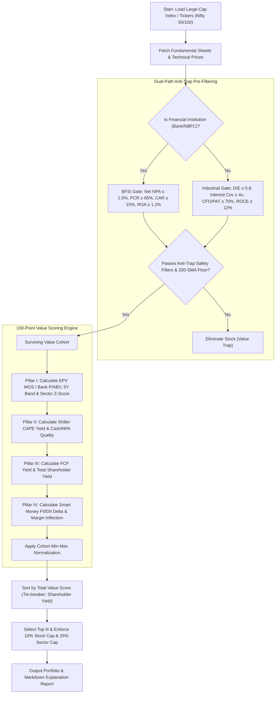

# Large-Cap Value Investment Strategy ("Finding Cheaper Stocks in Big Companies")

This document details the quantitative framework, dual-path sector filters, intrinsic valuation models, and relative scoring system implemented in the **Large-Cap Value Strategy**.

The primary objective of this strategy is to systematically identify high-quality, market-leading large-cap companies (Nifty 50, Nifty 100, Nifty LargeMidcap 250) that are trading at **deep discounts to their intrinsic value, historical valuation bands, and sector peers**, without falling into structural **Value Traps**.

---

## 1. Executive Summary & Strategy Mandate

Unlike small-cap stock picking—where outperformance comes from undiscovered earnings growth and volume breakouts—large-cap investing operates in a liquid, heavily covered market. When a blue-chip or large-cap industry leader trades cheap, it is usually caused by **temporary cyclical headwinds, short-term margin compression, macro sector rotation, or overreaction to quarterly earnings missteps**.

The **Large-Cap Value Strategy** exploits these temporary market dislocations by combining **Bruce Greenwald’s Earnings Power Value (EPV)**, **Joel Greenblatt’s Operating Earnings Yield**, **5-Year Valuation Band Discounts**, and **Smart Money Institutional Accumulation**.

```
                        ┌──────────────────────────────────────────────┐
                        │      5 PILLARS OF INTRINSIC CHEAPNESS        │
                        ├──────────────────────────────────────────────┤
                        │ 1. Bruce Greenwald EPV Discount (MOS ≥ 30%)  │
                        │ 2. 5-Year Historical Multiple Band (≤ 20th %)│
                        │ 3. Sector-Relative Discount (Peer Z-Score)   │
                        │ 4. Tangible FCF & Shareholder Return Yield   │
                        │ 5. Smart Money Institutional Accumulation    │
                        └──────────────────────────────────────────────┘
```

---

## 2. Intrinsic Value Mechanics: Earnings Power Value (EPV) & Margin of Safety

To determine whether a large-cap stock is **genuinely cheap** (and not just cheap relative to an overvalued market), the model calculates **Earnings Power Value (EPV)**—a zero-growth, steady-state valuation methodology developed by Columbia Business School Professor Bruce Greenwald.

### A. Earnings Power Value (EPV) Formula
EPV measures what the business is worth today based *only* on current normalized operating cash generation, ignoring speculative future growth assumptions:

$$\text{Normalized EBIT} = \text{3-Year Average Operating Income (EBIT)}$$

$$\text{NOPAT} = \text{Normalized EBIT} \times (1 - \text{Effective Tax Rate})$$

$$\text{Adjusted Cash Earnings} = \text{NOPAT} + \text{Depreciation} - \text{Maintenance CapEx}$$

$$\text{Earnings Power Value (EPV)} = \frac{\text{Adjusted Cash Earnings}}{\text{WACC}}$$

*(Where $\text{WACC}$ is the Cost of Capital, benchmarked at **10.5%** for Indian Large-Caps).*

### B. Margin of Safety (MOS) Threshold
$$\text{Margin of Safety (MOS) \%} = \left( 1 - \frac{\text{Enterprise Value (EV)}}{\text{EPV}} \right) \times 100$$

* **Rule**: Candidates trading at $\text{EV} \le 0.70 \times \text{EPV}$ (i.e. **$\text{MOS} \ge 30\%$**) are flagged as selling at a deep intrinsic discount.

---

## 3. Dual-Path Architecture: Industrial vs. BFSI (Financials)

In Indian Large-Cap indices (Nifty 50 / Nifty 100), Financial Institutions (Banks, NBFCs, Insurance) represent 30–35% of total index weight. 

Because industrial metrics like $\text{EV}/\text{EBITDA}$, Debt-to-Equity ($\text{D/E}$), and Operating Cash Flow ($\text{CFO}/\text{PAT}$) do not apply to financial balance sheets, the engine routes candidates through **Dual-Path Evaluation**:

```
                        ┌────────────────────────────────┐
                        │ Large-Cap Candidate Evaluator  │
                        └───────────────┬────────────────┘
                                        │
                       Is Financial (Bank / NBFC / Insurance)?
                                 ├─── YES ───► [Path A: BFSI Evaluation Engine]
                                 │             (P/ABV, NNPA, ROA, CAR, PCR, Tier-1)
                                 │
                                 └─── NO  ───► [Path B: Industrial & Commercial Engine]
                                               (EPV MOS, EV/EBITDA, CFO/PAT, ROCE, FCF/EV)
```

---

## 4. Value Trap Prevention: The 6 Anti-Trap Hard Safety Filters

Before any stock enters the scoring matrix, it must pass **all 6 Anti-Trap Safety Gates**:

### Anti-Trap Safety Filter Summary

| Code | Anti-Trap Filter | Configured Limit | Industrial Path (Non-BFSI) | Financial Path (BFSI / Banks) |
| :--- | :--- | :--- | :--- | :--- |
| **A** | **Market Cap Size** | $\ge$ **₹20,000 Crore** | Restricts universe to established blue-chip companies with analyst coverage. | Restricts universe to established blue-chip banks/NBFCs with institutional coverage. |
| **B** | **Liquidity (ADV)** | $\ge$ **₹10 Crore** | Average Daily Volume ($\text{Price} \times \text{Volume}$) ensuring zero impact cost. | Average Daily Volume ($\text{Price} \times \text{Volume}$) ensuring zero impact cost. |
| **C** | **Cash / Asset Quality**| High Earnings Realization | **$\text{CFO} / \text{PAT} \ge 70\%$** (70% of profit realized in cash). | **Net NPA $\le 1.5\%$** & **Provision Coverage Ratio (PCR) $\ge 65\%$**. |
| **D** | **Balance Sheet Safety**| Solvency Protection | **$\text{D/E} \le 0.8$** & **Interest Coverage $\ge 4.0\text{x}$**. | **Capital Adequacy Ratio (CAR) $\ge 15.0\%$** & **Tier-1 Capital $\ge 12\%$**. |
| **E** | **Capital Efficiency** | Minimum ROE Floor | **ROCE $\ge 12\%$** & **ROE $\ge 12\%$**. | **Return on Assets (ROA) $\ge 1.2\%$** & **ROE $\ge 12\%$**. |
| **F** | **Trend Reversal Floor**| Price Stability Floor | **Close $\ge 0.85 \times \text{200-SMA}$** (Allows mean-reversion dips up to 15% below 200-SMA, excludes falling knives). | **Close $\ge 0.85 \times \text{200-SMA}$** (Allows mean-reversion dips up to 15% below 200-SMA, excludes falling knives). |

---

## 5. The 100-Point Refined Value Scoring Matrix

Surviving candidates are scored across **4 Core Pillars** using dynamic **Min-Max Normalization** relative to the surviving cohort:

```
 ┌─────────────────────────────────────────────────────────────────────────────┐
 │                100-POINT REFINED LARGE-CAP VALUE MATRIX                     │
 ├───────────────────────┬───────────────────────┬─────────────────────────────┤
 │ Pillar I: Intrinsic & │ Pillar II: Cyclical & │ Pillar III: Cash Flow &     │
 │ Valuation Discounts   │ Earnings Quality      │ Shareholder Return          │
 │      (35 Points)      │      (25 Points)      │         (20 Points)         │
 ├───────────────────────┴───────────────────────┴─────────────────────────────┤
 │ Pillar IV: Catalysts & Smart Money Institutional Accumulation (20 Points)   │
 └─────────────────────────────────────────────────────────────────────────────┘
```

### Detailed Scoring Breakdown

| Pillar | Metric | Weight | Formula & Scoring Logic |
| :--- | :--- | :--- | :--- |
| **I. Intrinsic & Multiple Discounts** <br>*(35 Points)* | **EPV Intrinsic Discount / Bank P/ABV** | 15 pts | **Non-BFSI**: Margin of Safety ($\text{MOS \%} = 1 - \frac{\text{EV}}{\text{EPV}}$). Higher MOS = Higher score.<br>**BFSI**: Price to Adjusted Book Value ($\text{P/ABV}$) inverse rank. |
| | **5Y Valuation Band Percentile** | 10 pts | Percentile rank of current P/E (or P/B) relative to its own 5-year rolling band. Lower percentile = Higher score. |
| | **Sector-Adjusted Z-Score** | 10 pts | $$\text{Z-Score} = \frac{\text{Sector Median P/E} - \text{Stock P/E}}{\sigma_{\text{Sector P/E}}}$$ <br>Ranks cheapness relative to industry peers. |
| **II. Cyclical Safety & Earnings Quality** <br>*(25 Points)* | **Shiller Normalized CAPE Yield** | 10 pts | $$\text{CAPE Yield} = \frac{\text{3-Year Average EPS}}{\text{Current Price}}$$ <br>Protects against buying cyclical stocks at peak earnings traps. |
| | **Cash Realization & Asset Quality** | 15 pts | **Non-BFSI**: $\text{CFO} / \text{PAT}$ ratio.<br>**BFSI**: Net NPA % (inverse rank; lower NNPA = higher score). |
| **III. FCF & Capital Allocation** <br>*(20 Points)* | **Free Cash Flow Yield** | 10 pts | $$\text{FCF Yield} = \frac{\text{Free Cash Flow}}{\text{Enterprise Value}}$$ (or Tier-1 Capital ratio for Banks). |
| | **Total Shareholder Yield** | 10 pts | $$\text{Shareholder Yield} = \text{Dividend Yield \%} + \text{Net Buyback Yield \%}$$ <br>Rewards companies returning tangible cash during valuation dips. |
| **IV. Catalysts & Smart Money** <br>*(20 Points)* | **Smart Money Accumulation** | 10 pts | $$\text{Inst Stake Delta} = (\text{FII \%}_t + \text{DII \%}_t) - (\text{FII \%}_{t-1} + \text{DII \%}_{t-1})$$ <br>Scores expanding institutional ownership during price consolidation. |
| | **Operating Margin Inflection** | 10 pts | $$\text{Margin Spread} = \text{TTM Operating Margin \%} - \text{3Y Avg Operating Margin \%}$$ <br>Identifies companies experiencing operating margin bottoming and expansion. |

---

## 6. Portfolio Construction & Rebalancing Cadence

Large-cap value opportunities rerate over longer horizons than high-beta small caps. The portfolio engine applies specific position sizing and risk management rules:

1. **Position Weighting**: Weights are allocated proportionally to the final 100-Point Value Score.
2. **Single Stock Concentration Cap**: Max **10%** of total portfolio weight in any single stock.
3. **Sector Concentration Cap**: Max **25%** total portfolio weight in any single sector.
4. **Rebalancing Cadence**: **Semi-Annual (Every 6 Months)** or **Quarterly**, preventing portfolio churn while allowing time for mean-reversion rerating.

---

## 7. Valuation Rerating Exit & Off-Ramp Protocols

A Large-Cap Value position is exited or rebalanced when any of the following 3 exit triggers occur:

```
                          ┌────────────────────────────────┐
                          │   Position Monitoring Gate    │
                          └───────────────┬────────────────┘
                                          │
       ┌──────────────────────────────────┼──────────────────────────────────┐
       │                                  │                                  │
┌──────▼─────────────────────┐  ┌─────────▼────────────────────┐  ┌──────────▼────────────────────┐
│ 1. Valuation Rerating Exit │  │ 2. Value Trap Failure Exit   │  │ 3. Trailing Stop-Loss        │
│ Reaches 5Y Median P/E or   │  │ CFO/PAT < 50% for 2 Qtrs or  │  │ Fundamental drawdown limit   │
│ EPV Fair Value Target.     │  │ Net NPA > 2.0% (BFSI).       │  │ breach (15% below entry).    │
└────────────────────────────┘  └──────────────────────────────┘  └──────────────────────────────┘
```

1. **Valuation Rerating Exit (Take-Profit)**: When the stock's P/E or P/B reaches or exceeds its **5-Year Median Valuation** or **EPV Fair Value Target**, the mean-reversion cycle is complete. Capital is harvested and rotated into cheaper candidates.
2. **Value Trap Failure Exit**: Triggered immediately if cash conversion degrades ($\text{CFO}/\text{PAT} < 50\%$ for 2 consecutive quarters), or banking asset quality deteriorates ($\text{Net NPA} > 2.0\%$).
3. **Stop-Loss Protocol**: 15% trailing fundamental drawdown limit to cut losses in case of severe macro shocks.

---

## 8. Strategic Execution Pipeline (Mermaid Flowchart)



---

## 9. Comparative Matrix: Multibagger vs. Large-Cap Value

| Dimension | **Multibagger Strategy** | **Large-Cap Value Strategy** |
| :--- | :--- | :--- |
| **Target Size** | Micro, Small & Mid Caps (₹500 Cr – ₹50,000 Cr) | Large Caps & Blue Chips ($\ge$ ₹20,000 Cr) |
| **Primary Goal** | 10x Velocity & CapEx Inflection | Intrinsic Discount, Dividend Cash Flow & Mean Reversion |
| **Valuation Anchor** | PEG Ratio & Revenue Acceleration Gap | Bruce Greenwald EPV MOS, 5Y Band & Sector Z-Score |
| **Financial Sector Handling**| Standard filters | Dual-Path Evaluator (P/ABV, Net NPA, CAR, ROA) |
| **Leverage Limit** | $\text{D/E} \le 1.5$ | $\text{D/E} \le 0.8$ (Strict Solvency Gate) |
| **Cash Conversion** | $\text{CFO} / \text{PAT} \ge 25\%$ | $\text{CFO} / \text{PAT} \ge 70\%$ (Strict Cash Realization) |
| **Catalyst Driver** | Volume Breakout (2.0x volume multiplier) | Smart Money Accumulation (FII + DII Stake Delta) |
| **Rebalancing Cadence** | Monthly / Quarterly | Semi-Annual (6-Month) |

---


## 10. Quantitative Layers Ensuring Valuation Cheapness

To ensure that selected large-cap stocks are genuinely cheap (and not just cheap compared to an overvalued market or a structural value trap), the strategy evaluates 6 quantitative layers of valuation and cash flow metrics:

### 1. Self-Relative Historical Discount (5-Year Valuation Band)
* **How it works**: Measures where the stock’s current P/E or P/B multiple sits relative to its own 5-year rolling valuation band.
* **Why it ensures cheapness**: A blue-chip market leader (e.g., ONGC or Cipla) whose 5-year median P/E is 18x trading at 8x P/E sits in the lowest 10th percentile of its historical range, proving it is historically discounted.

### 2. Bruce Greenwald’s Earnings Power Value (EPV) & Intrinsic Margin of Safety
* **Formulas**:
  $$\text{EPV} = \frac{\text{3-Year Average Operating Income (EBIT)} \times (1 - \text{Tax Rate})}{\text{WACC}}$$
  $$\text{Margin of Safety (MOS) \%} = \left( 1 - \frac{\text{Enterprise Value}}{\text{EPV}} \right) \times 100$$
* **Why it ensures cheapness**: EPV calculates what the company is worth today assuming zero future growth. Buying at $\text{MOS} \ge 30\%$ means you are buying the stock for 30%+ less than its current cash generation power, getting all future growth for free.

### 3. Sector-Adjusted Z-Score (Peer-Relative Cheapness)
* **Formula**:
  $$\text{Z-Score} = \frac{\text{Sector Median P/E} - \text{Stock P/E}}{\sigma_{\text{Sector P/E}}}$$
* **Why it ensures cheapness**: Directly comparing an IT stock (e.g. 25x P/E) to a Steel stock (e.g. 10x P/E) would be flawed. The Z-Score compares each stock against its industry peer group median, ensuring we find the cheapest stock inside each specific sector.

### 4. Shiller CAPE Normalized Earnings Yield (Cyclical Peak Prevention)
* **Formula**:
  $$\text{CAPE Yield} = \frac{\text{3-Year Average EPS}}{\text{Current Stock Price}}$$
* **Why it ensures cheapness**: In cyclical sectors (Metals, Energy, Autos), single-year P/E looks artificially low at the peak of a cycle. By averaging 3 years of earnings, we normalize cyclical swings and ensure we don't fall for "peak earnings traps".

### 5. Tangible Free Cash Flow Yield & Shareholder Yield
* **Formulas**:
  $$\text{FCF Yield} = \frac{\text{Free Cash Flow}}{\text{Enterprise Value}}$$
  $$\text{Shareholder Yield} = \text{Dividend Yield \%} + \text{Net Buyback Yield \%}$$
* **Why it ensures cheapness**: High cash flow yield and high dividend payout prove that the reported earnings are real cash that management is actively returning to shareholders.

### 6. Dual-Path BFSI Valuation for Financial Institutions
* **Why it ensures cheapness**: Traditional $\text{EV}/\text{EBITDA}$ and $\text{D/E}$ don't work for Banks or NBFCs. The engine evaluates financial stocks using Price-to-Adjusted Book Value ($\text{P/ABV}$), Net NPA $\le 1.5\%$, and Return on Assets ($\text{ROA}) \ge 1.2\%$.

---

## 11. Configuration Schema (`config/mfs.json`)

```json
{
  "filters": {
    "value": {
      "min_market_cap": 200000000000,
      "max_market_cap": 50000000000000,
      "min_adv": 100000000,
      "min_cfo_pat": 0.70,
      "max_debt_to_equity": 0.80,
      "min_interest_coverage": 4.0,
      "min_roce": 0.12,
      "min_roe": 0.12,
      "max_net_npa": 0.015,
      "min_car": 0.15,
      "min_200day_sma_ratio": 0.85,
      "max_stocks_per_sector": 3,
      "max_sector_weight_cap": 0.25,
      "max_stock_weight_cap": 0.10,
      "score_weight_epv_mos": 15.0,
      "score_weight_5y_val_percentile": 10.0,
      "score_weight_sector_zscore": 10.0,
      "score_weight_shiller_yield": 10.0,
      "score_weight_cash_realization": 15.0,
      "score_weight_fcf_yield": 10.0,
      "score_weight_shareholder_yield": 10.0,
      "score_weight_smart_money_delta": 10.0,
      "score_weight_margin_inflection": 10.0
    }
  }
}
```

---

## 12. CLI Execution Commands

```bash
# Screen Nifty 50 for the top 5 cheapest high-quality large-caps
./dist/mycase pick --index nifty50 --method value --top 5

# Screen Nifty 100 index for top 10 value stocks
./dist/mycase pick --index nifty100 --method value --top 10

# Screen LargeMidcap 250 index with 25% sector caps
./dist/mycase pick --index largemidcap250 --method value --top 15

# Screen custom blue-chip watchlist
./dist/mycase pick --file data/largecaps.csv --method value --top 5
```
