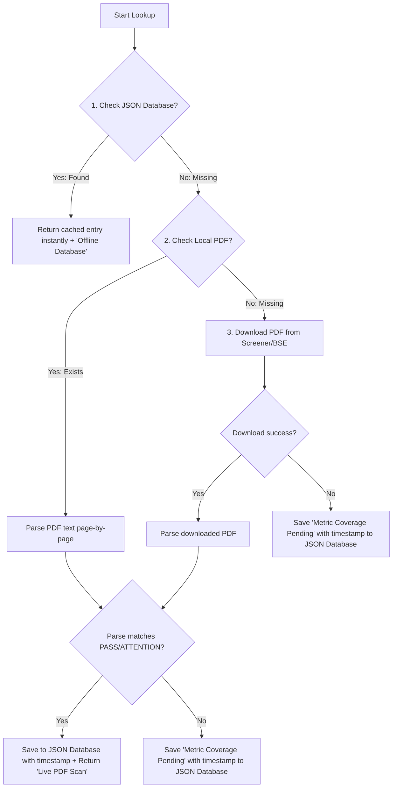

# Scuttlebutt & Live Qualitative Research Reporting Pipeline

The Scuttlebutt Reporting System is an automated qualitative research pipeline integrated into the Go Mycase Stock Picker. It dynamically extracts, compiles, and verifies key fundamental, governance, stability, and operational indicators for selected stocks, outputting a daily consolidated report at `report/<index_name>_<strategy>/research/<YYYYMMDD>_scuttlebutt.txt`.

---

## 1. Automation History & Python Transition

Originally, much of the qualitative data collation for the scuttlebutt reports (such as corporate actions, board resignations, related party alerts, and customer concentrations) was managed through manually maintained files or static offline checks.

Following the core request:
> *"as now we have new python nse live data can we check if we can automate this report?"*

The system was fully automated using custom-written Python scripts called from Go:
1. **`scripts/fetch_nse_data.py`**: Scrapes live NSE schedules, delivery accumulation volumes, related-party alerts, and board cessations/resignations.
2. **`scripts/check_customer_concentration.py`**: Handles local PDF segment extraction, online report downloading, and auto-updating the JSON database caches.
3. **`scripts/update_sector_tam.py`**: Maintains the Total Addressable Market (TAM) statistics per sector.

---

## 2. Pipeline Architecture & Execution Flow

The reporting engine is run automatically during the stock picking process when executing standard strategies (`value` or `multibagger`) unless `--skip-scuttlebutt` is set:

```bash
go run main.go pick -f data/microsmall.csv -m multibagger --name microsmall --golden data/microsmall.csv
```

### Go Orchestration Layer
1. **Parallel Execution**: Go manages the orchestration, running parallel qualitative fetches using goroutines and a WaitGroup inside `pkg/yfinance/screener.go`.
2. **Resource Throttling**: Because PDF layout analysis and text extraction are CPU-intensive, Go throttles the concurrent python execution using a **buffered channel semaphore** limited to **`3` concurrent workers**.
3. **Robust Script Resolution**: Script locations are dynamically resolved by traversing directory trees up to the project root, ensuring both `go run main.go` and package tests (`go test ./...`) can execute python sub-processes without relative path errors.
4. **Environment Propagation**: Passes `cmd.Env = os.Environ()` to subprocesses, guaranteeing they inherit the virtual environment (`.venv`) and system python library paths (avoiding `ModuleNotFoundError`).

---

## 3. Qualitative Metrics Breakdown

For every selected stock, the scuttlebutt pipeline aggregates and formats the following 13 key checks:

### 1. [Live NSE Result Schedule]
* **Source**: Scraped live from NSE results calendar using Screener/NSE APIs via `fetch_nse_data.py`.
* **Format**: Displays the previous earnings release date alongside any announced upcoming earnings release schedule (e.g., `30-06-26 -> N/A`).

### 2. [Live NSE Delivery Vol %]
* **Source**: Scraped live from NSE historical delivery records for the last business day via `fetch_nse_data.py`.
* **Format**: Shows the deliverable share volume accumulation percentage (e.g., `46.7% deliverable accumulation (Last Business Day: 28-07-26)`).

### 3. [Shareholding Snapshot]
* **Source**: Yahoo Finance financial profiles.
* **Format**: Institutional holding %, Promoter/Insiders %, and Pledged shares % (e.g., `Institutional: 31.5% | Promoter/Insiders: 42.1% | Pledged: 0.0%`).

### 4. [Fundamental Traction]
* **Source**: Financial statement tables.
* **Format**: Summarizes Trailing Twelve Months (TTM) Sales Growth, 3-Year Sales CAGR, Return on Capital Employed (ROCE), and Days Sales Outstanding (DSO) compared to the previous period (e.g., `TTM Growth: +11.7% | 3Y CAGR: +4.7% | ROCE: 14.4% | DSO: 52d (Prev: 57d)`).

### 5. [Operating Margin Trajectory]
* **Source**: Quarterly income statement files.
* **Format**: Shows the YoY trajectory of the Operating Profit Margin (OPM %) and the change in basis points (e.g., `OPM: 7.1% -> 7.7% (+54 bps YoY)`).

### 6. [Balance Sheet & Reinvestment]
* **Source**: Balance sheet ratios.
* **Format**: Displays the Debt-to-Equity ratio and the annual Capital Expenditure (CapEx) YoY growth rate (e.g., `Debt/Equity: 0.40 | CapEx: 535.1Cr -> 522.6Cr (-2.3% YoY Expansion)`).

### 7. [Earnings Growth Consistency]
* **Source**: EPS history.
* **Format**: Measures the consistency of earnings growth over the last 3 fiscal cycles (e.g., `2/3 YoY Growth Cycles (67% Expansion Rate)`).

### 8. [Auditor Opinion Status]
* **Source**: Annual report audit reports (live text scan or offline database).
* **Format**: Flags if the auditor has raised qualifications, modified opinions, or issued a clean opinion (e.g., `Clean / Unmodified Opinion (No Qualifications Found)`).

### 9. [Live Transcript Highlights]
* **Source**: Transcripts segment extractor.
* **Format**: Extracts management guidance, order book execution metrics, and capacity targets from recent concall transcripts.

### 10. [Sector TAM Trajectory]
* **Source**: `scripts/update_sector_tam.py` and `config/sector_tam.json`.
* **Format**: Checks if the sector's Total Addressable Market (TAM) grows at a rate exceeding the target (>15% CAGR), outputting the industry trends and growth rate.

### 11. [Management Stability Check]
* **Source**: Corporate filing feeds and overrides database (`config/management_alerts.json`) via `fetch_nse_data.py`.
* **Logic**: Alerts the user to cessations or resignations of CFOs, Auditors, or Key Managerial Personnel (KMPs) within a rolling **12-month (365 days)** window.
* **Alert Override Example**: Mr. Krunal Bhatt (Company Secretary / KMP) relieved on `2026-01-12` triggers a KMP resignation warning.

### 12. [Related Party Trans. Check]
* **Source**: Related party disclosure tables via `fetch_nse_data.py`.
* **Format**: Verifies if there are excessive or non-arm's length related-party transactions (RPTs) that could pose governance risks.

### 13. [Customer Concentration Check]
* **Source**: `scripts/check_customer_concentration.py` and `config/customer_concentration.json`.
* **Logic**: Verifies if the top 3 clients contribute $< 40\%$ of revenue (Ind AS 108 Segment Reporting compliance).

---

## 4. Customer Concentration Lookup & Caching Design

The customer concentration pipeline uses a multi-tier prioritized lookup system designed to maximize accuracy, speed, and CPU safety:

### Lookup Priority Flow:



### JSON Auto-Updating Cache
The caching mechanism auto-updates `config/customer_concentration.json` to prevent redundant network and CPU operations:
* **Successful Scans**: Appends the scan date (e.g. `(Scanned: 2026-07-29)`) to the parsed result and saves it.
* **Pending/Failed Scans**: If the PDF is missing, cannot be downloaded, or segment data is not found, the script saves the `"Metric Coverage Pending (Place the Annual Report PDF in data/annual_reports/) (Scanned: 2026-07-29)"` state into the JSON overrides file.
* Subsequent runs instantly load this status from the cache without retrying.

### Manual Cache Eviction
To force a rerun on a cached ticket:
1. Manually add the target PDF in `data/annual_reports/<TICKER>.pdf`.
2. Delete the ticket's cached entry from `config/customer_concentration.json`.

### PDF Parsing Accuracy
* **Context-Aware Parsing**: To prevent false positives (like picking up tax rates or asset percentages), the parser only extracts percentages from lines containing customer concentration keywords (`customer`, `client`, `major`, `single`, `external`).
* **Deduplication & Sanity Checks**: Deduplicates extracted percentages to avoid double counting, and validates that the sum of the top 3 clients is $\le 100\%$ before outputting results.
