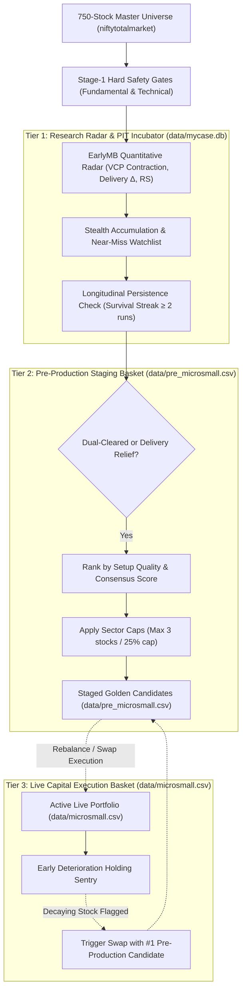
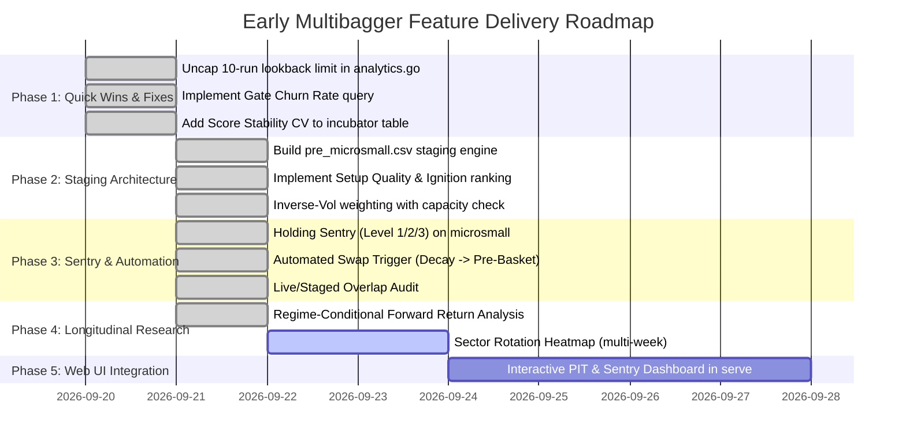

# Early Multibagger (EMB): Quantitative Architecture & Feature Specification

This document provides the authoritative engineering and quantitative specification for the **Early Multibagger (`earlymb`)** strategy in `mycase`. It formalizes the pre-breakout detection models, the **Three-Tier Portfolio Lifecycle**, longitudinal Point-in-Time (PIT) research engines, active holding sentries, and cross-strategy consensus integration with `multibagger`.

---

## Table of Contents

| § | Section | Status |
|---|---|---|
| [1](#1-strategy-stratification--architectural-separation) | Strategy Stratification & Architectural Separation | ✅ Live |
| [2](#2-the-three-tier-portfolio-lifecycle-architecture) | The Three-Tier Portfolio Lifecycle Architecture | 🟡 Architectural (partially live) |
| [3](#3-core-pre-breakout-quantitative-engines) | Core Pre-Breakout Quantitative Engines (Stage-1 & Pillars) | ✅ Live |
| ↳ [3A](#a-stage-1-hard-gates--elimination-topology-pre-scoring-filtration) | Stage-1 Hard Gates & Fallback Architecture (CFO/PAT, ROCE, CROIC) | ✅ Live |
| ↳ [3B](#b-the-four-quantitative-pillars-of-earlymb) | The Four Quantitative Pillars (Formulas & Bounds) | ✅ Live |
| ↳ [3C](#c-setup-quality--ignition-signal-decomposition-coiled-spring-index) | Setup Quality & Ignition Signal (Coiled Spring Index) | 🔴 New Proposal |
| [4](#4-pre-production-staging-engine-datapre_microsmallcsv) | Pre-Production Staging Engine (`data/pre_microsmall.csv`) | 🟡 Proposed (CSV created, engine pending) |
| ↳ [4A](#a-qualification--staging-rules) | Qualification Rules & 3 Relief Channels Status | 🟡 Proposed |
| ↳ [4B](#b-csv-structure--weighting-scheme) | Risk-Parity Weighting & Sector Constraints | 🟡 Proposed |
| ↳ [4C](#c-capacity--liquidity-constraint) | Execution Capacity & Liquidity Defenses | 🟡 Proposed |
| [5](#5-active-portfolio-early-deterioration-holding-sentry) | Active Portfolio Holding Sentry (3-Level Severity) | 🟡 Proposed |
| ↳ [5B](#b-sentry-monitoring-matrix-for-datamicrosmallcsv) | Sentry Monitoring Matrix (Level 1, 2, 3 Triggers) | 🟡 Proposed |
| ↳ [5C](#c-the-automated-rebalance-swap-workflow) | Automated Rebalance Swap Workflow | 🟡 Proposed |
| [6](#6-longitudinal-pit-research--deductions-duckdb) | Longitudinal PIT Research & Deductions (DuckDB) | ✅ Live (Sections 7–11 in analytics.go) |
| ↳ [6A–6D](#6-longitudinal-pit-research--deductions-duckdb) | Persistence Streaks, Macro Regime, Sector Rotation, Alpha | ✅ Live |
| ↳ [6E](#e-gate-churn-rate--pool-stability-oscillator) | Gate Churn Rate & Pool Stability Oscillator | 🔴 New Proposal |
| ↳ [6F](#f-score-stability-coefficient-of-variation) | Score Stability Coefficient of Variation | 🔴 New Proposal |
| ↳ [6G](#g-regime-conditional-forward-return-stratification) | Regime-Conditional Forward Returns | 🔴 New Proposal |
| [7](#7-cross-strategy-consensus--dual-conviction-engine) | Cross-Strategy Consensus & Dual-Conviction Engine | ✅ Live |
| ↳ [7A–7C](#7-cross-strategy-consensus--dual-conviction-engine) | Consensus Scoring, 4-Quadrant Matrix, DuckDB View | ✅ Live |
| ↳ [7D](#d-live--staged-basket-overlap-audit) | Live & Staged Basket Overlap Audit | 🔴 New Proposal |
| [8](#8-cli-command-architecture--operational-runbook) | CLI Command Architecture & Operational Runbook | 🟡 Partial (some commands proposed) |
| [9](#9-implementation-status-matrix) | Implementation Status Matrix | 🔴 New |
| [10](#10-phased-implementation-roadmap) | Phased Implementation Roadmap | Updated |

---

## 1. Strategy Stratification & Architectural Separation

To guarantee institutional execution discipline and avoid mixing speculative timing with long-term capital compounding, strategies in `mycase` operate across two stratified engines on the shared 750-stock **`niftytotalmarket`** master universe:

| Operational Layer | Engine Name | Scope & Authority | Core Focus |
|---|---|---|---|
| **Live Production** | `multibagger` | **Authoritative Live Execution**. Exclusively governs real Demat capital (`data/microsmall.csv`), broker order baskets (`mycase basket`), and rebalance execution. | Long-term capital compounders, ROCE $\ge 15\%$, CFO $>$ PAT, conservative leverage ($D/E \le 1.0$), structural earnings acceleration. |
| **Testing & Radar** | `earlymb` | **Pre-Breakout Timing & Staging Engine**. Governs the pre-production incubator, candidate qualification, and pre-production staging (`data/pre_microsmall.csv`). Does not execute unconfirmed live market orders. | Micro-structural timing (1–3 weeks prior to markup), Volatility Contraction Pattern (VCP), Institutional Delivery Delta %, Pocket Pivots. |

---

## 2. The Three-Tier Portfolio Lifecycle Architecture

Rather than promoting newly screened momentum stocks directly into the live broker execution basket, `mycase` implements a **Three-Tier Portfolio Lifecycle**:



### The Three Tiers Defined:

1. **Tier 1: Quantitative Radar & PIT Incubator (`data/mycase.db`)**
   - Daily screening of 750 stocks via post-market Bhavcopy MTO delivery and daily candle feeds.
   - Detects institutional footprints, tracks Markov survival streaks, and logs shadow divergence without risking capital.

2. **Tier 2: Pre-Production Staging Basket (`data/pre_microsmall.csv`)**
   - **The "On-Deck" Bullpen**: The top 10–20 highest-conviction candidates that have passed Stage-1 gates (or verified relief channels) and demonstrate extreme kinetic coil tension.
   - Sized with target weights under sector cap defense constraints.
   - Actively tracked for price volume confirmation without triggering live broker orders until a rebalance event occurs.

3. **Tier 3: Live Production Execution Basket (`data/microsmall.csv`)**
   - The authoritative 20-holding portfolio reflecting actual Demat holdings.
   - Actively defended by the **Early Deterioration Holding Sentry**.
   - When a live holding decays, its replacement is pulled directly from the top of `data/pre_microsmall.csv`.

---

## 3. Core Pre-Breakout Quantitative Engines

### A. Stage-1 Hard Gates & Elimination Topology (Pre-Scoring Filtration)
Before any candidate receives a quantitative score across the 4 pillars, it must clear the binary **Stage-1 Hard Gates** implemented in [`pkg/stockpicker/filters.go:450-653`](file:///Users/raghavgarg/Projects/myGo/mycase/pkg/stockpicker/filters.go#L450-L653). These gates enforce strict fundamental survivability, balance sheet safety, and capital efficiency floors.

In production runs across the 750-stock universe, Stage-1 eliminates ~85–88% of candidates, yielding ~90–135 qualified survivors. The dominant elimination gates are:

1. **Cash Flow Quality Gate (`min_cfo_pat: 0.25`) — The Largest Single Elimination Bottleneck**:
   - **Condition**: $\text{OperatingCashflow} > 0$ and $\frac{\text{OperatingCashflow}}{\text{NetIncome}} \ge 0.25$ (with $\text{FreeCashflow} > 0$ check when configured).
   - **Soft Buffer for Existing Portfolio Holdings**: Gate relaxes to $\text{CFO} / \text{PAT} \ge 0.20$ ($20\%$ relaxation buffer).
   - **Empirical Reality**: **"Weak Cash Conversion (CFO < PAT)" is consistently the single largest elimination category**, eliminating **23%–25%+ of the entire 750-stock pool** (150–175+ stocks per run), often surpassing even macro downtrend rejections. It forms the ultimate defense against aggressive accrual accounting and unbacked paper profits.

2. **Capital Efficiency (ROCE) Gate with 3-Year Average Fallback (`min_roce: 0.12`)**:
   - **Condition**: Evaluates $\text{ROCE} \ge 12.0\%$ (or $7.0\%$ floor for cyclicals, capital goods, or recent listings).
   - **3-Year Average Fallback (`Get3YearAvgROCE`)**: If single-year ROCE dips below threshold due to cyclicality or capex expansion, the engine evaluates the average ROCE across the last 3 visible fiscal years (accounting for a 45-day filing lag). If the 3-year average $\ge 12.0\%$, the candidate passes.
   - **Soft Buffer for Existing Holdings**: $10.2\%$ ($15\%$ relaxation).

3. **Financial Services (BFSI) Sector-Specific Substitution**:
   - Banking and NBFC balance sheets treat customer deposits and loan capital as core operational inventory rather than traditional debt, causing standard $\text{ROCE} = \frac{\text{EBIT}}{\text{Total Assets} - \text{Current Liabilities}}$ to produce distorted, unrepresentative figures.
   - **The Engine Bypasses ROCE entirely for Financial Services** and substitutes an **ROE Quality Gate**: $\text{ROE} \ge 12.0\%$.

4. **Cash Return on Invested Capital (CROIC) Gate with 3-Year Fallback (`min_croic: 0.06`)**:
   - **Condition**: Evaluates $\text{CROIC} = \frac{\text{FreeCashflow}}{\text{Invested Capital}} \ge 6.0\%$.
   - **3-Year Average Fallback (`Get3YearAvgCROIC`)**: Evaluates 3-year average CROIC if single-year FCF fluctuates due to capex cycles.
   - **Soft Buffer for Existing Holdings**: $4.8\%$ ($20\%$ relaxation).

5. **Balance Sheet Survivability & Liquidity Gates**:
   - **Debt-to-Equity Cap**: $\frac{\text{Total Debt}}{\text{Equity}} \le 1.5$.
   - **Interest Coverage Floor**: $\frac{\text{EBIT}}{\text{Interest Expense}} \ge 3.0$.
   - **Liquidity Floor**: Average Daily Traded Value ($\text{ADV}_{20\text{D}}$) $\ge ₹1\text{ Cr}$.
   - **Long-Term Trend Floor**: $\text{Price} \ge 0.95 \times \text{SMA}_{200}$.
   - **Promoter Stake & Pledge**: Minimum promoter holding $\ge 25.0\%$, pledged shares $\le 5.0\%$.

---

### B. The Four Quantitative Pillars of EarlyMB
Every candidate that clears Stage-1 hard gates is evaluated across four mathematical pillars yielding a composite raw score ($0 - 100\text{ pts}$):

> [!NOTE]
> Pillar formulas below reference the **canonical specification** in [`docs/earlyMB.md`](file:///Users/raghavgarg/Projects/myGo/mycase/docs/earlyMB.md). Reference bounds are the fixed invariant bounds used in production scoring, with empirically calibrated P5/P95 bounds noted for context.

1. **Pillar 1: Idiosyncratic Momentum (25 Points)**
   $$\text{Composite RS} = 0.40 \times \text{RS}_{1\text{M}} + 0.30 \times \text{RS}_{3\text{M}} + 0.30 \times \text{RS}_{12\text{M}}$$
   where $\text{RS}_T = R_{\text{Stock}, T} - R_{\text{NIFTY}, T}$ represents horizon excess return evaluated over 1M (21 sessions), 3M (63 sessions), and 12M (252 sessions).
   - **Production Reference Bounds**: $[-30\%, \, +70\%]$.
   - **Empirical Calibration (OOS)**: Mean IC = $+0.069$, IR = $+0.56$, Hit Rate = $77.8\%$ — **second strongest predictor**.

2. **Pillar 2: Volatility Contraction Pattern (25 Points)**
   $$\text{VCP Ratio} = \frac{\text{ATR}_{10}}{\text{ATR}_{60}}$$
   - Lower ratio = tighter base = higher score (inverted scoring).
   - **Production Reference Bounds**: $[0.25, \, 0.75]$.
   - **Empirical Calibration (OOS)**: Mean IC = $+0.081$, IR = $+0.55$, Hit Rate = $55.6\%$ — **strongest standalone predictor of 21-day forward returns**.

3. **Pillar 3: Volume Footprint (25 Points = 12.5 + 12.5)**
   - **3A: Winsorized RVOL Z-Score** (12.5 pts): $Z_{\text{vol}} = \frac{\overline{\text{Vol}}_{\text{capped}, 5\text{D}} - \overline{\text{Vol}}_{\text{capped}, 50\text{D}}}{\sigma(\text{Vol}_{\text{capped}, 50\text{D}})}$ with daily volume capped at $4.0 \times \overline{\text{Vol}}_{20\text{D}}$.
     - **Production Reference Bounds**: $[0.0, \, 3.0]$.
   - **3B: Bounded Decayed Pocket Pivot** (12.5 pts): Identifies volume footprints exceeding max down-day volume of prior 10 sessions.
     - **Production Reference Bounds**: $[0.0, \, 12.0]$.
   - **Empirical Calibration (OOS)**: RVOL Z IC = $-0.071$, PP IC = $-0.108$ — **weakest pillars out-of-sample**; contribute to composite scoring but have limited standalone predictive power.

4. **Pillar 4: Institutional Delivery Delta (25 Points)**
   $$\Delta_{\text{deliv}} = \overline{\text{Delivery\%}}_{5\text{D}} - \overline{\text{Delivery\%}}_{20\text{D Baseline}}$$
   - Extracted directly from official 21:00 PM NSE Bhavcopy MTO records.
   - Uses **disjoint windowing** (5D recent vs prior 20D baseline) to avoid self-contamination.
   - **Production Reference Bounds**: $[-10\%, \, +15\%]$.
   - **Empirical Calibration (OOS)**: Mean IC = $+0.017$, IR = $+0.16$, Hit Rate = $55.6\%$ — **positive but noisy standalone**; strongest value is as a confirmation overlay, not as a primary ranking factor.

> [!WARNING]
> **Pillar 4 Empirical Calibration Pre-Dates Disjoint Baseline Fix**:
> The out-of-sample calibration figures above ($\text{Mean IC} = +0.017, \text{IR} = +0.16, \text{Hit Rate} = 55.6\%$) were evaluated under the legacy baseline formula $(\text{DeliveryPct} - 35\%)$, which granted an artificial subsidy to ~46% of the universe. In `data/mycase.db`, pre-migration runs are formally tagged `pillar4_uncalibrated = true`. Formal statistical recalibration over the disjoint baseline is pending accumulation of 30+ clean post-fix sessions.

> [!IMPORTANT]
> **Key Calibration Insight**: The out-of-sample IC results from [`earlyMB.md §6.4`](file:///Users/raghavgarg/Projects/myGo/mycase/docs/earlyMB.md#L219-L250) prove that **VCP Tightness and Composite RS are the dominant predictive pillars**. Delivery Delta is valuable as a timing/confirmation signal but noisy when used as a ranking multiplier. This directly informs the Coiled Spring Index decomposition below.

---

### C. Setup Quality & Ignition Signal Decomposition ("Coiled Spring Index")

Rather than a single combined formula, the pre-breakout tension ranking is decomposed into two orthogonal components:

#### Component 1: Setup Quality Score (Structural Readiness)
Measures how tightly wound the spring is, independent of whether the ignition event has started:
$$\text{Setup Quality} = \frac{\max(0.10, \, 1 + \text{Composite RS})}{\text{VCP Ratio} + 0.10}$$

The $\max(0.10, \cdot)$ safety guardrail prevents non-positive scores under tail-risk market drawdowns where $\text{Composite RS} < -100\%$. This uses the **two pillars with proven out-of-sample predictive power** (VCP: IC = +0.081, RS: IC = +0.069).

> [!NOTE]
> **Mathematical Insulation from Pillar 4**:
> Notice that **Setup Quality Score** relies strictly on Pillar 1 (Composite RS: $\text{IC} = +0.069$) and Pillar 2 (VCP Ratio: $\text{IC} = +0.081$). It completely excludes Delivery Delta ($\Delta_{\text{deliv}}$). Consequently, **Setup Quality is 100% mathematically insulated** from the legacy Pillar 4 calibration noise and remains structurally robust.

**Interpretation**:
* **High Quality ($\ge 3.0$)**: Tight VCP coil ($\le 0.50$) combined with strong relative outperformance ($\ge +25\%$) → structurally primed for breakout.
* **Moderate Quality ($1.5 - 3.0$)**: Reasonable setup but not extreme.
* **Low Quality ($< 1.5$)**: Loose base or weak leadership — deprioritize.

**Example from Sep 18 data**:
| Ticker | VCP | Comp RS | Setup Quality | Interpretation |
|---|---|---|---|---|
| `NSE:TIPSMUSIC` | 0.31 | +8.4% | $\frac{1.084}{0.41} = 2.64$ | High — extreme coil with positive RS |
| `NSE:PARKHOSPS` | 0.41 | +32.6% | $\frac{1.326}{0.51} = 2.60$ | High — tight coil with strong RS |
| `NSE:MCX` | 0.60 | +41.9% | $\frac{1.419}{0.70} = 2.03$ | Moderate — decent coil with very strong RS |
| `NSE:AVALON` | 1.23 | +70.1% | $\frac{1.701}{1.33} = 1.28$ | Low quality — loose base despite strong RS |

#### Component 2: Ignition Signal (Timing Overlay)
$$\text{Ignition} = \Delta_{\text{deliv}}$$

Applied as a binary **readiness flag** rather than a continuous multiplier:
- $\Delta_{\text{deliv}} \ge +5.0\%$ → `🟢 IGNITION ACTIVE` — institutional money currently flowing in.
- $-5.0\% < \Delta_{\text{deliv}} < +5.0\%$ → `🟡 NEUTRAL` — no clear signal.
- $\Delta_{\text{deliv}} \le -5.0\%$ → `🔴 COOLING` — temporary pullback in delivery; setup may still be valid.

> [!TIP]
> **Ranking Strategy**: Sort `data/pre_microsmall.csv` primarily by **Setup Quality** (descending), then use Ignition Signal as a **tiebreaker** and visual flag. A tightly coiled stock with temporarily negative delivery (e.g., `NSE:PARKHOSPS`: Setup = 2.60, Ignition = COOLING) is still a prime candidate — it just hasn't been triggered yet.

---

## 4. Pre-Production Staging Engine (`data/pre_microsmall.csv`)

### A. Qualification & Staging Rules
A candidate in the PIT Incubator is automatically promoted to `data/pre_microsmall.csv` when:
1. **Gate Clearance & Relief Channels**: Passes Stage-1 hard gates. If gated by specific fundamental or base duration thresholds, qualification is governed by the operational status of the three distinct relief channels established during shadow auditing:
   - **`base_duration` (LIVE IN PRODUCTION)**: Replaces the binary 4-week base duration cliff with a graduated scoring multiplier ([`pkg/stockpicker/scoring.go`](file:///Users/raghavgarg/Projects/myGo/mycase/pkg/stockpicker/scoring.go) & DuckDB macro `base_duration_multiplier`: $\ge 4\text{w}: 1.0\times, 2\text{-}3\text{w}: 0.75\times, 0\text{-}1\text{w}: 0.50\times$). Candidates in fresh breakout zones are scored and qualified with appropriate base-maturity discounts rather than rejected. Validated across 24 empirical samples ($79.2\%$ win rate, $+3.22\%$ average return).
   - **`delivery_override` (RETAINED IN SHADOW — Tightened Bar)**: For ROCE / Capital Efficiency bottlenecks only: rescues candidates showing extraordinary institutional footprint ($\Delta_{\text{deliv}} \ge +9.0\%$, $\text{RS} \ge +15.0\%$, $\text{VCP} \le 1.20$). **Restricted to Shadow Mode tracking only** in `stage1_shadow_results`; does **not** generate live orders or pre-basket promotions due to weak empirical evidence ($-0.86\%$ average return across 6 initial test samples).
   - **`promoter_exempt` (SUSPENDED)**: Originally proposed to exempt regulated Financial Services institutions with dispersed promoter ownership; **shelved / suspended** after underlying fundamental data corrections naturally expanded the Financial Services survivor pool from 3 to 12 stocks without requiring a policy exemption.
2. **Persistence**: Appears on the stealth radar for $\ge 2$ consecutive runs.
3. **Consensus Strength**: Scores in the top quartile ($\ge \text{P75}$) of Stage-1 survivors.
4. **Score Stability**: Coefficient of Variation of raw score across last 5 runs $\le 0.30$ (see [§6F](#f-score-stability-coefficient-of-variation)).
5. **Sector Constraint Defense**: Maximum 3 stocks per sector; sector weight cap $\le 25.0\%$.

### B. CSV Structure & Weighting Scheme
`data/pre_microsmall.csv` uses the same `ticker,weight` schema as `data/microsmall.csv` for seamless interchangeability with `mycase basket`:

```csv
ticker,weight
NSE:PARKHOSPS,0.068
NSE:IPCALAB,0.065
NSE:MCX,0.062
NSE:TIPSMUSIC,0.060
NSE:AVALON,0.058
```

Enrichment metadata (score, VCP, delivery delta, sector, setup quality, ignition signal) is stored in a companion DuckDB table `pre_production_staging` for audit and analysis — not in the CSV itself.

Weights are calibrated using **Inverse Volatility Risk Parity**:
$$w_i = \frac{1 / \text{ATR}_{20, i}}{\sum_{j=1}^{N} (1 / \text{ATR}_{20, j})}$$
subject to:
- $w_i \le 8.0\%$ (single stock cap)
- $\sum_{i \in \text{Sector}} w_i \le 25.0\%$ (sector weight cap)
- **Iterative Redistribution**: If individual $8.0\%$ caps or sector $25.0\%$ caps constrain weights such that $\sum w_i < 1.00$, the unallocated residual weight is redistributed pro-rata across remaining unconstrained candidates.

### C. Capacity & Liquidity Constraint
The staging engine enforces a minimum execution capacity check:
- **Minimum ADV**: All staged candidates must satisfy $\text{ADV} \ge ₹1\text{ Cr}$ (inherited from Stage-1 liquidity gate).
- **Maximum Portfolio AUM**: Weights are calibrated for portfolios up to **₹25L** without exceeding 2% of 20-day ADV on any single holding. Beyond ₹25L, the engine should flag positions where execution impact may exceed 1%.

---

## 5. Active Portfolio Early Deterioration Holding Sentry

### A. The Challenge: Fundamental Reporting Lag
Corporate quarterly financial reports (PAT, CFO, ROCE) lag market reality by **3 to 6 months**. Institutional distribution begins long before accounting deterioration becomes public.

### B. Sentry Monitoring Matrix for `data/microsmall.csv`
The Holding Sentry continuously monitors all active holdings in `data/microsmall.csv` post-market:

| Level | Severity State | Quantitative Trigger | Operational Action |
|---|---|---|---|
| **Level 1** | `[SENTRY: COIL DECAY]` | VCP expands $> 1.60$ with RVOL Z-Score $> +2.0$ on declining closes. | Freeze fresh capital allocation; tighten tracking stops. |
| **Level 2** | `[SENTRY: INSTITUTIONAL DISTRIBUTION]` | 3-day cumulative $\Delta_{\text{deliv}} \le -10.0\%$ with Price $\le \text{SMA}_{50}$. | Tag holding for expedited review; initiate fundamental check. |
| **Level 3** | `[SENTRY: TREND RUPTURE]` | Price drops below $95\%$ of 200-Day SMA ($\text{Price} < 0.95 \times \text{SMA}_{200}$) OR $\text{Price} < 0.80 \times \text{High}_{52\text{W}}$ (drawdown $> 20\%$ from peak). | **Immediate Swap Candidate**: Trigger replacement with the #1 ranked candidate from `data/pre_microsmall.csv`. |

### C. The Automated Rebalance Swap Workflow
When an active holding in `data/microsmall.csv` triggers a Level 3 Trend Rupture:
1. Sentry flags the decaying holding (e.g. `NSE:SUMICHEM` slipping below 200-SMA).
2. The rebalancing engine inspects `data/pre_microsmall.csv` for the highest-ranked qualified candidate in an allowed sector.
3. The replacement order is queued in `mycase basket` for next-market-open execution.

---

## 6. Longitudinal PIT Research & Deductions (DuckDB)

With multi-week continuous PIT data (August 28, 2026 $\rightarrow$ Present), the system executes longitudinal institutional deductions. Currently implemented in [`analytics.go`](file:///Users/raghavgarg/Projects/myGo/mycase/pkg/pithistory/analytics.go) Sections 7–11.

> [!IMPORTANT]
> **Hardcoded Lookback Cap**: [`analytics.go:306`](file:///Users/raghavgarg/Projects/myGo/mycase/pkg/pithistory/analytics.go#L306) currently limits `GetRunHistory` to 10 runs. This must be parametrized via the CLI `--days` flag (default 30) to display the full database history from Aug 28 onward.

### A. Markov Gate Persistence ("Survival Streak")
Under severe market regimes ($R \approx 0.20 - 0.25$), over $80\%$ of stocks fail Stage 1 daily. Stocks that survive Stage-1 hard gates **across 10–15+ consecutive sessions** form the **Fortress Core**:
$$\text{Survival Rate} = \frac{\sum_{t=1}^{T} \mathbb{I}(\text{PassedStage1}_t)}{T} \times 100$$
$$\text{Current Streak} = \text{Consecutive runs passed Stage-1 up to latest run}$$
These stocks lead market rebounds when the regime multiplier recovers.

### B. Macro Regime Breadth Sentry & Inflection Oscillator
Tracks the velocity and acceleration of the Macro Regime Multiplier $R$:
$$\text{Regime Velocity (1D)} = R_t - R_{t-1}$$
$$\text{Regime Momentum (3D)} = R_t - R_{t-3}$$
- **Inflection Point Alert**: Detects regime turnarounds (e.g., $R$ troughing at $0.2000$ on Sep 16 and surging to $0.2579$ on Sep 18, cutting the hurdle by $33.7\text{ pts}$).
- **"On-Deck" Proximity**: Identifies candidates whose Raw Scores put them within $5 - 15\text{ pts}$ of clearing the hurdle as $R$ expands toward $0.50$.

### C. Longitudinal Sector Rotation Heatmap
Tracks the daily count and percentage of Stage-1 survivors by sector:
- Identifies where smart money is concentrating (e.g., Healthcare expanding from 16 to 29 qualified stocks over 3 weeks).
- Flags sector fatigue (e.g., Financial Services declining from 22 to 12 stocks).
- Enforces sector cap defense verification even during inflow surges.

### D. Empirical Forward Return & Alpha Calibration ($T+5\text{d}, T+10\text{d}, T+21\text{d}$)
Since historical snapshots are now older than 21 days, `pit_candidate_scores.forward_return_21d` is backfilled from realized prices:
- **P90 vs P25 Quantile Spread**: Proves whether top decile scores deliver excess returns over lower quartiles.
- **Radar Alpha Audit**: Evaluates the realized performance of stealth accumulation candidates relative to NIFTY benchmark returns.

### E. Gate Churn Rate & Pool Stability Oscillator
Measures the day-to-day instability of the Stage-1 survivor pool:

$$\text{Gate Churn Rate}_t = \frac{|\text{NewEntrants}_t| + |\text{Exits}_t|}{|\text{Survivors}_{t-1}|} \times 100$$

Where:
- $\text{NewEntrants}_t$ = stocks that passed Stage-1 today but failed yesterday.
- $\text{Exits}_t$ = stocks that passed yesterday but failed today.

**Interpretation**:
| Churn Rate | Pool State | Conviction Level |
|---|---|---|
| $< 10\%$ | **Stable** — same quality stocks keep qualifying | High confidence in individual candidates |
| $10\% - 25\%$ | **Moderate** — normal daily variation at gate boundaries | Standard confidence |
| $> 25\%$ | **Unstable** — survivors are borderline and flip-flopping | Low confidence; widen selection criteria or increase persistence requirements |

**SQL Implementation** (directly queryable from existing PIT tables):
```sql
WITH date_pairs AS (
    SELECT as_of_date AS curr_date,
           LAG(as_of_date) OVER (ORDER BY as_of_date) AS prev_date
    FROM (SELECT DISTINCT as_of_date FROM pit_candidate_scores WHERE index_name = 'niftytotalmarket' AND method = 'earlymb')
),
survivors AS (
    SELECT as_of_date, ticker
    FROM pit_candidate_scores
    WHERE passed_stage1 = true AND index_name = 'niftytotalmarket' AND method = 'earlymb'
)
SELECT 
    dp.curr_date AS as_of_date,
    COUNT(DISTINCT curr.ticker) AS survivors_today,
    COUNT(DISTINCT prev.ticker) AS survivors_yesterday,
    COUNT(DISTINCT curr.ticker) - COUNT(DISTINCT both_days.ticker) AS new_entrants,
    COUNT(DISTINCT prev.ticker) - COUNT(DISTINCT both_days.ticker) AS exits,
    ROUND(( (COUNT(DISTINCT curr.ticker) - COUNT(DISTINCT both_days.ticker)) + 
            (COUNT(DISTINCT prev.ticker) - COUNT(DISTINCT both_days.ticker)) ) * 100.0 / 
          NULLIF(COUNT(DISTINCT prev.ticker), 0), 1) AS churn_rate_pct
FROM date_pairs dp
LEFT JOIN survivors curr ON curr.as_of_date = dp.curr_date
LEFT JOIN survivors prev ON prev.as_of_date = dp.prev_date
LEFT JOIN survivors both_days ON both_days.as_of_date = dp.curr_date 
                             AND both_days.ticker IN (SELECT ticker FROM survivors WHERE as_of_date = dp.prev_date)
WHERE dp.prev_date IS NOT NULL
GROUP BY dp.curr_date
ORDER BY dp.curr_date;
```

> [!TIP]
> **Empirical Urgency from Recent Production Runs**:
> Between September 15 and September 18, 2026, Stage-1 survivors swung sharply from 89 to 134 within a single five-session trading window. This empirical instability proves that gate churn is a primary source of phantom turnover, making the Gate Churn Rate and Pool Stability Oscillator an immediate analytical priority.

### F. Score Stability Coefficient of Variation
Tracks the volatility of each candidate's raw score across their recent PIT history:

$$\text{Score CV}_i = \frac{\sigma(\text{RawScore}_{i, t-N..t})}{\overline{\text{RawScore}}_{i, t-N..t}}$$

**Purpose**: A stock scoring 38.7 today might have scored 22.0 two days ago and 44.0 two days before that. High score volatility ($\text{CV} > 0.30$) indicates the candidate's quantitative signature is noisy and unreliable — today's high rank may be transient rather than structural.

**Interpretation & Staging Impact**:
| Score CV | Stability | Impact on `data/pre_microsmall.csv` |
|---|---|---|
| $< 0.15$ | **Stable** — consistent quantitative signature | Full weight; high confidence |
| $0.15 - 0.30$ | **Moderate** — some fluctuation | Normal weight; standard confidence |
| $> 0.30$ | **Volatile** — score flip-flops daily | **Downweight by 50%** or exclude until stabilization |

> [!NOTE]
> This directly relates to [Bug-001 in `Bugs_EMB.md`](file:///Users/raghavgarg/Projects/myGo/mycase/docs/Bugs_EMB.md): the 65 candidates exhibiting extreme score shifts (+/- 15–20 pts between runs) were a symptom of high score CV — not just a display overflow bug but a genuine signal quality issue.

### G. Regime-Conditional Forward Return Stratification
Forward return calibration must account for the **market regime state at scoring time**:

| Regime Band | $R$ Range | Expected Forward Environment | Key Question |
|---|---|---|---|
| **Severe Contraction** | $0.20 - 0.30$ | Bear / high-stress market | Do high scores during bear regimes still predict forward alpha? Or are selections during contraction lower quality? |
| **Transitional** | $0.30 - 0.50$ | Recovery / early basing | Is this the optimal "buy the dip" window where pre-breakout setups have the highest forward IR? |
| **Expansion** | $0.50 - 1.00$ | Bull trend / risk-on | Standard selection regime with normal alpha expectations |

$$\text{Regime-Conditional IC}_{k, R} = \text{SpearmanCorr}(\text{Pillar}_k, R_{t+21}) \quad \text{where } R_t \in [R_{\text{low}}, R_{\text{high}}]$$

**Strategic Implication**: If P90 stocks scored during $R \approx 0.25$ deliver higher forward alpha than the same score during $R = 0.80$, then the system should be **more aggressive** (larger weights, tighter staging criteria) when $R$ begins recovering from troughs.

---

## 7. Cross-Strategy Consensus & Dual-Conviction Engine

### A. Consensus Formulation
$$\text{Consensus Score} = \text{Multibagger Effective Score} + \text{EarlyMB Effective Score}$$

### B. Dual-Conviction Matrix
| Quadrant | MB Fundamentals | EarlyMB Momentum | Strategic Classification | Action |
|---|---|---|---|---|
| **Quadrant I** | **High ($\ge \text{P75}$)** | **High ($\ge \text{P75}$)** | **"The Sweet Spot" (Dual Leaders)** | Top Priority for `data/pre_microsmall.csv` |
| **Quadrant II** | High ($\ge \text{P75}$) | Low ($< \text{P50}$) | Fundamental Compounders in Base | Hold in Live Basket; await volume trigger |
| **Quadrant III** | Low ($< \text{P50}$) | High ($\ge \text{P75}$) | High-Beta Momentum / Turnaround | Keep on Radar; verify cash flow quality |
| **Quadrant IV** | Low ($< \text{P50}$) | Low ($< \text{P50}$) | Dead Capital / Value Traps | Disqualify from all tiers |

### C. Database Representation (`v_strategy_consensus`)
```sql
CREATE VIEW IF NOT EXISTS v_strategy_consensus AS
SELECT 
    m.as_of_date,
    m.ticker,
    m.sector,
    m.effective_score AS mb_score,
    e.effective_score AS earlymb_score,
    (COALESCE(m.effective_score, 0) + COALESCE(e.effective_score, 0)) AS consensus_score,
    m.passed_stage1 AS mb_passed_stage1,
    e.passed_stage1 AS earlymb_passed_stage1,
    e.vcp_ratio,
    e.delivery_delta,
    e.rvol_z_score
FROM pit_candidate_scores m
JOIN pit_candidate_scores e 
  ON m.as_of_date = e.as_of_date 
 AND m.ticker = e.ticker
 AND m.index_name = e.index_name
WHERE m.method = 'multibagger' 
  AND e.method = 'earlymb'
  AND m.index_name = 'niftytotalmarket';
```

### D. Live & Staged Basket Overlap Audit
When a stock exists in **both** `data/microsmall.csv` (live holding) and qualifies for `data/pre_microsmall.csv` (staged candidate), the system generates an **Overlap Signal**:

| Overlap Scenario | Signal Type | Interpretation |
|---|---|---|
| Live holding **re-qualifies** in staging with high Setup Quality ($\ge 2.5$) | `🟢 REINFORCEMENT` | Position strength confirmed — the stock you own is also a top pre-breakout candidate. Consider overweighting. |
| Live holding **does not appear** anywhere in Tier 1 or Tier 2 | `🟡 FADING` | Relative attractiveness declining. Monitor for Sentry Level 1/2 triggers. |
| Staged candidate was **recently exited** from live basket ($< 30$ days) | `🔴 RE-ENTRY RISK` | Churning risk — the same stock cycling in and out incurs unnecessary transaction costs. Suppress re-entry for 30 calendar days. |

> [!NOTE]
> **Live Foundation**: The consensus terminal renderer ([`analytics.go:1450-1523`](file:///Users/raghavgarg/Projects/myGo/mycase/pkg/pithistory/analytics.go#L1450-L1523)) already ingests `data/microsmall.csv` to flag `ACTIVE (w%)` holdings. The proposed Overlap Audit integrates Tier 2 (`data/pre_microsmall.csv`) into this pipeline to generate automated `REINFORCEMENT`, `FADING`, and `RE-ENTRY RISK` alerts.

---

## 8. CLI Command Architecture & Operational Runbook

| Workflow | Command Line | Description | Status |
|---|---|---|---|
| **PIT Deep Analysis** | `mycase pit analysis --days 60`<br>*(or `mycase -i niftytotalmarket -m earlymb -a`)* | Full longitudinal deduction (Regime, Quantiles, Streaks, Sector Rotation, Incubator with CV, Shadow Mode, Churn, Regime Stratification). | ✅ Live |
| **Dual Consensus** | `mycase pit consensus --top 15` | Cross-strategy consensus leaderboard combining MB and EarlyMB with active holding and staged tags. | ✅ Live |
| **Single Ticker Velocity** | `mycase pit stats --ticker NSE:PARKHOSPS` | Longitudinal score and gate trajectory for a specific constituent. | ✅ Live |
| **Shadow Mode Divergence** | `mycase pit stats --shadow` | Stage-1 legacy vs relief gate divergence audit. | ✅ Live |
| **Stage Pre-Production** | `mycase pit stage --output data/pre_microsmall.csv --top 15` | Generates the pre-production staging basket with Inverse-Vol risk parity, stock (8%) & sector (25%) caps. | ✅ Live |
| **Holding Sentry Audit** | `mycase pit sentry --basket data/microsmall.csv --staged data/pre_microsmall.csv` | Evaluates live holdings for L1 Coil Decay, L2 Distribution, L3 Trend Rupture with automated swap triggers and basket overlap audit. | ✅ Live |
| **Gate Churn Report** | `mycase pit analysis --churn` | Displays daily Stage-1 survivor pool turnover, entrants, exits, and stability oscillator. | ✅ Live |

---

## 9. Implementation Status Matrix

| Feature | Section | Code Location | Status |
|---|---|---|---|
| Pre-Breakout Incubator | §2 / Tier 1 | [`analytics.go:664-718`](file:///Users/raghavgarg/Projects/myGo/mycase/pkg/pithistory/analytics.go#L664-L718) | ✅ Live |
| Multi-Run Accumulation Velocity | §6 | [`analytics.go:720-798`](file:///Users/raghavgarg/Projects/myGo/mycase/pkg/pithistory/analytics.go#L720-L798) | ✅ Live |
| Stealth Radar & Graduation Audit | §6 | [`analytics.go:800-1010`](file:///Users/raghavgarg/Projects/myGo/mycase/pkg/pithistory/analytics.go#L800-L1010) | ✅ Live |
| Shadow Mode Divergence | §6 | [`analytics.go:1122-1253`](file:///Users/raghavgarg/Projects/myGo/mycase/pkg/pithistory/analytics.go#L1122-L1253) | ✅ Live |
| Dual-Conviction Consensus | §7 | [`analytics.go:1436-1538`](file:///Users/raghavgarg/Projects/myGo/mycase/pkg/pithistory/analytics.go#L1436-L1538) | ✅ Live |
| Daily Top Gainers with Gate Overlay | §6 | [`analytics.go:1016-1120`](file:///Users/raghavgarg/Projects/myGo/mycase/pkg/pithistory/analytics.go#L1016-L1120) | ✅ Live |
| Base Duration Graduated Scoring | §4A | [`scoring.go:34-45`](file:///Users/raghavgarg/Projects/myGo/mycase/pkg/stockpicker/scoring.go#L34-L45), DuckDB macro | ✅ Live in Production |
| Delivery Override Relief Channel | §4A | `stage1_shadow_results` in `data/mycase.db` | 🟡 Shadow Only (Tightened Bar) |
| BFSI Promoter Exemption | §4A | Diagnostic query only | ⚪ Suspended (Shelved) |
| Setup Quality & Ignition Signal (Coil Index) | §3C | [`staging.go:27-75`](file:///Users/raghavgarg/Projects/myGo/mycase/pkg/pithistory/staging.go#L27-L75) | ✅ Live in Production |
| `data/pre_microsmall.csv` staging engine | §4 | [`staging.go:240-420`](file:///Users/raghavgarg/Projects/myGo/mycase/pkg/pithistory/staging.go#L240-L420) | ✅ Live in Production |
| Holding Sentry (Level 1/2/3) | §5 | [`sentry.go:30-290`](file:///Users/raghavgarg/Projects/myGo/mycase/pkg/pithistory/sentry.go#L30-L290) | ✅ Live in Production |
| Gate Churn Rate | §6E | [`analytics.go:1286-1355`](file:///Users/raghavgarg/Projects/myGo/mycase/pkg/pithistory/analytics.go#L1286-L1355) | ✅ Live in Production |
| Score Stability CV | §6F | [`staging.go:77-105`](file:///Users/raghavgarg/Projects/myGo/mycase/pkg/pithistory/staging.go#L77-L105), [`analytics.go:680-720`](file:///Users/raghavgarg/Projects/myGo/mycase/pkg/pithistory/analytics.go#L680-L720) | ✅ Live in Production |
| Regime-Conditional Forward Returns | §6G | [`analytics.go:1356-1407`](file:///Users/raghavgarg/Projects/myGo/mycase/pkg/pithistory/analytics.go#L1356-L1407) | ✅ Live in Production |
| Live/Staged Overlap Audit | §7D | [`sentry.go:292-360`](file:///Users/raghavgarg/Projects/myGo/mycase/pkg/pithistory/sentry.go#L292-L360), [`analytics.go:1450-1523`](file:///Users/raghavgarg/Projects/myGo/mycase/pkg/pithistory/analytics.go#L1450-L1523) | ✅ Live in Production |
| Uncap Lookback Window (fix `LIMIT 10`) | §6 | [`analytics.go:300-340`](file:///Users/raghavgarg/Projects/myGo/mycase/pkg/pithistory/analytics.go#L300-L340), [`cmd/pit.go:120-140`](file:///Users/raghavgarg/Projects/myGo/mycase/cmd/pit.go#L120-L140) | ✅ Live in Production |

---

## 10. Phased Implementation Roadmap

