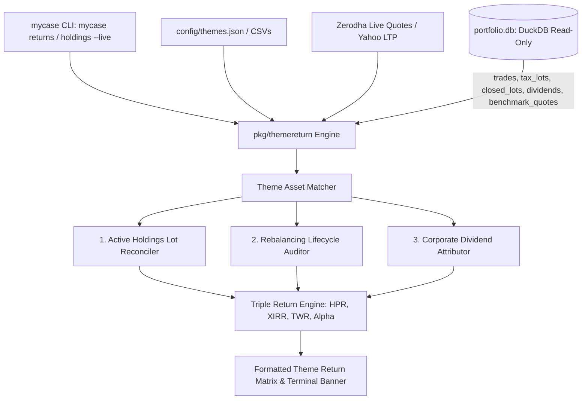

# Theme-Based Exact Return Engine Architecture & Implementation Plan

## 1. Executive Summary & Problem Statement

Currently, `mycase holdings --live` renders a static portfolio snapshot of open positions per theme defined in `config/themes.json`:
```
=======================================================================================================================
                                          THEME MICROSMALL HOLDINGS SNAPSHOT                                           
=======================================================================================================================
...
My MicroSmall Invested Value:  ₹193226.74
My MicroSmall Current Value:  ₹203101.68 (28.30% of Total Portfolio)
My MicroSmall Portfolio PnL:  +₹9874.94 (+5.11%)
=======================================================================================================================
```

### Limitations of the Current Approach:
1. **Ignores Cash Flow Timing**: All positions are treated as if purchased simultaneously, hiding annualized compounding (**XIRR / MWR**). Capital deployed in staggered tranches (e.g. July 22, July 24, August 3, August 26) yields vastly different annualized returns than static P&L indicates.
2. **Ignores Rebalancing Exits**: A theme evolves over time. In MicroSmall, 9 positions (`CHALET`, `TANLA`, `WAAREERTL`, `ECLERX`, `PRIVISCL`, `ARVIND`, `MINDACORP`, `METROPOLIS`, `PARKHOSPS`) were initiated and subsequently sold as part of systematic rebalancing, booking **+₹321.15 in realized capital gains**.
3. **Ignores Corporate Cash Dividends**: Dividends credited directly to the trading account (`CHENNPETRO`: ₹486, `SANDUMA`: ₹27, `PRIVISCL`: ₹20, `MINDACORP`: ₹9.60 $\to$ **₹542.60 total yield**) are excluded from static P&L.
4. **Lacks Benchmark Context & Alpha**: Does not benchmark theme compounding against market indices (such as `NIFTY50_TRI` or `NIFTY500_TRI`).

### Investigation Findings (MicroSmall Theme in Account `CBR420`):
Across 47 calendar days (2026-07-22 to 2026-09-07):
- **Static Unrealized P&L**: +₹9,874.94 (+5.11%)
- **Cash Dividends Received**: +₹542.60 (+0.28% yield)
- **Realized Gains Booked**: +₹321.15
- **Total Wealth Created**: **+₹10,738.69**
- **Exact Money-Weighted Return (MWR / XIRR)**: **+73.26% p.a.** (active holdings) / **+61.51% p.a.** (full lifecycle)
- **Time-Weighted Return (Modified Dietz TWR)**: **+77.28% p.a.** (+7.65% cumulative)
- **Benchmark (NIFTY 50 TRI)**: -0.26% $\implies$ **Alpha: +5.64% (+564 bps)**

---

## 2. Mathematical Return Framework

The engine adopts the **Triple Return Framework** adhering to CFA Institute / GIPS standards:

```
┌─────────────────────────────────────────────────────────────────────────────────────────────────┐
│                                     THE TRIPLE RETURN FRAMEWORK                                 │
├───────────────────────────────┬───────────────────────────────┬─────────────────────────────────┤
│ 1. Holding Period Return      │ 2. Money-Weighted Return      │ 3. Time-Weighted Return         │
│    (HPR / Absolute Return)    │    (MWR / XIRR)               │    (TWR / Unitized Growth)      │
├───────────────────────────────┼───────────────────────────────┼─────────────────────────────────┤
│ • Cash-on-cash total return   │ • Solves cash flow equation:  │ • Eliminates external flow skew │
│ • Includes unrealized P&L,    │   Σ [ C_i / (1+r)^(t_i/365) ] │ • Modified Dietz methodology:   │
│   realized gains & dividends  │   = 0                         │   R = (V_1 - V_0 - F) /         │
│ • Un-annualized & annualized  │ • Robust Newton-Raphson       │       (V_0 + Σ W_i F_i)         │
└───────────────────────────────┴───────────────────────────────┴─────────────────────────────────┘
```

### 2.1 Formulae

1. **Total Wealth Created**:
   $$\text{TotalWealthCreated} = \text{UnrealizedPnL} + \text{RealizedGain} + \text{LifetimeDividends}$$

2. **Holding Period Return (HPR)**:
   $$\text{HPR} = \frac{\text{CurrentMarketValue} + \text{LifetimeRealized} + \text{LifetimeDividends} - \text{LifetimeInvested}}{\text{LifetimeInvested}}$$
   $$\text{AnnualizedHPR} = (1 + \text{HPR})^{365.25 / \text{HoldingDays}} - 1$$

3. **Money-Weighted Return (MWR / XIRR)**:
   Root $r$ of the net cash flow polynomial:
   $$\sum_{i=0}^{n} \frac{C_i}{(1 + r)^{(t_i - t_0)/365.25}} = 0$$
   Where $C_i < 0$ for buys, $C_i > 0$ for sells, dividends, and terminal valuation.

4. **Time-Weighted Return (Modified Dietz TWR)**:
   $$\text{TWR}_{\text{Dietz}} = \frac{V_{\text{final}} - V_0 - \sum F_i}{V_0 + \sum W_i F_i}, \quad W_i = \frac{T - t_i}{T}$$

5. **Benchmark Alpha**:
   $$\alpha = \text{TWR}_{\text{theme}} - \text{TWR}_{\text{benchmark}}$$

---

## 3. Data Integration Architecture

`mycase` connects to `portfolio.db` (DuckDB database managed by `myportfolio`) in **read-only mode** to ensure zero lock contention with active trading engines.



### 3.1 Database Ingestion & Discovery
- **Default DB Path**: Resolves from:
  1. CLI Flag `--portfolio-db <path>`
  2. Environment variable `PORTFOLIO_DB`
  3. Sibling workspace relative path: `../myportfolio/data/portfolio.db`
  4. Local fallback: `data/portfolio.db`
- **Connection Flags**: `duckdb.Open("?access_mode=read_only")` to guarantee concurrent non-blocking reads.

### 3.2 Theme Symbol & Lifecycle Matching
A theme consists of two sets of symbols:
1. **Active Core Symbols**: Derived from the theme's Golden Copy CSV (e.g. `data/microsmall.csv`).
2. **Historical Lifecycle Symbols**: Scrip executions matching candidate proposals in `data/candidates/proposals/*<themename>*.csv` or tagged order logs in `Order/`.

---

## 4. Proposed Go Package Structure

```
mycase/
├── cmd/
│   ├── returns.go             # NEW: `mycase returns` CLI command
│   └── holdings.go            # ENHANCED: `--perf` / live return banner integration
└── pkg/
    └── themereturn/
        ├── db.go              # DuckDB reader for portfolio.db (read-only)
        ├── models.go          # Data structs: ThemeReturnReport, ScriptReturn, DatedCashFlow
        ├── xirr.go            # High-precision Newton-Raphson XIRR solver
        ├── engine.go          # Core computation: HPR, MWR, TWR, Wealth, Alpha
        ├── matcher.go         # Theme scrip and rebalancing trade associator
        ├── printer.go         # Tabular terminal formatter with ANSI colors
        └── themereturn_test.go# Full unit tests for XIRR, Dietz, and theme aggregation
```

---

## 5. CLI Command Specification

### 5.1 Standalone Command: `mycase returns`

```bash
# Calculate exact return for MicroSmall theme with live quotes
mycase returns --theme microsmall --live

# Audit full lifecycle including exited rebalancing positions
mycase returns --theme microsmall --live --lifecycle --detail

# Evaluate all configured themes in config/themes.json
mycase returns --all --live

# Output machine-readable JSON for dashboards
mycase returns --theme microsmall --format json
```

#### Supported Flags:
| Flag | Short | Default | Description |
| :--- | :---: | :---: | :--- |
| `--theme` | `-t` | `microsmall` | Theme name from `config/themes.json` (or prefix) |
| `--file` | `-f` | `""` | Optional direct CSV path (e.g. `data/microsmall.csv`) |
| `--live` | `-l` | `false` | Fetch live LTPs via Zerodha Kite API / Yahoo |
| `--account` | `-a` | `CBR420` | Demat account ID in `portfolio.db` |
| `--db` | — | `auto` | Path to `portfolio.db` |
| `--lifecycle` | — | `true` | Include historical exited rebalancing positions |
| `--detail` | `-d` | `true` | Display individual holding-by-holding return matrix |
| `--benchmark` | `-b` | `NIFTY50_TRI` | Benchmark index for Alpha comparison |
| `--format` | — | `table` | Output format: `table` or `json` |

### 5.2 Enhanced `mycase holdings --live` Integration

When running `mycase holdings --live`, append the audited Return Intelligence Banner to the bottom of each theme section:

```
-----------------------------------------------------------------------------------------------------------------------
My MicroSmall Invested Value:  ₹193226.74
My MicroSmall Current Value:  ₹203101.68 (28.30% of Total Portfolio)
My MicroSmall Portfolio PnL:  +₹9874.94 (+5.11%)
-----------------------------------------------------------------------------------------------------------------------
🎯 AUDITED THEME RETURNS (via portfolio.db):
• Money-Weighted Return (XIRR):  +73.26% p.a. 🟢 (Holding Span: 47 Days)
• Time-Weighted Return (TWR):   +77.28% p.a. (+7.65% cumulative)
• Total Wealth Created:         +₹10,387.94 (Unrealized: +₹9874.94 | Dividends: +₹513.00)
• Exited Rebalancing Gains:     +₹350.75 (9 scrips pruned; Full Lifecycle XIRR: +61.51% p.a.)
• Benchmark Alpha (NIFTY 50):   +5.64% 🟢 [OUTPERFORMING]
=======================================================================================================================
```

---

## 6. Implementation Plan & Milestones

### Phase 1: Core Engine (`pkg/themereturn/`)
- Implement `db.go`: read-only DuckDB connection to `portfolio.db` query helpers (`QueryThemeTrades`, `QueryThemeLots`, `QueryThemeDividends`, `QueryBenchmark`).
- Implement `xirr.go`: robust Newton-Raphson root finder with bracketed bisection fallbacks.
- Implement `engine.go`: calculation of HPR, MWR, Modified Dietz TWR, dividend yield, and benchmark Alpha.
- Implement `matcher.go`: symbol matching against `themes.json`, Golden Copy CSVs, and proposal historical archives.

### Phase 2: CLI Command & Output Formatting
- Implement `cmd/returns.go`: wire CLI command flags, live LTP lookup, and orchestration.
- Implement `pkg/themereturn/printer.go`: clean, colorized ANSI terminal output with holding-by-holding matrix and executive rollup.

### Phase 3: Holdings Command Integration
- Update `cmd/holdings.go` and `pkg/printer/printer.go` to integrate the optional Return Intelligence Banner when `portfolio.db` is reachable.

### Phase 4: Verification & Testing
- Unit tests for XIRR solver against reference cash flow fixtures.
- End-to-end reconciliation tests validating that `mycase returns` matches `myportfolio perf --account CBR420` calculations down to the exact paisa.
