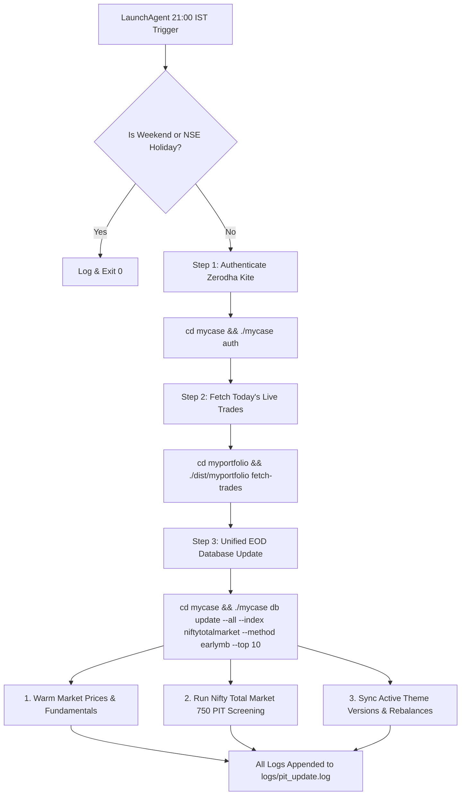

# Theme Lifecycle Database & Daily Automation Architecture

This document describes how theme lifecycle history, versioning, constituent turnover, and daily trade ingestion are managed within `data/mycase.db` and automated via `scripts/daily_sync.sh`.

---

## 1. Domain Architecture & Separation of Concerns

Theme management is partitioned into clean, decoupled layers:

1. **Broker Execution & Trade Accounting (`myportfolio`)**:
   - Location: `/Users/raghavgarg/Projects/myGo/myportfolio`
   - Database: `../myportfolio/data/portfolio.db`
   - Purpose: Ingests raw Zerodha trades (`fetch-trades`), computes FIFO capital gains tax lots, and maintains real broker cash/demat holdings.
2. **Strategy Engine & Theme Rebalancing (`mycase`)**:
   - Location: `/Users/raghavgarg/Projects/myGo/mycase`
   - Database: `data/mycase.db`
   - Purpose: Evaluates quant models (earlyMB, multibagger), optimizes target weights, tracks theme constituent versions, and audits historical rebalance turnover.

---

## 2. Theme Tables in `data/mycase.db`

### Table: `theme_rebalances`
Tracks discrete portfolio rebalance events (e.g. `v1`, `v2`, ... `v22`):
```sql
CREATE TABLE IF NOT EXISTS theme_rebalances (
    id                VARCHAR PRIMARY KEY,
    theme             VARCHAR NOT NULL,
    version           INTEGER NOT NULL,
    rebalance_date    DATE NOT NULL,
    run_id            VARCHAR,
    source            VARCHAR NOT NULL,
    turnover          DOUBLE,
    created_at        TIMESTAMP DEFAULT CURRENT_TIMESTAMP
);
```

### Table: `theme_history`
Stores the exact point-in-time constituent roster, weights, and turnover actions (`NEW`, `REMOVED`, `INCREASED`, `DECREASED`, `UNCHANGED`) for every rebalance version:
```sql
CREATE TABLE IF NOT EXISTS theme_history (
    id             VARCHAR PRIMARY KEY,
    theme          VARCHAR NOT NULL,
    version        INTEGER NOT NULL,
    symbol         VARCHAR NOT NULL,
    weight         DOUBLE NOT NULL,
    action         VARCHAR NOT NULL,
    prior_weight   DOUBLE,
    rebalance_date DATE NOT NULL,
    created_at     TIMESTAMP DEFAULT CURRENT_TIMESTAMP
);
```

---

## 3. Daily 9:00 PM Automation (`scripts/daily_sync.sh`)

Post-market daily execution is automated via macOS LaunchAgent (`com.mycase.daily_sync.plist`) triggering `scripts/daily_sync.sh` at **21:00 IST (9:00 PM)** Monday through Friday.

### Execution Workflow:


### Script Implementation (`scripts/daily_sync.sh`):
```bash
#!/bin/zsh
set -euo pipefail

PROJECT_DIR="/Users/raghavgarg/Projects/myGo/mycase"
cd "$PROJECT_DIR"
export PATH="/Users/raghavgarg/go/bin:/opt/homebrew/bin:/usr/local/bin:$PATH"

LOG_DIR="$PROJECT_DIR/logs"
mkdir -p "$LOG_DIR"
LOG_FILE="$LOG_DIR/pit_update.log"

# Skip weekends and NSE trading holidays
# ... (holiday calendar validation) ...

# 4. Authenticate with broker (Zerodha Kite)
echo "[$(date '+%Y-%m-%d %H:%M:%S')] Authenticating broker session (mycase auth)..." >> "$LOG_FILE"
cd "$PROJECT_DIR"
./mycase auth >> "$LOG_FILE" 2>&1

# 5. Fetch today's executed trades into myportfolio
PORTFOLIO_DIR="/Users/raghavgarg/Projects/myGo/myportfolio"
if [ -d "$PORTFOLIO_DIR" ] && [ -x "$PORTFOLIO_DIR/dist/myportfolio" ]; then
    echo "[$(date '+%Y-%m-%d %H:%M:%S')] Fetching today's trades into myportfolio..." >> "$LOG_FILE"
    cd "$PORTFOLIO_DIR"
    ./dist/myportfolio fetch-trades >> "$LOG_FILE" 2>&1
else
    echo "[$(date '+%Y-%m-%d %H:%M:%S')] WARNING: myportfolio directory or binary not found. Skipping trade fetch." >> "$LOG_FILE"
fi

# 6. Run the unified EOD database update (Market Data Cache, PIT Quant Research, and Theme Lifecycle)
echo "[$(date '+%Y-%m-%d %H:%M:%S')] Starting unified EOD database update for data/mycase.db..." >> "$LOG_FILE"
cd "$PROJECT_DIR"
./mycase db update --all --index niftytotalmarket --method earlymb --top 10 >> "$LOG_FILE" 2>&1
```

---

## 4. Key CLI Commands

| Action | Command | Description |
|---|---|---|
| **View Theme Roster** | `mycase theme show microsmall` | Displays the active constituent roster, current weights, and action tags for a theme. |
| **View Theme History** | `mycase theme history microsmall` | Lists chronological rebalance versions, dates, sources, and constituent turnover. |
| **Sync Themes from Files** | `mycase theme sync` | Scans proposal CSVs and golden copies to backfill rebalance events into `data/mycase.db`. |
| **Manual Single EOD Run** | `mycase --database --update` | Manually triggers the complete post-market update across cache, PIT, and themes. |
