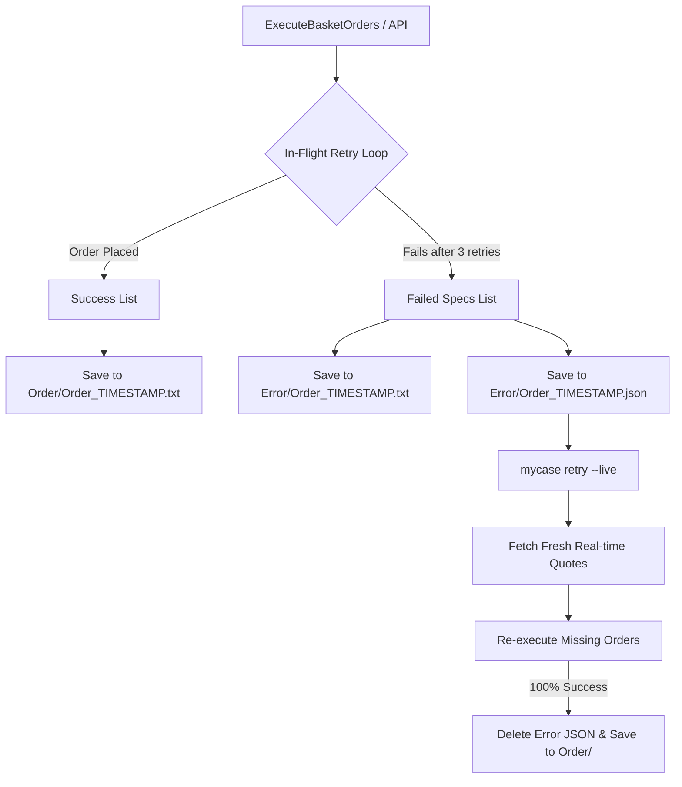

# Order Execution Rate Limiting & Failure Recovery Architecture (`executorError.md`)

This document outlines the root cause analysis, architecture, implementation details, and operational commands for handling order placement errors, API rate-limiting, split logging, and automated retry management in `mycase`.

---

## 1. The Incident & Error Analysis

### What Error Occurred?
During a live basket execution of 18 orders via Zerodha Kite, 10 orders succeeded and 8 orders failed with the error:
```text
Error placing order for JAMNAAUTO: Maximum allowed order requests per second exceeded.
Error placing order for METROPOLIS: Maximum allowed order requests per second exceeded.
...
```

### Why Did It Happen?
1. **Zerodha Rate Limits**: Zerodha Kite Connect enforces a strict limit of **10 order placement requests per second** (`PlaceOrder` / `PlaceGTT`).
2. **Un-throttled Loop Execution**: The initial order execution loop placed orders in tight succession without delay (~1ms between calls). After the 10th order was placed within the same second, Zerodha rejected all subsequent order requests (orders 11–18).

---

## 2. What We Implemented

To solve this issue and ensure zero order loss, we implemented a 5-layer execution & recovery architecture:

1. **Rate Limiting Throttle**: Inserted an explicit `200ms` delay (`time.Sleep(200 * time.Millisecond)`) between order placements, capping execution speed at ~5 orders/second (well below Zerodha's 10 req/s limit).
2. **In-Flight Auto-Retry**: Built-in automatic retry (up to 3 attempts with 500ms backoff) for transient API errors before declaring an order as failed.
3. **Split Logging (`Order/` vs `Error/`)**:
   - **`Order/Order_<timestamp>.txt`**: Contains ONLY successfully placed orders (Zerodha Order ID, filled price, timestamp).
   - **`Error/Order_<timestamp>.txt`**: Contains human-readable details of failed orders.
   - **`Error/Order_<timestamp>.json`**: Temporary machine-readable JSON payload storing unfulfilled order specifications.
4. **Fresh Quote Refresh on Retry**: When retrying orders, `mycase` fetches real-time market prices (`yfinance` or Zerodha API) to avoid stale limit price slippage.
5. **Automated Cleanup & CLI Shortcut**:
   - Running `./dist/mycase retry --live` automatically targets the latest JSON retry payload in `Error/`.
   - Upon 100% successful placement of remaining orders, `Error/*.json` is automatically deleted, and success details are logged to `Order/Order_retry_<timestamp>.txt`.

---

## 3. How We Implemented It (Code Architecture)



### Component Breakdown

#### 1. Core Executor ([pkg/executor/executor.go](file:///Users/raghavgarg/Projects/myGo/mycase/pkg/executor/executor.go))
- **`placeOrderWithRetry` & `placeGTTWithRetry`**: Wraps broker order calls with a 3-attempt loop and 500ms backoff.
- **`ExecuteBasketOrders`**: Iterates through basket orders with `200ms` throttling. Splits results into `successLines` and `failedSpecs`. Prompts user for immediate interactive retry if errors occur.
- **`SaveSuccessLog`**: Writes success reports to `Order/Order_<timestamp>.txt`.
- **`SaveErrorLog`**: Writes error summaries to `Error/Order_<timestamp>.txt` and temporary retry JSON payload `Error/Order_<timestamp>.json`.
- **`ExecuteRetryPayload`**: Loads `.json` error payloads, fetches real-time prices via `yfinance.FetchQuotes` or Zerodha, re-submits orders with rate limiting, logs success, and deletes `.json` upon 100% completion.
- **`FindLatestErrorPayload`**: Scans `Error/` directory and picks the newest `.json` payload automatically.

#### 2. CLI Command ([cmd/retry.go](file:///Users/raghavgarg/Projects/myGo/mycase/cmd/retry.go))
- Registers `mycase retry [path/to/Order_*.json]` with `--live` flag support.
- If no argument is provided, automatically calls `FindLatestErrorPayload()` to resolve `--latest`.

#### 3. Web Dashboard Integration ([pkg/server/handlers.go](file:///Users/raghavgarg/Projects/myGo/mycase/pkg/server/handlers.go))
- `handleExecute` (`POST /api/portfolio/{name}/execute`): Emits split logs to `Order/` and `Error/`.
- `handleRetry` (`POST /api/portfolio/{name}/retry`): Triggers async execution of the latest retry payload.

---

## 4. Operational Guide

### Retrying Failed Orders Live
To retry unfulfilled orders from the most recent failure payload:

```bash
./dist/mycase retry --live
```

To retry a specific error file payload:

```bash
./dist/mycase retry Error/Order_260722_092229.json --live
```

### Dry-Run / Mock Testing
To test retry logic without placing live orders:

```bash
./dist/mycase retry
```
