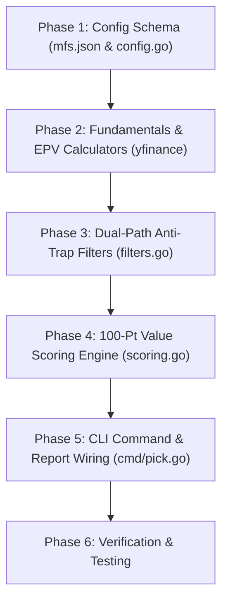

# Implementation Plan: Large-Cap Value Strategy (`docs/value_impl.md`)

This document outlines the step-by-step technical implementation plan for integrating the **Large-Cap Value Strategy** ([docs/value.md](file:///Users/raghavgarg/Projects/myGo/mycase/docs/value.md)) into the `mycase` Go codebase.

---

## 1. Architectural Overview & Design Goals

The implementation will introduce the `"value"` strategy method alongside the existing `"multibagger"` and multi-factor strategies. 

### Key Modules Impacted:
* [config/mfs.json](file:///Users/raghavgarg/Projects/myGo/mycase/config/mfs.json): Strategy filter parameters and scoring weight definitions.
* [pkg/yfinance/yfinance.go](file:///Users/raghavgarg/Projects/myGo/mycase/pkg/yfinance/yfinance.go): Intrinsic value (EPV), Shiller CAPE Yield, and BFSI asset quality helper calculations.
* [pkg/config/config.go](file:///Users/raghavgarg/Projects/myGo/mycase/pkg/config/config.go): Go struct mappings for new hard filter parameters (`MinSalesCAGR3Y`, `MaxNetNPA`, `MinCAR`, `MinROA`, `EPVMOSFloor`, `ScoreWeightEPVMOS`, etc.).
* [pkg/stockpicker/filters.go](file:///Users/raghavgarg/Projects/myGo/mycase/pkg/stockpicker/filters.go): Dual-Path (Industrial vs. BFSI) anti-trap eligibility filtering in `isEligible`.
* [pkg/stockpicker/scoring.go](file:///Users/raghavgarg/Projects/myGo/mycase/pkg/stockpicker/scoring.go): 100-Point dynamic Min-Max relative scoring matrix (`ScoreValue`) with shareholder yield tie-breaker.
* [cmd/pick.go](file:///Users/raghavgarg/Projects/myGo/mycase/cmd/pick.go): CLI integration to allow `--method value`.

---

## 2. Step-by-Step Implementation Roadmap



---

## 3. Detailed Component Plan

### Phase 1: Configuration Schema Updates
#### 1. Modify [config/mfs.json](file:///Users/raghavgarg/Projects/myGo/mycase/config/mfs.json)
Add the `"value"` strategy configuration block under `filters` and `strategies`:

```json
{
  "filters": {
    "value": {
      "min_market_cap": 200000000000,
      "max_market_cap": 50000000000000,
      "min_adv": 100000000,
      "min_cfo_pat": 0.70,
      "max_debt_to_equity": 0.80,
      "min_interest_coverage": 4.0,
      "min_roce": 0.12,
      "min_roe": 0.12,
      "max_net_npa": 0.015,
      "min_car": 0.15,
      "min_roa": 0.012,
      "min_200day_sma_ratio": 0.85,
      "max_stocks_per_sector": 3,
      "max_sector_weight_cap": 0.25,
      "max_stock_weight_cap": 0.10,
      "score_weight_epv_mos": 15.0,
      "score_weight_5y_val_percentile": 10.0,
      "score_weight_sector_zscore": 10.0,
      "score_weight_shiller_yield": 10.0,
      "score_weight_cash_realization": 15.0,
      "score_weight_fcf_yield": 10.0,
      "score_weight_shareholder_yield": 10.0,
      "score_weight_smart_money_delta": 10.0,
      "score_weight_margin_inflection": 10.0
    }
  }
}
```

#### 2. Update [pkg/config/config.go](file:///Users/raghavgarg/Projects/myGo/mycase/pkg/config/config.go)
Extend the `HardFilters` struct with fields for the new Value Strategy settings:
* `MinSalesCAGR3Y float64`
* `MaxNetNPA float64`
* `MinCAR float64`
* `MinROA float64`
* `Min200DaySMARatio float64`
* `ScoreWeightEPVMOS float64`
* `ScoreWeight5YValPercentile float64`
* `ScoreWeightSectorZScore float64`
* `ScoreWeightShillerYield float64`
* `ScoreWeightCashRealization float64`
* `ScoreWeightFCFYield float64`
* `ScoreWeightShareholderYield float64`
* `ScoreWeightSmartMoneyDelta float64`
* `ScoreWeightMarginInflection float64`

---

### Phase 2: Fundamental Valuation & BFSI Helpers (`pkg/yfinance/`)

Add the following quantitative calculation functions to [pkg/yfinance/yfinance.go](file:///Users/raghavgarg/Projects/myGo/mycase/pkg/yfinance/yfinance.go):

1. **`CalculateEPV(f *Fundamentals, wacc float64) (float64, float64, bool)`**
   - Calculates 3-Year Average EBIT, NOPAT, and Earnings Power Value ($\text{EPV}$).
   - Computes Margin of Safety: $\text{MOS \%} = 1 - \frac{\text{Enterprise Value}}{\text{EPV}}$.

2. **`CalculateShillerYield(f *Fundamentals) (float64, bool)`**
   - Calculates Shiller CAPE Yield ($\text{3-Year Average EPS} / \text{Price}$).

3. **`IsFinancialSector(sector string) bool`**
   - Utility identifying if a stock belongs to Banks, NBFCs, Insurance, or Financial Services.

4. **`CalculateShareholderYield(f *Fundamentals) float64`**
   - Sums Dividend Yield % + Net Share Buyback Yield %.

---

### Phase 3: Dual-Path Anti-Trap Eligibility Engine (`pkg/stockpicker/filters.go`)

Update `isEligible` in [pkg/stockpicker/filters.go](file:///Users/raghavgarg/Projects/myGo/mycase/pkg/stockpicker/filters.go) to handle `method == "value"`:

1. **Size & Liquidity Filter**: Market Cap $\ge$ ₹20,000 Cr, ADV $\ge$ ₹10 Cr.
2. **Dual-Path Routing**:
   - **Financial Path (BFSI)**: Check Net NPA $\le 1.5\%$, CAR $\ge 15\%$, ROA $\ge 1.2\%$, ROE $\ge 12\%$.
   - **Industrial Path (Non-BFSI)**: Check Debt-to-Equity $\le 0.8$, Interest Coverage $\ge 4.0\text{x}$, CFO/PAT $\ge 70\%$, ROCE $\ge 12\%$.
3. **Trend Stability Floor**: Close $\ge 0.85 \times \text{200-SMA}$.
4. **Pledging Check**: Promoter Pledging $< 1\%$.

---

### Phase 4: 100-Point Relative Scoring Engine (`pkg/stockpicker/scoring.go`)

Implement **`ScoreValue`** in [pkg/stockpicker/scoring.go](file:///Users/raghavgarg/Projects/myGo/mycase/pkg/stockpicker/scoring.go):

1. **Compute Raw Indicators**:
   - EPV Margin of Safety ($\text{MOS}$) / Bank $\text{P/ABV}$.
   - 5Y Valuation Percentile Rank.
   - Sector-Adjusted Multiple Z-Score.
   - Shiller CAPE Yield.
   - Cash Realization ($\text{CFO}/\text{PAT}$) / Bank Net NPA.
   - FCF Yield ($\text{FCF}/\text{EV}$).
   - Total Shareholder Yield.
   - Institutional Stake Delta ($\Delta(\text{FII \%} + \text{DII \%})$).
   - Operating Margin Inflection Spread.

2. **Min-Max Cohort Normalization**:
   - Normalize indicators between 0 and their pillar weights.

3. **Tie-Breaker Logic**:
   - Tie-breaking by **Total Shareholder Yield**.

---

### Phase 5: Selection & Weight Normalization (`pkg/stockpicker/scoring.go`)

Implement **`SelectTopNValue`** and **`NormalizeValueWeights`**:
* Enforces **Max 3 stocks per sector**.
* Enforces **Max 25% single sector weight cap**.
* Enforces **Max 10% single stock weight cap**.

---

### Phase 6: CLI & Report Integration (`cmd/pick.go`)

1. Update `cmd/pick.go` to accept `--method value`.
2. Update portfolio report printer to generate `value` portfolio explanation reports detailing EPV MOS, 5Y Band Percentiles, and Shareholder Yields.

---

## 4. Verification & Testing Plan

### Automated Tests
Run Go unit tests across stockpicker modules:
```bash
go test -v ./pkg/config/...
go test -v ./pkg/stockpicker/...
go test -v ./pkg/yfinance/...
```

### Manual Verification Commands
Execute the compiled binary against Indian indices:
```bash
# 1. Screen Nifty 50 for Top 5 Large-Cap Value stocks
./dist/mycase pick --index nifty50 --method value --top 5

# 2. Screen Nifty 100 for Top 10 Large-Cap Value stocks
./dist/mycase pick --index nifty100 --method value --top 10

# 3. Verify output CSV generated in data/ directory
cat data/stockpicker_nifty50_value.csv
```
