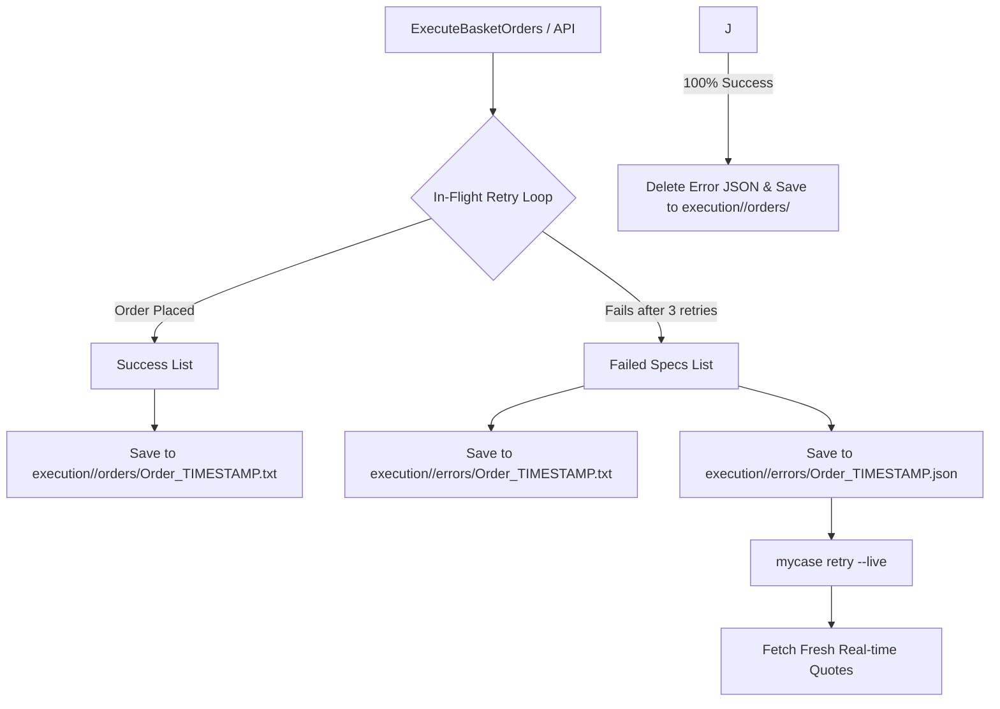

# Order Execution & Retry

Order placement is rate-limited and failure-recovering: it paces requests under the
broker's per-second ceiling, retries transient failures, splits success/failure logs, and
can resume a partially-failed basket without re-placing filled orders. This chapter covers
that architecture and its operational commands (`pkg/executor`, `cmd/retry`).

---

## 1. The rate-limit constraint

Zerodha Kite Connect enforces a strict **10 order-placement requests per second** ceiling
(`PlaceOrder` / `PlaceGTT`); Schwab has its own order limits. An un-throttled placement loop
that fires orders in tight succession (~1ms apart) exhausts the per-second budget after the
tenth order, and the broker rejects the remainder of the basket with:

```text
Maximum allowed order requests per second exceeded.
```

The execution layer exists to place a full basket without ever tripping that ceiling, and
to recover cleanly when an individual order still fails.

---

## 2. The execution & recovery architecture

A 5-layer design ensures zero order loss:

1. **Rate Limiting Throttle**: An explicit `200ms` delay (`time.Sleep(200 * time.Millisecond)`) between order placements caps execution at ~5 orders/second, well below Zerodha's 10 req/s limit.
2. **In-Flight Auto-Retry**: Automatic retry (up to 3 attempts with 500ms backoff) for transient API errors before an order is declared failed.
3. **Split Logging (`execution/<market>/orders/` vs `execution/<market>/errors/`)**:
   - **`execution/<market>/orders/Order_<timestamp>.txt`**: ONLY successfully placed orders (Zerodha/Schwab Order ID, filled price, timestamp).
   - **`execution/<market>/errors/Order_<timestamp>.txt`**: human-readable details of failed orders.
   - **`execution/<market>/errors/Order_<timestamp>.json`**: machine-readable JSON payload storing unfulfilled order specifications.
4. **Fresh Quote Refresh on Retry**: Retrying orders fetches real-time market prices (`yfinance` or broker API) to avoid stale limit-price slippage.
5. **Automated Cleanup & CLI Shortcut**:
   - `mycase retry --live` automatically targets the latest JSON retry payload in `execution/<market>/errors/` (with fallback to legacy paths).
   - On 100% successful placement of the remaining orders, `execution/<market>/errors/*.json` is deleted and success details are logged to `execution/<market>/orders/Order_retry_<timestamp>.txt`.

---

## 3. How We Implemented It (Code Architecture)



### Component Breakdown

#### 1. Core Executor ([pkg/executor/executor.go](../pkg/executor/executor.go))
- **`placeOrderWithRetry` & `placeGTTWithRetry`**: Wraps broker order calls with a 3-attempt loop and 500ms backoff.
- **`ExecuteBasketOrders`**: Iterates through basket orders with `200ms` throttling. Splits results into `successLines` and `failedSpecs`. Prompts user for immediate interactive retry if errors occur.
- **`SaveSuccessLog`**: Writes success reports to `Order/Order_<timestamp>.txt`.
- **`SaveErrorLog`**: Writes error summaries to `Error/Order_<timestamp>.txt` and temporary retry JSON payload `Error/Order_<timestamp>.json`.
- **`ExecuteRetryPayload`**: Loads `.json` error payloads, fetches real-time prices via `yfinance.FetchQuotes` or Zerodha, re-submits orders with rate limiting, logs success, and deletes `.json` upon 100% completion.
- **`FindLatestErrorPayload`**: Scans `Error/` directory and picks the newest `.json` payload automatically.

#### 2. CLI Command ([cmd/retry.go](../cmd/retry.go))
- Registers `mycase retry [path/to/Order_*.json]` with `--live` flag support.
- If no argument is provided, automatically calls `FindLatestErrorPayload()` to resolve `--latest`.

#### 3. Web Dashboard Integration ([pkg/server/handlers.go](../pkg/server/handlers.go))
- `handleExecute` (`POST /api/portfolio/{name}/execute`): Emits split logs to `Order/` and `Error/`.
- `handleRetry` (`POST /api/portfolio/{name}/retry`): Triggers async execution of the latest retry payload.

---

## 4. Operational Guide

### Retrying Failed Orders Live
To retry unfulfilled orders from the most recent failure payload:

```bash
./dist/mycase retry --live
```

To retry a specific error file payload:

```bash
./dist/mycase retry Error/Order_260722_092229.json --live
```

### Dry-Run / Mock Testing
To test retry logic without placing live orders:

```bash
./dist/mycase retry
```
