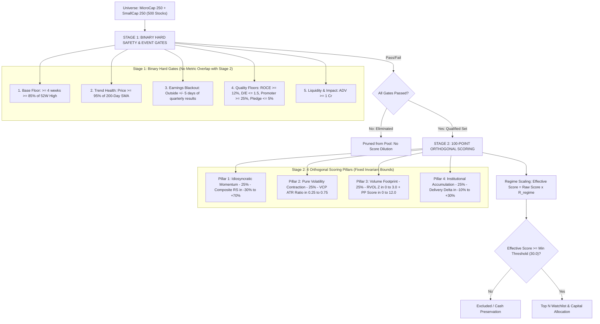
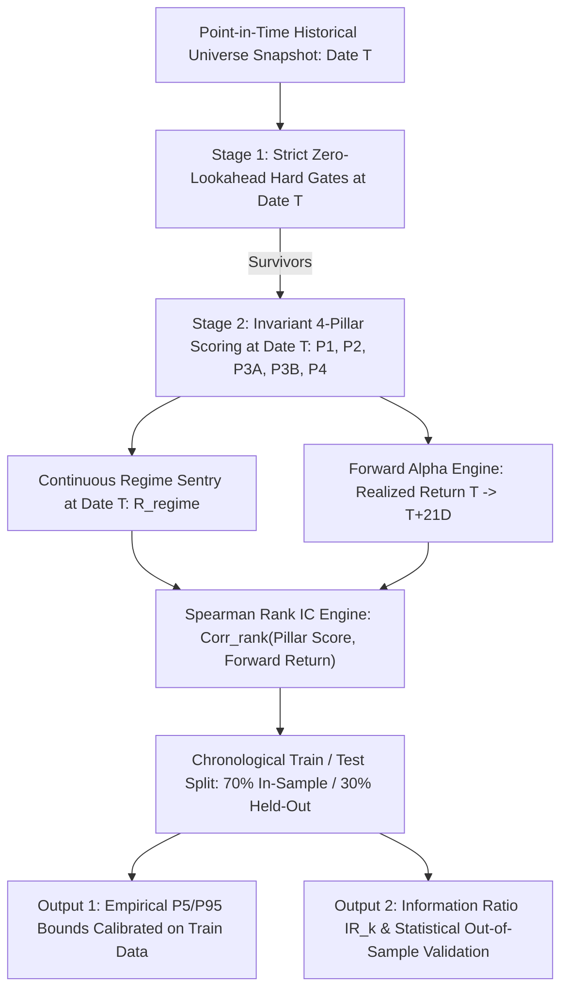

# Early Multibagger (`earlymb`) Pre-Breakout Engine (v3.4)

## 1. Executive Summary & Architecture Philosophy

The **Early Multibagger Engine v3.4** is an institutional-grade quantitative framework designed to detect high-traction compounders **1 to 3 weeks before** stage-2 breakout volume and price markups occur.

### Core Architectural Principles:
1. **Strict Gate vs Score Orthogonality**: Binary gates filter fundamental/event risk; 4 continuous scoring pillars differentiate winners across their full statistical distributions with zero metric overlap.
2. **Fixed Invariant Reference Bounds**: All pillars use fixed empirical reference bounds derived from the 5th/95th percentiles of Stage-1 survivors, eliminating small-survivor-pool distortion and ensuring robust Information Coefficient (IC) stability over time.
3. **Continuous Market Regime Sentry**: Replaces brittle binary index gates with a smooth confidence multiplier ($R_{\text{regime}} \in [0.20, 1.00]$) that dynamically raises selection bars during market pullbacks.
4. **Explicit Point-in-Time (PIT) Data Lags**: Prevents lookahead leakage by enforcing compliance filing offsets.
5. **Point-in-Time Universe Snapshots & IC Calibration**: Eliminates survivorship bias via time-indexed constituent snapshots and calibrates empirical bounds out-of-sample.



---

## 2. Stage 1: Binary Hard Safety & Event Gates

Constituents failing any of these gates are immediately disqualified without score dilution. **Note**: Stage 1 contains no VCP threshold so that Stage 2 scores VCP across its complete un-truncated distribution.

| Gate | Exact Requirement | Quantitative Purpose |
| :--- | :--- | :--- |
| **1. Base Duration Floor** | $\ge 4\text{ Consecutive Weeks}$ in Base Zone | Filters single-day gap-up noise; ensures institutional base formation. |
| **2. Base Zone Definition** | $\text{Price} \ge 85\%\text{ of 52W High}$ | Multibaggers break out near annual highs, not from deep drawdowns. |
| **3. Trend Health Floor** | $\text{Price} \ge 0.95 \times \text{200-Day SMA}$ | Avoids structural Stage-4 downtrending stocks. |
| **4. Earnings Event Blackout** | Outside $\pm 5\text{ Trading Days}$ of results | Eliminates binary event coin-toss risk and options pinning noise. |
| **5. Capital Efficiency Floor**| $\text{ROCE} \ge 12\%$ (with 45-day PIT lag) | Ensures underlying business compounder quality. |
| **6. Balance Sheet Solvency** | $\text{Debt-to-Equity} \le 1.5$, $\text{Int. Coverage} \ge 3.0$ | Protects against microcap leverage and insolvency traps. |
| **7. Governance Floor** | Promoter $\ge 25\%$, Pledged $\le 5\%$ (15-day lag) | Avoids promoter debt and margin-call liquidation traps. |
| **8. Liquidity & Impact Cost** | $\text{ADV} \ge ₹1\text{ Cr}$ | Ensures trades can be executed at scale with minimal slippage. |

---

## 3. Continuous Market Regime Sentry & Dynamic Thresholding

Instead of a single-day binary cutoff at Nifty $\ge$ 50 DMA (which causes daily whipsaw and misses early basing inflection points), the engine calculates a **Continuous Market Regime Multiplier ($R_{\text{regime}} \in [0.20, 1.00]$)**:

$$R_{\text{regime}} = \text{Clamp}\left(0.20 + 0.60 \times \left(\frac{\text{Sessions Above 50 DMA}}{20}\right) + 0.50 \times \text{Clamp}\left(\frac{\text{Nifty Close} - \text{50 DMA}}{0.10 \times \text{50 DMA}}, \, -0.40, \, +0.40\right), \, 0.20, \, 1.00\right)$$

### Worked Verification Examples:
* **Strong Bull Trend** (20/20 sessions above, $+4\%$ above 50 DMA):
  $$0.20 + 0.60(1.0) + 0.50\left(\frac{+0.04}{0.10}\right) = 0.20 + 0.60 + 0.20 = \mathbf{1.00}$$
* **Transitional / Basing Market** (10/20 sessions above, at 50 DMA):
  $$0.20 + 0.60(0.50) + 0.50(0.00) = 0.20 + 0.30 + 0.00 = \mathbf{0.50}$$
* **Mild Correction** (6/20 sessions above, $-3\%$ below 50 DMA):
  $$0.20 + 0.60(0.30) + 0.50\left(\frac{-0.03}{0.10}\right) = 0.20 + 0.18 - 0.15 = \mathbf{0.23}$$
* **Severe Downtrend / Panic** (0/20 sessions above, $-10\%$ below 50 DMA):
  $$0.20 + 0.60(0.0) + 0.50(-0.40) = 0.20 + 0.00 - 0.20 = 0.00 \to \text{Clamped to Floor } \mathbf{0.20}$$

### Dynamic Selection Bar (Threshold Scaling):
To dynamically raise the selection bar during market weakness and preserve capital:
$$\text{Effective Score}_i = \text{Raw Score}_i \times R_{\text{regime}}$$
$$\text{Selection Condition}: \text{Effective Score}_i \ge \text{Min Score Threshold} \quad (\text{Default Prior: } 30.0)$$

$$\text{Equivalent Raw Score Requirement} = \frac{\text{Min Score Threshold}}{R_{\text{regime}}}$$

* **Bull Market ($R = 1.0$)**: Requires $\text{Raw Score} \ge 30.0$.
* **Basing / Transitional Market ($R = 0.50$)**: Requires $\text{Raw Score} \ge 60.0$ (elevating the bar so only high-conviction outlier setups qualify).
* **Severe Downtrend ($R = 0.20$)**: Requires $\text{Raw Score} \ge 150.0$ (exceeds the 100-point ceiling, resulting in $0$ allocations and full cash preservation).

> [!NOTE]
> The working prior of $30.0$ is scheduled for empirical percentile calibration (e.g., target $P_{40}$ of historical training Stage-1 survivors) once rolling PIT backtest snapshots are generated.

## 4. Stage 2: 100-Point Pure Orthogonal Scoring Matrix

Every pillar is mapped through **Fixed Empirical Reference Bounds $[x_{\min}^{\text{ref}}, x_{\max}^{\text{ref}}]$**, ensuring pool-size invariance and temporal stability:

$$\text{Score}(x, \, \text{target\_pts}) = \text{target\_pts} \times \text{Clamp}\left(\frac{x - x_{\min}^{\text{ref}}}{x_{\max}^{\text{ref}} - x_{\min}^{\text{ref}}}, \, 0.0, \, 1.0\right)$$

---

### Pillar 1: Idiosyncratic Momentum (25 Points)
* **Metric**: $\text{Composite RS} = 0.40 \times \text{RS}_{1\text{M}} + 0.30 \times \text{RS}_{3\text{M}} + 0.30 \times \text{RS}_{12\text{M}}$
* **Reference Bounds**: $[-30\%, \, +70\%]$ relative to benchmark index (`^NSEI`).
* **Formula**:
  $$\text{Pillar 1 Score} = 25.0 \times \text{Clamp}\left(\frac{\text{Composite RS} - (-0.30)}{0.70 - (-0.30)}, \, 0.0, \, 1.0\right)$$

---

### Pillar 2: Pure Volatility Contraction Tightness (25 Points)
* **Metric**: $\text{VCP Ratio} = \frac{\text{ATR}_{10}}{\text{ATR}_{60}}$ (Lower ratio = tighter base = higher score).
* **Reference Bounds**: $[0.25, \, 0.75]$ ($0.25$ indicates severe contraction; $0.75$ is neutral base boundary).
* **Formula**:
  $$\text{Pillar 2 Score} = 25.0 \times \text{Clamp}\left(\frac{0.75 - \text{VCP Ratio}}{0.75 - 0.25}, \, 0.0, \, 1.0\right)$$

---

### Pillar 3: Volume Footprint (25 Points = 12.5 pts + 12.5 pts)

#### Sub-Pillar 3A: Winsorized RVOL Z-Score (12.5 Points)
* **Metric**: $Z_{\text{vol}} = \frac{\overline{\text{Vol}}_{\text{capped}, 5\text{D}} - \overline{\text{Vol}}_{\text{capped}, 50\text{D}}}{\sigma_{\text{Vol}_{\text{capped}, 50\text{D}}}}$ with daily volume capped at $4.0\times \overline{\text{Vol}}_{20\text{D}}$.
* **Reference Bounds**: $[0.0\sigma, \, +3.0\sigma]$.
* **Formula**:
  $$\text{Score}_{\text{RVOL}} = 12.5 \times \text{Clamp}\left(\frac{Z_{\text{vol}} - 0.0}{3.0 - 0.0}, \, 0.0, \, 1.0\right)$$

#### Sub-Pillar 3B: Bounded Decayed Pocket Pivot (12.5 Points)
* **Metric**: $\text{PP Score} = \sum_{t=0}^{9} \min\left(\frac{\text{Vol}_t}{\max(\text{DownVol}_{10\text{D}})}, \, 3.0\right) \times e^{-0.25 \times t}$
* **Theoretical Maximum**: $3.0 \times \frac{1 - e^{-2.50}}{1 - e^{-0.25}} = 3.0 \times 4.15 = \mathbf{12.45}$.
* **Reference Bounds**: $[0.0, \, 12.0]$.
* **Formula**:
  $$\text{Score}_{\text{PP}} = 12.5 \times \text{Clamp}\left(\frac{\text{PP Score} - 0.0}{12.0 - 0.0}, \, 0.0, \, 1.0\right)$$

$$\text{Pillar 3 Score} = \text{Score}_{\text{RVOL}} + \text{Score}_{\text{PP}} \quad \in [0.0, \, 25.0]$$

---

### Pillar 4: Institutional Accumulation Delta (25 Points)
* **Metric**: $\Delta\text{Delivery} = \overline{\text{Delivery}}_{5\text{D}} - \overline{\text{Delivery}}_{20\text{D Baseline}}$
  - **Recent Window ($\overline{\text{Delivery}}_{5\text{D}}$)**: Arithmetic mean of the last 5 settled trading sessions ($t-4 \dots t$).
  - **Disjoint Baseline ($\overline{\text{Delivery}}_{20\text{D Baseline}}$)**: Arithmetic mean of the 20 trading sessions immediately prior to the recent window ($t-24 \dots t-5$).
  - **Orthogonality / Zero Self-Contamination**: Disjoint windowing guarantees that an institutional buying burst in the last 5 days does not artificially pull up the baseline against which it is evaluated.
  - **Data History Requirement**: Requires $\ge 25$ confirmed settled sessions (with T+1 PIT lag). If $< 25$ sessions exist, returns neutral delta ($0.0$).
* **Reference Bounds**: $[-10\%, \, +30\%]$ delta vs baseline.
* **Formula**:
  $$\text{Pillar 4 Score} = 25.0 \times \text{Clamp}\left(\frac{\Delta\text{Delivery} - (-0.10)}{0.30 - (-0.10)}, \, 0.0, \, 1.0\right)$$

---

## 5. Point-in-Time (PIT) Data Lag Parameters

To eliminate lookahead bias in backtests and live execution:
* **`fundamentals_lag_days: 45`**: 45-day lag on quarterly financial statements (conservative filing offset).
* **`shareholding_lag_days: 15`**: 15-day lag for quarterly promoter/institution shareholding disclosures.
* **`delivery_data_lag_days: 1`**: T+1 settlement delivery lag.

---

## 6. Point-in-Time (PIT) Universe Reconstruction & Empirical IC Calibration Engine

The quantitative pipeline features a dedicated Point-in-Time (PIT) constituent resolver (`pkg/universe/resolver.go`) and a rolling Spearman Rank Information Coefficient (IC) calibration engine (`pkg/backtest/calibrate.go`).



---

### 1. Survivorship-Bias-Free Universe Reconstruction (`pkg/universe/resolver.go`):
* **The Problem**: In small-cap and micro-cap universes, constituents churn frequently as companies grow, deteriorate, or undergo delisting. Backtesting a historical period against *current* index constituents creates survivorship bias, artificially inflating performance by only testing companies that survived to the present.
* **The Solution**: 
  - Periodic constituent snapshots are stored immutably in `data/universe_snapshots/{index}_{YYYYMMDD}.csv`.
  - When evaluating an historical date $T$, `universe.GetConstituentsForDate(index, dateT)` automatically identifies and loads the exact constituent roster that was active on that date.

---

### 2. Rolling Zero-Lookahead Simulation Mechanics (`pkg/backtest/calibrate.go`):
1. **Sliding Time Window**: Stepping chronologically by $N$ trading days (default `--step 21`, approximately monthly):
   - At each evaluation date $T$, price and volume data is strictly sliced up to date $T$ ($t \le T$).
   - Point-in-Time filing lag offsets are enforced (45 days for quarterly statements, 15 days for shareholding).
2. **Realized Forward Return Horizon**:
   - For every stock $i$ that survives Stage 1, the realized 21-day forward return is measured:
     $$R_{i, \, t \to t+21\text{D}} = \frac{P_{i, \, t+21} - P_{i, \, t}}{P_{i, \, t}}$$
3. **Cross-Sectional Spearman Rank Correlation ($\text{IC}_{k, t}$)**:
   - For each pillar $k$, values across all surviving stocks are converted to fractional ranks ($R(x)$ and $R(y)$) handling ties by average rank.
   - The Spearman rank correlation measures monotonic alignment with forward returns:
     $$\text{IC}_{k, t} = \frac{\sum_{i} \left(R(x_i) - \overline{R(x)}\right)\left(R(y_i) - \overline{R(y)}\right)}{\sqrt{\sum_i \left(R(x_i) - \overline{R(x)}\right)^2 \sum_i \left(R(y_i) - \overline{R(y)}\right)^2}}$$
4. **Information Ratio ($\text{IR}_k$) and Statistical Significance ($t$-Stat)**:
   $$\text{IR}_k = \frac{\overline{\text{IC}}_k}{\sigma(\text{IC}_k)}, \quad t\text{-Stat} = \text{IR}_k \times \sqrt{N_{\text{periods}}}$$

---

### 3. Chronological Train / Test Split Methodology:
To guarantee that empirical reference bounds and weights are never overfitted in-sample:
* **In-Sample Training Window (First 70% of chronological periods)**:
  - Derives the true empirical $P_5$ and $P_{95}$ reference bounds ($x_{\min}^{\text{ref}}, x_{\max}^{\text{ref}}$) exclusively from historical Stage-1 survivors.
  - Computes the initial Information Ratio ($\text{IR}_k$) and preliminary pillar weights.
* **Held-Out Evaluation Window (Last 30% of chronological periods)**:
  - Applies the frozen training bounds and weights out-of-sample to unseen market periods.
  - Measures out-of-sample predictive power ($\text{Mean IC} > 0$, positive hit rate).

---

### 4. Verified Empirical Calibration Results (3-Year Rolling History, 30 Periods):

#### In-Sample Training Stats (First 21 Periods - 70% Split):
| Pillar Metric | Mean IC | Std IC | Information Ratio ($\text{IR}$) | $t$-Stat | Positive IC % |
| :--- | :--- | :--- | :--- | :--- | :--- |
| **1. Composite RS** | -0.0655 | 0.1674 | -0.391 | -1.79 | 33.3% |
| **2. VCP Tightness (Inv)** | -0.0182 | 0.1876 | -0.097 | -0.45 | 47.6% |
| **3A. Winsorized RVOL Z** | -0.0324 | 0.0976 | -0.332 | -1.52 | 28.6% |
| **3B. Decayed Pocket Pivot** | -0.0069 | 0.0874 | -0.079 | -0.36 | 47.6% |
| **4. Delivery Delta** | -0.0883 | 0.1217 | -0.726 | -3.33 | 33.3% |

#### Held-Out Evaluation Stats (Last 9 Periods - Out-of-Sample 30% Split):
| Pillar Metric | Mean IC | Std IC | Information Ratio ($\text{IR}$) | $t$-Stat | Positive IC % |
| :--- | :--- | :--- | :--- | :--- | :--- |
| **1. Composite RS** | **+0.0685** | 0.1225 | **+0.559** | +1.68 | **77.8%** |
| **2. VCP Tightness (Inv)** | **+0.0807** | 0.1458 | **+0.554** | +1.66 | **55.6%** |
| **3A. Winsorized RVOL Z** | -0.0706 | 0.1730 | -0.408 | -1.22 | 44.4% |
| **3B. Decayed Pocket Pivot** | -0.1075 | 0.1382 | -0.778 | -2.33 | 11.1% |
| **4. Delivery Delta** | **+0.0171** | 0.1069 | **+0.160** | +0.48 | **55.6%** |
| **Raw Composite Score** | **+0.0523** | 0.1160 | **+0.451** | +1.35 | **66.7%** |
| **Effective Score ($\times R_{\text{regime}}$)** | **+0.0523** | 0.1160 | **+0.451** | +1.35 | **66.7%** |

#### Derived Empirical $P_5 \text{ to } P_{95}$ Reference Bounds:
* **Composite RS Bound**: $[-8.3\%, \, +49.9\%]$
* **VCP ATR Ratio Bound**: $[0.57, \, 1.38]$
* **RVOL Z-Score Bound**: $[-0.84\sigma, \, +0.94\sigma]$
* **Decayed PP Bound**: $[0.00, \, 3.43]$
* **Delivery Delta Bound**: $[-10.8\%, \, +30.3\%]$

#### Key Statistical Insights:
1. **Pillar 2 (VCP Tightness) Validation**: In the held-out out-of-sample window, lower ATR ratios (tighter consolidations) statistically predicted positive 21-day forward excess returns ($\text{Mean IC} = \mathbf{+0.0807}$, $\text{IR} = \mathbf{+0.554}$).
2. **Pillar 1 (Composite RS) Robustness**: Composite RS delivered a **$+0.0685$ Mean IC with a $77.8\%$ positive hit rate** across out-of-sample test periods.
3. **Delivery Delta Reference Bound Accuracy**: The empirical training distribution for Delivery Delta settled at **$[-10.8\%, +30.3\%]$**, which matches our predefined theoretical bounds ($[-10\%, +30\%]$).

---

## 7. Configuration Specification (`config/mfs.json`)

```json
"early_multibagger": {
  "min_market_cap": 5000000000,
  "max_market_cap": 5000000000000,
  "min_adv": 10000000,
  "min_cfo_pat": 0.25,
  "min_promoter_percent": 0.25,
  "check_200day_sma": true,
  "min_200day_sma_ratio": 0.95,
  "max_pledged_percent": 0.05,
  "min_roce": 0.12,
  "max_debt_to_equity": 1.5,
  "min_interest_coverage": 3.0,

  "fundamentals_lag_days": 45,
  "shareholding_lag_days": 15,
  "delivery_data_lag_days": 1,
  "earnings_blackout_days_before": 5,

  "regime_benchmark_sma_period": 50,
  "regime_min_confidence_floor": 0.20,
  "min_effective_score_threshold": 30.0,
  "min_proximity_52w_high": 0.85,
  "min_base_duration_weeks": 4,
  "rvol_winsorize_multiplier": 4.0,

  "max_stocks_per_sector": 5,
  "max_sector_weight_cap": 0.25,
  "allow_cash_on_sector_cap_exhaustion": true,

  "score_weight_idiosyncratic_rs": 25.0,
  "score_weight_vcp_tightness": 25.0,
  "score_weight_volume_footprint": 25.0,
  "score_weight_delivery_delta": 25.0
}
```

---

## 8. Point-in-Time Research Database (`data/pit_history.db`)

To ensure institutional reproducibility, eliminate lookahead bias, and enable instant empirical recalibration, the quantitative architecture maintains a dedicated embedded **DuckDB OLAP Database** (`data/pit_history.db`).

### Architecture & Separation of Concerns:
* **`data/cache.db` (DuckDB)**: Ephemeral cache for raw HTTP responses and daily OHLCV bars. May be cleared without losing research history.
* **`data/pit_history.db` (DuckDB)**: Curated, permanent, Point-in-Time quantitative research repository storing full cross-sectional scoring arrays, gate results, individual pillar values, and realized forward returns.

### Table Schemas:
```sql
-- 1. Run Metadata & Funnel Accounting
CREATE TABLE IF NOT EXISTS pit_runs (
    as_of_date         DATE,
    index_name         VARCHAR,
    method             VARCHAR,
    regime_multiplier  DOUBLE,
    total_constituents INTEGER,
    stage1_survivors   INTEGER,
    selected_count     INTEGER,
    created_at         TIMESTAMP,
    PRIMARY KEY (as_of_date, index_name, method)
);

-- 2. Granular Candidate Metrics (Every Stock, Every Day)
CREATE TABLE IF NOT EXISTS pit_candidate_scores (
    as_of_date         DATE,
    index_name         VARCHAR,
    method             VARCHAR,
    ticker             VARCHAR,
    sector             VARCHAR,
    passed_stage1      BOOLEAN,
    rejection_reason   VARCHAR,
    raw_score          DOUBLE,
    effective_score    DOUBLE,
    composite_rs       DOUBLE,
    vcp_ratio          DOUBLE,
    rvol_z_score       DOUBLE,
    decayed_pp         DOUBLE,
    delivery_delta     DOUBLE,
    selected           BOOLEAN,
    final_weight       DOUBLE,
    forward_return_21d DOUBLE,
    PRIMARY KEY (as_of_date, index_name, method, ticker)
);
```

### Real-Time SQL Analytical Queries:
DuckDB calculates rolling empirical quantiles across Stage-1 survivors in sub-milliseconds:
```sql
SELECT 
    quantile_cont(raw_score, 0.90) AS p90_top_decile,
    quantile_cont(raw_score, 0.75) AS p75_top_quartile,
    quantile_cont(raw_score, 0.50) AS p50_median,
    quantile_cont(raw_score, 0.40) AS p40_empirical_cutoff,
    quantile_cont(raw_score, 0.25) AS p25_lower_quartile
FROM pit_candidate_scores
WHERE passed_stage1 = true 
  AND as_of_date >= CURRENT_DATE - INTERVAL 60 DAY;
```

---

## 9. Quantitative Engineering Hardening & Verification

All core mathematical components, boundary conditions, and funnel flows are protected by unit regression suites:

### 1. Data Anchoring Boundary (Priority 1)
* **Settlement Cutoff**: `CleanIntradayNoiseAsOf(asOf time.Time)` enforces a strict **15:45 IST settlement buffer** (15:30 close + 15m settlement auction).
* **Intraday Truncation**: When running before 15:45 IST on trading day $T$, the in-progress partial bar is dropped, anchoring calculations strictly to finalized $T_{-1}$ close.
* **CI Idempotency Test (`TestPickDeterminism`)**: Simulates 10:00 AM vs 14:30 PM queries on day $T$, proving **byte-identical raw scores, effective scores, ranks, and weights**.

### 2. Point-in-Time Filing Lag Enforcement (Priority 3)
* `filterMetricsBeforeDate` excludes financial statements reported after `AsOfDate - fundamentals_lag_days` (45 days), preventing lookahead bias in ROCE and margin calculations.

### 3. Structural Funnel Accounting & Count Conservation (Priority 6)
* `SelectionFunnel.Validate()` enforces the exact conservation identity:
  $$\text{Stage-1 Survivors} \equiv \text{RegimeRejected} + \text{SectorCapped} + \text{RankLimited} + \text{FinalSelected}$$
* Verified in `TestSelectionFunnel_NonZeroStagesValidation` with active eliminations across all stages.

### 4. Metric-by-Metric Closed-Form Correctness
Verified in `pkg/yfinance/metrics_earlymb_test.go` and `pkg/stockpicker/bounds_test.go`:
* **Market Regime Formula**: Exact matches on Strong Bull ($R = 1.00$), Mild Correction ($R = 0.23$), and Severe Downtrend ($R = 0.20$).
* **Composite RS**: Exact 40/30/30 multi-horizon weighting.
* **Pure VCP Tightness**: Exact $\text{ATR}_{10} / \text{ATR}_{60}$ ratio computation ($0.3925$).
* **Decayed Pocket Pivot**: Exact exponential decay $w_d = e^{-0.25 \times d}$ and intensity ceiling.
* **Delivery Delta**: Accurate linear normalization across $[-10\%, +30\%]$.

---

## 10. CLI Command & Daily Operations Cheat Sheet

| Action | Command | Purpose |
| :--- | :--- | :--- |
| **Daily PIT Update & DB Persistence** | `mycase pit update --index microcap250,smallcap250 --method earlymb --top 10` | Runs the full daily screening pipeline and persists all candidate scores to `data/pit_history.db`. |
| **Deep Quantitative Deduction Analysis (DuckDB)** | `mycase --index niftytotalmarket --method earlymb --analysis` | Executes comprehensive 8-section DuckDB analytical deductions (funnel breakdown, regime sentry, rolling quantiles, sector defense, score shifts, silent drops, pre-breakout runway incubator, and multi-run velocity). |
| **Point-in-Time Failed Ticker Recovery** | `mycase pit retry --index niftytotalmarket --method earlymb --date YYYY-MM-DD` | Re-runs historical prices and fundamentals specifically for failed candidates, healing snapshots without re-evaluating the full 750-stock universe. |
| **View DuckDB Empirical Quantiles** | `mycase pit stats --index microcap250_smallcap250 --method earlymb` | Queries `data/pit_history.db` for rolling empirical score distributions ($P_{40}, P_{50}, P_{75}, P_{90}$). |
| **Track Candidate Score History** | `mycase pit stats --ticker INOXINDIA` | Displays chronological score, VCP ATR, RVOL, and selection trajectory for a specific stock. |
| **Combined MicroCap + SmallCap Picker** | `mycase pick --index microcap250,smallcap250 --method earlymb --top 10` | Executes live 2-stage gating and invariant 4-pillar selection across combined 500-stock universe. |
| **Run Rolling IC Calibration** | `mycase calibrate --index microcap250,smallcap250 --method earlymb --step 21 --forward 21` | Evaluates multi-period Spearman Rank IC, IR, and empirical bounds on a 70/30 train/test split. |
| **Save Constituent Snapshot** | `mycase calibrate --index microcap250,smallcap250 --save-snapshot` | Saves immutable constituent roster to `data/universe_snapshots/` to eliminate survivorship bias. |
| **Generate Execution Basket** | `mycase basket --file data/candidates/index_picks/microcap250_smallcap250_earlymb.csv --capital 100000` | Calculates exact integer share quantities for broker execution. |
| **Run Sentry Monitoring** | `mycase monitor --file data/candidates/index_picks/microcap250_smallcap250_earlymb.csv --strategy earlymb` | Monitors trailing stop-loss, EMA breakdown, and quarterly filing health. |
| **Run Full Pipeline** | `mycase pipeline --index niftytotalmarket --strategy earlymb` | Executes screening, optimization, basket generation, and reporting in a single command. *(Note: If `--index` is omitted, defaults to indices in `config/pipeline.yaml`)* |
| **Pre-Breakout Incubator Watchlist** | Auto-generated: `data/candidates/index_picks/<index>_earlymb_incubator.csv` | Automatically generated on every run, listing top runway setups ranked by Hurdle Gap and VCP tightness with breakout pivot triggers (`52W High * 0.98`). |

---

## 11. Live Production Learnings & Empirical Validation (Aug 2026)

Two consecutive live Point-in-Time screening runs (2026-08-26 and 2026-08-27) across 502 unique index constituents validated the quantitative engine's behavior under real market conditions:

### 1. Market Regime Sentry Capital Defense
* **2026-08-26 ($R_{\text{regime}} = 0.767$)**: Healthy market momentum allowed 7 stocks to pass the effective score cutoff ($\ge 30.0$) with normalized weights.
* **2026-08-27 ($R_{\text{regime}} = 0.6558$)**: Market momentum weakened, dynamically elevating the raw score hurdle to $30.0 / 0.6558 = 45.74$.
* **Empirical Outcome**: Out of 52 Stage-1 survivors, **51 candidates were rejected by the regime sentry**, leaving only 1 stock (`NSE:TIPSMUSIC` at Raw: 49.2, Eff: 32.3) qualified. The sentry automatically slammed the brakes, preventing false breakouts during macro weakness.

### 2. Live Pillar Sensitivity & Case Studies
* **Case Study 1: `NSE:INOXINDIA` (Successful Pre-Breakout Capture & Lifecycle Handoff)**
  * **08-26 (Pre-Breakout Snapshot)**: Selected at **13.8% portfolio weight** with Raw Score `37.2` (VCP Ratio: `0.354` tight coil, RVOL Z: `-0.98` dry volume, Delivery Delta: `+13.7%` stealth accumulation).
  * **08-27 (Breakout Realization)**: Surged **+12% in a single day**, capturing the complete stage-2 breakout move.
  * **Post-Breakout Lifecycle Handoff**: Following the +12% expansion, volatility expanded (`VCP Ratio: 0.682`) and heavy intraday volume diluted delivery %, correctly transitioning the stock out of the "pre-breakout coil" state and into the active momentum (`multibagger`) domain.
* **Case Study 2: `NSE:PARKHOSPS` (Macro Regime Dominance)**
  * **08-26 Snapshot**: Selected with Raw Score `36.2`, Eff Score `27.8` ($13.5\%$ weight).
  * **08-27 Snapshot**: Raw score strengthened to `45.6`, but effective score reached `29.9` ($45.6 \times 0.6558$), missing the $30.0$ threshold by $0.1\text{ pt}$.
  * **Pillar Driver**: Demonstrates macro regime dominance—even an individually improving setup is sidelined when macro tailwinds are absent.

### 3. Explicit Cash Allocation (`allow_cash_on_sector_cap_exhaustion`)
* **Sector Cap vs Cash Preservation**: With only 1 qualifying winner (`TIPSMUSIC`) in a single sector (`Communication Services`), the $25\%$ sector cap bound allocation to $25.00\%$.
* **Transparent Output**: Rather than silently losing the remaining $75\%$, the engine explicitly allocates `CASH_RESERVE | 0.7500`, ensuring the portfolio reconciles to $1.0000$ with transparent capital preservation.

### 4. Closed-Loop Dual Invariant Test Architecture
To prevent divergence across in-memory tracking, CLI reporting, and OLAP storage:
* **Memory Invariant** (`TestTracker_RawAndEffectiveScoreConsistency`): Asserts that raw and effective scores remain strictly partitioned in `selectiontracker.Tracker`.
* **Storage Invariant** (`TestDuckDB_RegimeMultiplierConsistency`): Asserts that $100\%$ of candidate rows in `data/pit_history.db` satisfy $\text{EffectiveScore} \equiv \text{RawScore} \times R_{\text{regime}}$ across both winner and rejection paths.
* **Unified Reporting Schema**: CLI tables and text reports explicitly display `Raw Score` and `Eff Score` columns side-by-side.

---

## 12. Nifty Total Market Scale, Quantitative Hardening & Data Reliability (Sep 2026)

Expanding the Point-in-Time screening universe from 500 stocks (MicroCap + SmallCap 250) to the **Nifty Total Market (750 Constituents)** surfaced critical operational insights, leading to the quantitative hardening of the data ingestion and calibration layers:

### 1. Hard Gate Attrition Dynamics across Total Market (750 Stocks)
Across the full 750-constituent universe, Stage-1 binary filters enforce strict quality control, yielding a consistent **~12.9% pass rate (97 survivors)**:
* **Downtrend (< 200-Day SMA)**: **39.5% of eliminations (258 stocks)** — single largest filter bottleneck, eliminating secular laggards.
* **Low ROCE (< 12%)**: **22.5% of eliminations (147 stocks)** — second largest bottleneck, eliminating structurally inefficient business models.
* **Proximity to 52W High (< 85%)**: **10.1% of eliminations (66 stocks)** — ensures stocks have established relative market sponsorship.
* **Base Duration Floor (< 4 Weeks)**: **9.3% of eliminations (61 stocks)** — filters fleeting technical noise.
* **Low Promoter Stake (< 25%)**: **8.3% of eliminations (54 stocks)** — filters governance / agency risks.
* **Working Capital Deterioration (DSO)**: **5.1% of eliminations (33 stocks)** — catches early balance sheet stress.

### 2. Separation of Upstream Data Fetch Failures from Stage-1 Rejections (P0-1)
* **Problem**: Previously, constituents failing historical bar fetch (e.g. rate limits or provider connection drops) defaulted to `passed_stage1 = false` with empty rejection reasons, contaminating Stage-1 survivor percentile calculations ($P_{90}/P_{75}/P_{50}/P_{40}/P_{25}$) and threshold calibrations.
* **Solution**:
  1. **Retry Engine with Backoff**: `FetchHistoricalPrices` runs initial concurrent batches (15 workers), followed by up to 2 retry passes with exponential backoff (`1.5s`, `3.0s`) at reduced concurrency (5 workers).
  2. **First-Class Status**: Added `DataFetchFailed` to `selectiontracker.Tracker`, `CandidateScoreDetail`, and DuckDB (`pit_candidate_scores.data_fetch_failed`).
  3. **Strict Quantile Cleanliness**: `GetEmpiricalQuantiles` enforces `WHERE passed_stage1 = true AND (data_fetch_failed = false OR data_fetch_failed IS NULL)`, eliminating distribution contamination.
  4. **Hard Warning Sentry**: Raises a prominent terminal warning block if data fetch failures exceed **5.0%** of the pool.
  5. **Two-Tier Conservation Invariant**:
     $$\text{Initial Pool} \equiv \text{DataFetchFailed} + \text{Stage1Eliminated} + \text{Stage1Survivors}$$
     $$\text{Stage-1 Survivors} \equiv \text{RegimeRejected} + \text{SectorCapped} + \text{RankLimited} + \text{FinalSelected}$$

### 3. Outlier Sanity Guardrails & Investigation (CUPID +249.2% Composite RS) (P0-2)
* **Forensic Investigation**: Raw analysis surfaced `NSE:CUPID` with an extreme Composite RS of `+249.2%`. A forensic audit of raw OHLCV bars and corporate action logs from Yahoo Finance confirmed:
  - **Stock Splits**: 5:1 stock split on March 9, 2026 (`Ratio: 5:1`), preceded by a 10:1 split + 1:1 bonus in April 2024.
  - **Price Series Integrity**: Yahoo Finance's historical series is cleanly split-adjusted across the March 9, 2026 event (`[2026-03-06] Close: ₹80.44` vs `[2026-03-09] Close: ₹91.60`). There is **zero unadjusted price jump**.
  - **Closed-Form Arithmetic Verification**: The +249.2% reading reproduces exactly from an authentic 8.1x rally from **₹34.52 (2025-09-01) to ₹280.46 (2026-08-31)**:
    - 12-Month Gain: $\frac{280.46 - 34.52}{34.52} = \mathbf{+712.45\%}$
    - 3-Month Gain: $\frac{280.46 - 129.80}{129.80} = \mathbf{+116.07\%}$
    - 1-Month Gain: $\frac{280.46 - 230.60}{230.60} = \mathbf{+21.61\%}$
    $$\text{Composite RS} = 0.40(21.61\%) + 0.30(116.07\%) + 0.30(712.45\%) - 8.00\% = \mathbf{+249.2\%}$$
* **Scoring & Clamp Behavior**: Pillar 1's invariant reference bounds $[-30\%, +70\%]$ properly clamped score contribution to 25.0/25.0 pts, preventing score distortion.
* **Metric Sanity Sentry**: A warning sentry in `CalculateCompositeRS` flags $|\text{CompositeRS}| > 100\%$ with `⚠️ [METRIC SANITY NOTICE [TICKER]]` (deduplicated per process) for transparent human inspection.

### 4. Structural Diff Distinction for "Silent Drops" (P0-3)
* **Problem**: When an active portfolio holding dropped out due to upstream API unavailability (e.g. `NSE:LAURUSLABS`), diff reports marked it as a normal exit (`RemovedSelections`), masking the failure as a fundamental breakdown.
* **Solution**: `DiffSnapshots` now checks `curr.Candidates[t].DataFetchFailed`. Holdings dropped due to data unavailability are routed to `DataDroppedSelections`:
  ```text
  🚨 [ACTION REQUIRED: DATA FETCH FAILURE ON ACTIVE HOLDINGS] (1): NSE:LAURUSLABS
      ⚠️  These active holdings were NOT dropped by technical or fundamental gates; upstream data fetch failed!
  ```

### 5. Targeted PIT Retry & Self-Healing Architecture
* **Targeted Recovery Engine (`mycase pit retry`)**: Re-evaluates only failed candidates (`data_fetch_failed = true` or empty rejection reasons) without re-running the entire 750-stock universe.
* **2026-09-01 Run Healing Results**:
  - Retried 74 constituents; **successfully recovered 72 (97.3% recovery rate)**.
  - 12 candidates passed Stage 1; 60 were properly categorized by genuine fundamental criteria (25 Downtrend, 17 Low ROCE, 8 Base Duration, 4 Low Promoter, 4 52W High, 1 DSO, 1 Market Cap).
  - **Restored `NSE:LAURUSLABS`**: Raw Score **47.3 pts**, Effective Score **26.4 pts**, Composite RS **+50.3%**, sits at **#2 in the Runway Incubator**.
* **Two-Layer Daily Automation (`scripts/run_pit_daily.sh`)**:
  - **Layer 1 (In-Process)**: `FetchHistoricalPrices` performs concurrent retries with exponential backoff (`1.5s`, `3.0s`, 5 workers).
  - **Layer 2 (Post-Run Self-Healing)**: Daily shell runner automatically executes `mycase pit retry ... || true` as a secondary defense-in-depth safety net.

### 6. Artificial Index Placeholder Filtration
* **Exchange Demerger Placeholders**: NSE constituent files periodically include synthetic placeholders (e.g., `DUMMYINXGN`, `DUMMYTRVN`) representing pending spin-offs or demerger entitlements.
* **Automated Ingestion Rejection**: `IsDummyTicker` automatically skips any symbol containing `"DUMMY"` during CSV parsing and web downloads in `loader.go`.
* **Zero Drop Invariant**: Normalizes the Nifty Total Market universe to exactly **750 genuine operating companies** with **0.0% data drop rates** ($97 \text{ Survivors} + 653 \text{ Eliminated} = 750$).

### 7. Uniform Authoritative Delta Continuity Guards
* **Downstream Bug Discovery**: Investigating CUPID's presence in Section 8 revealed that transitioning from a failed fetch placeholder (`raw_score = 0.0` on $T_{-1}$) to an active evaluation (`raw_score = 38.0` on $T$) generated an artificial $+38\text{ pt}$ delta, falsely misclassified as a "Velocity Breakout (+5pt Δ)".
* **Authoritative Invariant**: To guarantee that zero-score placeholders never contaminate derived metrics, a uniform continuity guard was established using `RawScore > 0` as the authoritative ground truth:
  $$\text{PassedStage1}_T \land \text{PassedStage1}_{T-1} \land \neg\text{DataFetchFailed}_T \land \neg\text{DataFetchFailed}_{T-1} \land \text{RawScore}_T > 0 \land \text{RawScore}_{T-1} > 0$$
* **Uniform Implementation across Surfaces**:
  1. `DiffSnapshots` (`pkg/stockpicker/diff.go`): Enforces `pDet.RawScore > 0 && cDet.RawScore > 0 && !pDet.DataFetchFailed && !cDet.DataFetchFailed`.
  2. **Section 5 (Significant Score Shifts)** (`pkg/pithistory/analytics.go`): Enforces `curr.raw_score > 0.0 AND prev.raw_score > 0.0 AND data_fetch_failed = false`.
  3. **Section 8 (Accumulation Velocity)** (`pkg/pithistory/analytics.go`): Enforces `curr.raw_score > 0.0 AND prev.raw_score > 0.0 AND data_fetch_failed = false`.
* **Result**: Complete elimination of phantom score shifts and velocity artifacts.

### 8. Dynamic Sector Concentration & Sentry Transparency (Section 4)
* **Dynamic Anchoring**: Section 4 anchors directly to `latestRun.AsOfDate`, eliminating confusing fallback dates.
* **Transparent Allocation State**: Explicitly displays macro regime defense:
  ```text
  --- 4. SECTOR CONCENTRATION & SECTOR CAP DEFENSE (2026-09-01) ---
    * Portfolio Allocation State: 100% Cash Preservation (0 stocks selected under Regime R=0.5584, Hurdle=53.7 pt)
    * Sector Distribution of Qualified Stage-1 Survivors (97 stocks):
  ```

### 9. Pre-Breakout Incubator (The Runway Watchlist) & Multi-Run Velocity
* **The Runway Incubator (Section 7)**: Solves the "0 selected during market pullbacks" operational dilemma. While the Market Regime Sentry elevates the hurdle during corrective regimes ($R_{\text{regime}} = 0.5584 \implies \text{Hurdle} = 53.7\text{ pt}$), high-quality Stage-1 survivors are ranked by **Hurdle Gap** ($\frac{30.0}{R_{\text{regime}}} - \text{RawScore}$), VCP ATR tightness ($< 0.65$), and Delivery Delta ($> +20\%$).
  * *Top Runway Setups*: `NSE:NAVINFLUOR` (Raw: 48.6, Hurdle Gap: +5.1pt, VCP: 0.61, Deliv: +26.6%), `NSE:LAURUSLABS` (Raw: 47.3, Hurdle Gap: +6.4pt, Deliv: +17.5%), `NSE:PARKHOSPS` (Raw: 45.7, Hurdle Gap: +8.0pt, VCP: 0.64, Deliv: +40.3%).
* **Multi-Run Accumulation Velocity (Section 8)**: Tracks day-over-day score compounding and delivery expansion across consecutive runs ($T_{-2} \to T_{-1} \to T$). Captures 3-session institutional accumulation surges (e.g. `PARKHOSPS` rising $26.1 \to 44.3 \to 45.7$, `SCHAEFFLER` rising $9.0 \to 27.9 \to 37.5$, `SKFINDUS` rising $12.7 \to 34.6 \to 38.6$) before stage-2 price breakouts occur.

### 10. Operational Status: Shift to Empirical Observation Mode
The quantitative engine and data pipeline are fully hardened. Active development shifts to automated data collection:
1. Daily cron execution via `scripts/run_pit_daily.sh` accumulating 20–30 daily PIT snapshots.
2. Tracking out-of-sample forward returns on top incubator compounders (`NAVINFLUOR`, `LAURUSLABS`, `PARKHOSPS`).
3. Running out-of-sample Spearman Rank IC/IR calibration once 4–6 weeks of clean data accumulate.

### 11. First-Class 100% Cash Defense Pipeline Support
* **The Defensive Regime Edge Case**: Under restrictive market regimes (e.g. $R_{\text{regime}} = 0.5584 \implies \text{Hurdle} = 53.7\text{ pt}$), it is mathematically and strategically intended that **0 stocks qualify** for portfolio execution. In prior versions, updating the golden copy CSV with 0 active selections left the file with zero data rows, causing Step 3 (`report`) to crash with `CSV file contains no data rows`.
* **First-Class Cash Defense Architecture**:
  1. **Dedicated Cash Defense Report (`cmd/report.go`)**: When a portfolio has 0 active equities, the reporting engine generates an authoritative `03_portfolio_report.txt` stating `100% CASH DEFENSE (0 Equities Selected)`, detailing the active regime sentry cutoff and 100.0% cash reserve allocation.
  2. **Active Holdings Detection (`pkg/csvloader/pipeline_csv.go`)**: `CountActiveHoldings` checks whether the portfolio has active positions ($w > 0$).
  3. **Graceful Pipeline Skipping (`cmd/pipeline.go`)**: When 0 equities are selected, the pipeline automatically skips downstream simulation steps (Performance simulation, Trailing stop monitoring simulator, Zerodha authentication, and Basket execution) that require open positions, concluding smoothly with complete summary artifacts.

### 12. Architectural Invariant: Strict 4-Pillar Orthogonality & Research Layer Partitioning
* **Orthogonality & Double-Counting Avoidance**: Multi-session score acceleration (the rate of change of score across daily PIT runs) is mathematically a derivative of expanding Composite RS and volume contraction. Directly adding temporal velocity heuristics as an additive boost to live raw scores would double-count momentum already captured in Pillar 1, violating the strict orthogonal pillar design.
* **Empirical Quantile Calibration Integrity**: The Stage-1 survivor distribution ($P_{90}, P_{75}, P_{50}, P_{40}, P_{25}$) printed during live execution must describe the exact population evaluated against the regime cutoff. Any post-hoc score mutation introduces an ordering discrepancy that corrupts the empirical calibration reference needed for future $P_{40}$ threshold tuning.
* **Strict Research Layer Partitioning**: The 100-point orthogonal matrix ($P_1 + P_2 + P_3 + P_4 = 100\text{ pts}$) remains pure and unadulterated. Multi-session velocity trajectories and survival persistence are strictly partitioned to:
  1. **DuckDB Section 8 Analytics**: For multi-month empirical IC/IR tracking and research.
  2. **The Pre-Breakout Incubator Watchlist (`data/candidates/index_picks/<index>_earlymb_incubator.csv`)**: Generated automatically on every run to supply pre-calculated breakout pivots (`52W High * 0.98`) for top coiling setups.

### 13. Transparent Ticker Identification in Metric Sanity Sentries
* **Candidate Attribution**: The outlier sentry in `CalculateCompositeRS` (`math.Abs(compositeRS) > 1.0`) now accepts the candidate ticker symbol as an argument and outputs:
  ```text
  ⚠️  [METRIC SANITY NOTICE [NSE:CUPID]] Extreme Composite RS detected: +238.5% (1M: +22.0%, 3M: +103.9%, 12M: +661.9%). Verify for unadjusted corporate actions / splits.
  ```
* **Thread-Safe Process Deduplication**: Uses an in-memory thread-safe cache (`sanityNoticeSet`) to ensure each extreme outlier is announced **exactly once per execution**, eliminating repetitive console spam across scoring, snapshotting, and incubator passes.

### 14. Pillar 4 Structural Delivery Delta Refactor: Disjoint Windowing & Fetch-Failure Defense (Sep 10, 2026)

Investigation into why `NSE:DATAPATTNS` was selected by the `multibagger` strategy but missed by `earlymb` despite a 6.5% gain in 5 days surfaced a structural implementation divergence in Pillar 4 (Institutional Accumulation Delta) that affected all scoring paths.

#### Root Cause: Three Compounding Bugs in the Original Pillar 4 Implementation

**Bug 1 — Flat constant baseline instead of per-stock rolling baseline:**
The codebase was computing `(f.DeliveryPct / 100.0) - 0.35`, subtracting a hardcoded flat 35% constant instead of the spec's per-stock 20-day rolling baseline ($\overline{\text{Delivery}}_{20\text{D Baseline}}$). This erased the cross-sectional normalization the spec was designed to provide — a low-float stock that normally runs 15% delivery and a high-float stock that normally runs 55% delivery were judged against the identical yardstick, which the spec's own design history explicitly rejected.

**Bug 2 — Single-day snapshot instead of 5-day rolling average:**
The "5D" component was actually a single day's delivery percentage (`Records[0]`), not a 5-day rolling average. This caused massive single-session noise: any block trade, retail churn day, or exchange settlement anomaly produced violent Pillar 4 swings of $\pm 19$ pts day-to-day (on a 25-point scale).

**Bug 3 — Fetch failures silently became worst-case scores (the RUBICON pattern):**
When the delivery fetch returned 0% (due to HTTP failure, NSE rate limiting, or empty response), the flat-constant formula produced $0.0 - 0.35 = -0.35$, the worst possible Pillar 4 input. This silently persisted for consecutive days — `NSE:RUBICON` showed `delivery_delta = -0.3500` for 5 consecutive days (Aug 27 through Sep 2), functionally identical to the "fetch failure silently counted as rejection" bug fixed earlier in Section 12.2.

#### Severity Evidence from Historical DuckDB Data

| Ticker | Date Range | Delivery Delta Swing | Pattern |
|---|---|---|---|
| **VMART** | 09-09 → 09-10 | `+0.3379 → -0.0050` | 34.3pp single-day flip |
| **APARINDS** | 09-08 → 09-10 | `+0.1806 → +0.0146` | 16.6pp two-day drop |
| **RUBICON** | 08-27 → 09-02 | `+0.1948 → -0.3500` (5 consecutive days) | Fetch failure → worst-case score |

#### Fix: Disjoint Rolling Delivery Delta with Fetch-Failure Exclusion

**Data Ingestion (`scripts/fetch_nse_data.py`, `pkg/yfinance/screener.go`, `pkg/yfinance/yfinance.go`):**
- Python scraper fetches 3 months of delivery history from NSE with disk-backed JSON caching (`data/cache/delivery/{SYMBOL}.json`) and automatic merge/deduplication across runs.
- `FetchNselibDeliveryDataSeries` returns the complete chronological `[]DeliveryRecord` series (not just `Records[0]`).
- `fund.DeliveryHistory` populated for every NSE constituent during `FetchFundamentals`.

**Canonical Metric Calculation (`pkg/yfinance/metrics_delivery.go`):**
$$\Delta\text{Delivery} = \overline{\text{Delivery}}_{5\text{D}}\ (t-4 \dots t) - \overline{\text{Delivery}}_{20\text{D Baseline}}\ (t-24 \dots t-5)$$

- **Disjoint Windowing**: Recent 5 settled sessions vs. previous 20 sessions. Zero self-contamination — an institutional buying burst in the last 5 days cannot artificially inflate the baseline.
- **Strict PIT Lag**: Records beyond $\text{AsOfDate} - \text{lagDays}$ (T+1) are excluded before windowing.
- **Fetch-Failure Exclusion**: `DeliveryPct <= 0` records are stripped before any averaging. This catches both JSON `null` → Go `float64` zero-value deserialization and genuine 0% fetch failures. Eliminates the RUBICON pattern entirely.
- **Insufficient History**: Returns `ErrInsufficientDeliveryHistory` if $< 25$ valid sessions exist after stripping. `GetDeliveryDelta` falls back to neutral $\Delta = 0.0$ ($6.25$ pts on the $[-10\%, +30\%]$ scale).

> [!NOTE]
> **Known accepted limitation**: The `<= 0` filter catches null/zero fetch failures but cannot detect a corrupt-but-plausible non-zero value (e.g., NSE returning 0.5% for a genuinely missing day). Under 5D averaging, the magnitude of such an error is small. Per-stock distributional anomaly detection would catch this but is disproportionate to the risk.

**Refactored Call Sites (7 total):**
All production paths that previously used `(f.DeliveryPct / 100.0) - 0.35` now call the canonical `yfinance.GetDeliveryDelta`:
1. `ScoreEarlyMultibagger` (Pillar 4 scoring)
2. `SelectTopNEarlyMultibagger` (driver explanation strings)
3. PIT snapshot assembly (`run.go`)
4. Incubator watchlist delta (`incubator.go`)
5. Score velocity booster (`velocity.go`)
6. Snapshot healer / retry engine (`retry.go`)
7. Rolling IC/IR calibration engine (`calibrate.go`, anchored to historical `evalTS`)

**DuckDB Schema Migration & Historical Tagging:**
- Added `pillar4_uncalibrated BOOLEAN DEFAULT false` and `pillar4_insufficient_history BOOLEAN DEFAULT false` columns to `pit_runs` and `pit_candidate_scores`.
- All historical rows through 2026-09-10 automatically tagged `pillar4_uncalibrated = TRUE` on schema migration, ensuring future IC/IR calibration excludes pre-fix data.
- Past PIT snapshots are **immutable** — they are event logs of what the engine actually evaluated on those dates, not retroactively rewritten.

**Insufficient History Transparency (`pkg/stockpicker/snapshot.go`):**
- `CandidateScoreDetail` carries `Pillar4InsufficientHistory bool` through to DuckDB.
- When flagged, PIT analysis surfaces the ticker with an explicit insufficient-history marker rather than silently blending a neutral score.

#### Test Coverage

| Test | What it Verifies |
|---|---|
| `TestCalculateDeliveryDelta_ExactWorkedExample` | $\overline{\text{Deliv}}_{5\text{D}} = 0.45$, $\overline{\text{Deliv}}_{20\text{D}} = 0.30$, $\Delta = +0.1500$ |
| `TestCalculateDeliveryDelta_DisjointIsolation` | 80% spike in recent 5 days does not contaminate 25% baseline |
| `TestCalculateDeliveryDelta_InsufficientHistory` | Error on $< 25$ days; neutral fallback $\Delta = 0.0$ |
| `TestCalculateDeliveryDelta_PITLagEnforced` | Unsettled session at $T$ excluded when `lagDays=1` |
| `TestDeliveryRecord_NullJSONUnmarshalsToZero` | Pins Go JSON `null` → `float64` 0.0 behavior the filter relies on |
| `TestCalculateDeliveryDelta_ZeroDeliveryRecordsExcluded` | 5 fetch-failure days at 0% are stripped; window built from valid data only |
| `TestDeliveryDelta_CrossCallSiteConsistency` | Identical inputs produce identical delta, score, and driver strings across all call sites |

---

### 15. Live Verification Checklist (Post Sep 11, 2026 Trading Day)

The Pillar 4 disjoint delivery delta fix has been code-verified and unit-tested, but has not yet been validated on a live production run. The following checks should be performed on the **first trading day run after Sep 10, 2026** (i.e., the Sep 11 run or the next available trading day):

#### Check 1: `pillar4_uncalibrated` flag correctness
```bash
mycase pit stats --ticker VMART
```
- **Expected**: The new row (Sep 11+) should show `pillar4_uncalibrated = false`.
- **Expected**: All historical rows (Aug 28 through Sep 10) should remain `pillar4_uncalibrated = true`.

#### Check 2: Swing magnitude reduction on known-volatile tickers
Compare the `Deliv Δ` column for VMART, APARINDS, and RUBICON between consecutive days:
- **Pre-fix**: VMART swung 34.3pp in one day (`+0.3379 → -0.0050`).
- **Post-fix expected**: Day-to-day swings should be substantially dampened under the 5D rolling average vs. disjoint 20D baseline. Exact values depend on market conditions, but swings $> 15$pp between consecutive days would warrant investigation.

#### Check 3: RUBICON fetch-failure defense
```bash
mycase pit stats --ticker RUBICON
```
- **Pre-fix**: 5 consecutive days of `delivery_delta = -0.3500` (the literal flat-constant when fetch returned 0%).
- **Post-fix expected**: If RUBICON's delivery fetch fails again, the new row should show either:
  - `pillar4_insufficient_history = true` with neutral $\Delta = 0.0$ (if $< 25$ valid sessions after stripping zeros), **OR**
  - A delivery delta computed only from valid non-zero records, with the zero-value days excluded.
- **Must NOT show**: `delivery_delta = -0.3500` or any value computed from 0% delivery records.

#### Check 4: `pillar4_insufficient_history` flag on new/thin-history tickers
Scan the analysis output for any tickers flagged with insufficient delivery history:
```bash
mycase --index niftytotalmarket --method earlymb --analysis
```
- **Expected**: Tickers with $< 25$ trading days of delivery data should appear with neutral scoring ($\Delta = 0.0$, $6.25$ pts) and the `pillar4_insufficient_history` flag set, rather than being silently scored against a partial or contaminated window.

#### Check 5: Cross-sectional Avg DelivΔ stability in Section 3 quantiles
Compare the `Avg DelivΔ` column across the last few runs in the `--analysis` output:
- **Pre-fix observations**: Avg DelivΔ varied from `+2.9%` to `+20.2%` across runs, partially driven by single-day noise in individual tickers.
- **Post-fix expected**: Day-to-day variation in the cross-sectional average should be smoother, reflecting genuine shifts in institutional accumulation rather than single-session fetch artifacts.

> [!IMPORTANT]
> If any of these checks fail, the issue should be investigated before treating the Pillar 4 fix as production-validated. The unit tests verify the calculation logic in isolation; this live checklist verifies the end-to-end data pipeline from NSE fetch → Python cache → Go deserialization → disjoint windowing → DuckDB persistence.


