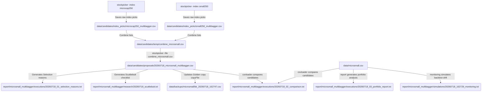

# File Structure & Reporting Guidelines

This document describes the directory layout and naming conventions for data and reports generated by the Go Mycase Automated Pipeline.

---

## Workspace Layout

```
workspace/
├── config/                          # Configuration files (pipeline.yaml, mfs.json, etc.)
├── data/                            # Golden copies, candidate lists, and rebalance backups
├── report/                          # Strategy-first namespaced execution, research, and simulation reports
├── cmd/                             # Go CLI tool entry points (pipeline, stockpicker, monitoring, report, etc.)
└── pkg/                             # Internal Go package code
```

---

## 1. The `data/` Directory

The `data/` directory manages all portfolio states, candidates, and transaction audit trails.

```
data/
├── [portfolio_name].csv             # <-- ACTIVE GOLDEN COPIES (Held portfolios)
│                                    #     Must remain at the root of data/ for easy manual edits.
│                                    #     Example: microsmall.csv, modularmicro.csv, nifty200.csv
│
├── backups/                         # <-- PORTFOLIO BACKUPS
│   └── [portfolio_name]/            #     Grouped by golden copy name. A backup is automatically created
│       │                            #     right before applying a rebalance update.
│       └── bk_YYYYMMDD_HHMMSS.csv   #     Example: backups/microsmall/bk_20260718_162747.csv
│
└── candidates/                      # <-- STOCKPICKER SELECTIONS
    ├── index_picks/                 #     Raw intermediate outputs from individual index runs.
    │   └── [index]_[strategy].csv   #     Example: candidates/index_picks/microcap250_multibagger.csv
    │
    ├── proposals/                   #     Proposed rebalance targets before merging to the golden copy.
    │   └── YYYYMMDD_[universe]_[strategy].csv
    │                                #     Example: candidates/proposals/20260718_microsmall_multibagger.csv
    │
    └── temp/                        #     Temporary workspace for combining files (automatically deleted).
        └── combine_[universe].csv
```

---

## 2. The `report/` Directory

The `report/` directory is partitioned using a **Strategy-First Namespacing** model and split into subfolders based on **Intent (Lifecycle-Phase)**.

### Subfolder Paths
* Directory format: `report/[universe]_[strategy]/[phase]/`
* Where:
  * `[universe]` is the index or portfolio base name (e.g., `smallcap250`, `microsmall`).
  * `[strategy]` is the weighting strategy/method (e.g., `multibagger`, `balanced`).
  * `[phase]` is one of the three lifecycle states: `executions`, `research`, or `simulations`.

### Phase Subfolders

```
report/[universe]_[strategy]/
├── executions/                      # <-- 1. Operational rebalance and trade execution logs
│   ├── YYYYMMDD_01_selection_reasons.txt #   Step 1: Rationale for picking/excluding stocks
│   ├── YYYYMMDD_02_comparison.txt        #   Step 2: Diffs vs golden copy (Adds/Removals/Weights changes)
│   └── YYYYMMDD_03_portfolio_report.txt  #   Step 3: Explanation report containing finalized portfolio metrics
│
├── research/                        # <-- 2. Qualitative research watchlist audits
│   └── YYYYMMDD_scuttlebutt.txt     #   Step 4: Interactive management guidelines due diligence checklists
│
└── simulations/                     # <-- 3. Parameters tuning, backtests, and monitoring simulation logs
    └── YYYYMMDD_HHMMSS_monitoring.txt # Monitoring drift check backtests (timestamped to resolve multi-run edits)
```

---

## 3. Naming Conventions & Formats

* **Dates**: Always formatted as `YYYYMMDD` (ISO 8601 compatible for chronological terminal sorting). Avoid `YYMMDD` or `DDMMYY`.
* **Timestamps**: Formatted as `YYYYMMDD_HHMMSS` (used for simulations to prevent run overlaps).
* **Step Prefixes**: Executions use sequence tags (`01_`, `02_`, `03_`) to represent the exact order of pipeline rebalance operations.
* **Lowercase Snake-Case**: All folders and filenames are lowercase snake_case (except step prefixes).

---

## 4. Pipeline Execution Sequence Mapping

When you run the automated pipeline runner:
```bash
./dist/mycase pipeline --config config/pipeline.yaml
```

The runner generates a synchronized `runTimestamp` (e.g., `20260718_162729`) and follows this exact folder workflow:


