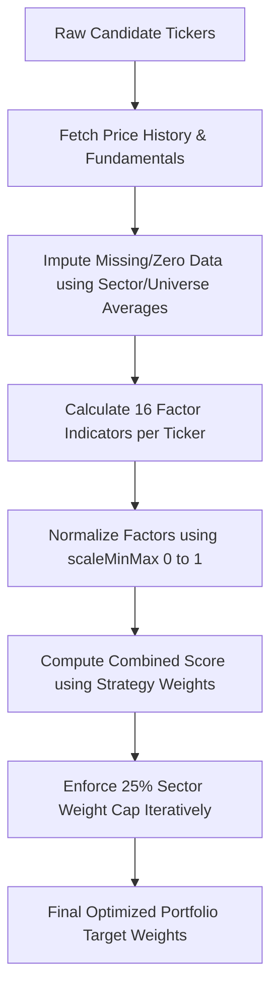

# Multi-Factor Scoring (MFS) Optimization Guide

Multi-Factor Scoring (MFS) is the core weight-optimization framework of the Go Mycase engine. It assesses and ranks candidate stocks across a multidimensional matrix of technical, momentum, and fundamental metrics to calculate their optimal target weights.

---

## 1. MFS Optimization Process Flow

The weight calculation process follows an automated sequence:



---

## 2. The 16 Factor Dimensions

The engine computes 16 individual factor scores for each stock. Factors are categorized into **Market/Return Statistics** and **Fundamental/Value Metrics**.

### A. Market & Return Statistics (Technical/Momentum)

These metrics evaluate price performance, volatility, and trend strength relative to the benchmark index (e.g. Nifty 50):

| Metric | Code Key | Evaluation Direction | Financial Purpose |
| :--- | :--- | :--- | :--- |
| **Total Return** | `return` | Higher is Better | Captures overall absolute price appreciation over the historical lookback period. |
| **Daily Volatility** | `volatility` | Lower is Better (Inverted) | Penalizes stocks with high daily standard deviation to reduce portfolio variance. |
| **Sharpe Ratio** | `sharpe` | Higher is Better | Measures risk-adjusted return (daily mean return divided by daily volatility). |
| **Sortino Ratio** | `sortino` | Higher is Better | Measures downside risk-adjusted return (daily mean return divided by downside deviation). |
| **Beta** | `beta` | Lower is Better (Inverted) | Evaluates systemic risk relative to the benchmark; prefers lower-beta stocks. |
| **Alpha** | `alpha` | Higher is Better | Quantifies historical abnormal returns outperforming the benchmark index. |
| **Treynor Ratio** | `treynor` | Higher is Better | Measures excess return per unit of systemic risk (daily mean return divided by Beta). |
| **Ulcer Index** | `ulcer` | Lower is Better (Inverted) | Measures depth and duration of price drawdowns; prefers smoother upward trends. |

### B. Fundamental & Value Metrics (Financial Quality)

These metrics assess balance sheet health, profitability, valuation, and ownership structures:

| Metric | Code Key | Evaluation Direction | Financial Purpose |
| :--- | :--- | :--- | :--- |
| **PEG Ratio** | `peg_ratio` | Lower is Better (Inverted) | Prefers growth valued at a reasonable price (Price/Earnings to Growth). |
| **Return on Equity** | `roe` | Higher is Better | Measures the efficiency of generating profits from shareholder equity. |
| **Forward P/E** | `forward_pe` | Lower is Better (Inverted) | Targets lower relative forward valuations. |
| **Operating Margins**| `operating_margins` | Higher is Better | Prefers companies with strong pricing power and operational efficiency. |
| **Price to Book (P/B)**| `pb_ratio` | Lower is Better (Inverted) | Measures asset-backed valuation; targets lower P/B ratios. |
| **Net Debt to EBITDA**| `net_debt_ebitda` | Lower is Better (Inverted) | Enforces leverage safety; penalizes highly indebted companies. |
| **Market Cap** | `market_cap` | Lower is Better (Inverted) | Prefers smaller capitalization sizes to capture high-growth multibagger room. |
| **Insider Ownership**| `insiders_percent` | Higher is Better | Aligns management interests with public shareholders. |

---

## 3. Mathematical Scaling & Scoring Formula

### A. Min-Max Normalization (`scaleMinMax`)
To compare indicators measured in different units (e.g. percentages, ratios, and billions of currency units), the engine scales every factor raw value to a normalized score between `0.0` (worst) and `1.0` (best) relative to the current candidate universe:

*   **For "Higher is Better" factors** (e.g. ROE, Operating Margins):
    $$Score = \frac{Val - Min}{Max - Min}$$
*   **For "Lower is Better" factors** (e.g. Volatility, PEG, Net Debt to EBITDA):
    $$Score = 1.0 - \frac{Val - Min}{Max - Min}$$

*Note: If the maximum and minimum values in the universe are identical, a neutral score of `0.5` is assigned.*

### B. Combined Scoring Equation
The final raw score $S_i$ for a stock $i$ is the weighted sum of its normalized factor scores:

$$S_i = \sum_{j=1}^{16} W_j \times Score_{i,j}$$

Where $W_j$ is the factor weight defined in `config/mfs.json` for the selected strategy. If the combined score falls below `0.01`, a floor of `0.01` is applied.

### C. Weight Normalization
The portfolio weight $w_i$ for stock $i$ is calculated by dividing its score by the sum of all scores:

$$w_i = \frac{S_i}{\sum_{k=1}^{N} S_k}$$

---

## 4. Sector Weight Cap Enforcement

To prevent sector-specific concentration risk (e.g., holding 80% IT or banking stocks), the engine enforces a sector cap of **25%** using an iterative redistribution algorithm (located in `pkg/optimizer/mfs_helpers.go`):

1.  **Calculate Sector Weights**: Sum the weights of all stocks belonging to the same sector.
2.  **Identify Excess**: For any sector exceeding $25\%$, calculate the excess weight:
    $$Excess = SectorWeight - 25\%$$
3.  **Scale Down Exceeded Sector**: Clamp the sector's total weight to $25\%$ by proportionally scaling down all stocks within it:
    $$w_{new} = w_{old} \times \frac{25\%}{SectorWeight}$$
4.  **Redistribute Excess**: Proportionally allocate the total $Excess$ weight to stocks in the remaining sectors that are below the cap.
5.  **Iterate**: Repeat the calculation up to $10$ times or until all sector weights are below or equal to $25\%$.

---

## 5. Strategic Profiles Configuration (`config/mfs.json`)

Strategic factor weight combinations are defined inside `config/mfs.json`. The codebase parses these settings into the `pkg/config/MFSConfig` struct:

```json
{
  "strategies": {
    "aggressive": {
      "sharpe": 0.15,
      "sortino": 0.10,
      "return": 0.25,
      "alpha": 0.15,
      "volatility": 0.05,
      "beta": 0.05,
      "treynor": 0.00,
      "ulcer": 0.00,
      "peg_ratio": 0.15,
      "roe": 0.10
    },
    "balanced": {
      "sharpe": 0.15,
      "sortino": 0.15,
      "return": 0.15,
      "alpha": 0.10,
      "volatility": 0.05,
      "beta": 0.05,
      "treynor": 0.00,
      "ulcer": 0.05,
      "forward_pe": 0.20,
      "operating_margins": 0.10
    },
    "conservative": {
      "sharpe": 0.10,
      "sortino": 0.20,
      "return": 0.05,
      "alpha": 0.05,
      "volatility": 0.10,
      "beta": 0.10,
      "treynor": 0.00,
      "ulcer": 0.15,
      "pb_ratio": 0.15,
      "net_debt_ebitda": 0.10
    },
    "multibagger": {
      "roe": 0.20,
      "operating_margins": 0.20,
      "peg_ratio": 0.15,
      "market_cap": 0.15,
      "insiders_percent": 0.10,
      "return": 0.10,
      "net_debt_ebitda": 0.10
    }
  }
}
```

---

## 6. Missing Data Imputation

When data fetching APIs encounter missing fields or return zero for critical fundamental ratios (e.g. missing PEG, ROE, or debt numbers), the optimizer automatically runs a fallback average calculation (`computeAverages`):
*   It computes the arithmetic mean of the respective metric across all other valid candidate stocks in the same selection run.
*   This average is imputed for the missing values, ensuring that data fetching hiccups do not artificially score a company's metrics as either $0$ (unnecessarily penalizing it) or default them to extreme numbers.
