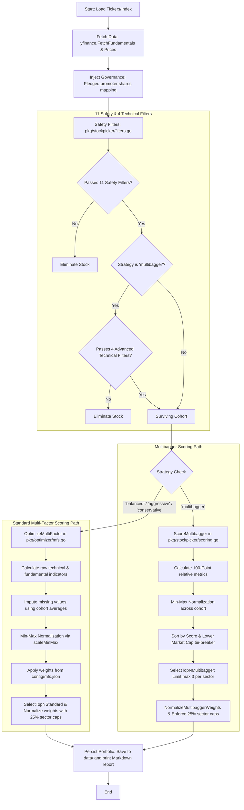

# Robust Multibagger Stock Selection Scheme

This document details the quantitative rules, quality filters, and diversification strategies implemented in the Go Mycase Multi-Factor Optimizer to identify high-conviction future **multibagger** stocks.

---

## 1. Core Philosophy

Traditional stock pickers often rely heavily on past returns (momentum). This approach introduces significant **recency bias** and risk:
* It forces investors to buy at the peak of industry cycles.
* It selects overvalued companies heading into a correction.

The **Multibagger Scheme** prioritizes **business quality, growth headroom, cash realization, safety, and strict diversification** over past stock performance. It implements a set of **absolute structural hard filters** that candidates must pass before entering the scoring phase.

---

### 2. The 11 Quantitative Safety Filters

Before any scoring or ranking is performed, the stockpicker applies strict pre-filters to the candidate list. A stock must pass **all active safety filters** to be considered.

The following table summarizes the **current safety configuration** applied to the multibagger strategy:

### Safety Filter Summary Table

| Code | Safety Constraint / Filter | Configured Limit | Operation & Robust Fallbacks |
| :--- | :--- | :--- | :--- |
| **A** | **Market Cap Range** | ₹500 Cr - ₹50,000 Cr | Absolute size limits to balance growth headroom & liquidity. |
| **B** | **Average Daily Volume (ADV)** | $\ge$ ₹1 Crore | Average Volume $\times$ Regular Price. Ensures exit liquidity. |
| **C** | **Quality of Earnings (CFO/PAT)** | $\ge$ **25%** | Verifies profits are backed by cash. CFO must be > 0. |
| **D** | **Consistent Earnings Growth** | **Disabled (`false`)** | Bypassed in config to allow turnaround / cyclical recovery stories. |
| **E** | **Promoter Shareholding** | $\ge$ **25%** | Ensures promoter skin-in-the-game. |
| **F** | **Downtrend (200-SMA)** | Close $\ge$ 200-SMA | Mandatory trend follower check. Avoids falling knives. |
| **G** | **Promoter Pledging** | < 5% | Prevents exposure to margin call liquidations. |
| **H** | **Capital Efficiency (ROCE)** | $\ge$ **12%** | Latest or 3y Avg ROCE must exceed cost of capital. |
| **I** | **Debt-to-Equity (D/E)** | < **1.5** | Keeps leverage manageable during credit tightness. |
| **J** | **Interest Coverage Ratio** | > 3.0 | Operating profits (EBIT) must comfortably service debt. |
| **K** | **CROIC (FCF Return)** | $\ge$ **6%** | FCF / (Equity + Debt) must be $\ge$ 6% to ensure cash efficiency. |

---

### Detailed Filter Specifications

### A. Size & Growth Headroom (Market Cap)
* **Rule:** Market Cap must be between **₹500 Crore (5e9)** and **₹50,000 Crore (5e11)**.
* **Why:** 
  * Stocks under ₹500 Crore (nano-caps) are highly speculative, prone to volume manipulation, and present low liquidity risk.
  * Stocks over ₹50,000 Crore have already grown significantly and have limited capacity to deliver 10x compounding returns.

### B. Liquidity Safety (Average Daily Volume)
* **Rule:** Average Daily Volume (ADV) in Rupees must be $\ge$ **₹1 Crore (1e7)**.
* **Calculation:** `AverageVolume * RegularMarketPrice`
* **Why:** Ensures that you can easily enter or exit the stock with minimal slippage.

### C. Quality of Earnings (Cash Conversion)
* **Rule:** 
  1. Operating Cash Flow (CFO) to Net Profit (PAT) ratio $\ge$ **0.25** (i.e. $\ge 25\%$ of reported net income is realized as cash).
  2. Operating Cash Flow (CFO) $>$ **0** (Free Cash Flow is not strictly capped to support companies undergoing high capital reinvestment/CapEx growth phases).
  3. **Data Coverage Bypass:** If both Operating Cash Flow and Free Cash Flow are reported as exactly `0.0` (indicating a data coverage gap on Yahoo Finance), the filter is bypassed.
* **Why:** Avoids severe "paper profits" value traps while ensuring cash backing of reported earnings.

### D. Consistent Earnings growth (PAT Trend)
* **Rule:** Configured as **Disabled** to support turnaround and cyclical stories. If enabled: latest year annual earnings must exceed the previous year ($PAT_t > PAT_{t-1}$).
* **Why:** Verifies the company's business model is actively growing, but turned off in multibagger strategy to allow cyclical recoveries (commodities, energy) to pass.

### E. Corporate Governance (Promoter Skin-in-the-game)
* **Rule:** Promoter / Insider ownership must be $\ge$ **25%**.
* **Why:** Ensures promoters have significant skin-in-the-game and their incentives are fully aligned with minority shareholders.

### F. Downtrend Filter (200-Day SMA Check)
* **Rule:** Latest stock price must be greater than or equal to its **200-day Simple Moving Average (SMA)**.
* **Why:** Excludes stocks that are in a severe long-term downtrend (falling knives), protecting the portfolio from buying too early before a trend reversal.

### G. The Indian Governance Trap (Promoter Pledging)
* **Rule:** Pledged Promoter Shares as a percentage of Total Promoter Holding must be **< 5%** (ideally 0%).
* **Why:** Prevents exposure to high-risk capital. If a market correction occurs, lenders may forcibly liquidate pledged promoter shares to meet margin calls, triggering lower circuits.

### H. Core Capital Efficiency (ROCE / ROIC)
* **Rule:** Return on Capital Employed (ROCE) must be $\ge$ **12%** for the latest year, OR the **3-Year Average ROCE** must be $\ge$ **12%**.
* **Calculation:** 
  $$\text{ROCE} = \frac{\text{EBIT}}{\text{Capital Employed}} = \frac{\text{Operating Income}}{\text{Total Assets} - \text{Current Liabilities}}$$
* **Why:** Verifies the underlying profitability of the business model. Enforcing a $\ge$ 12% bar ensures the company covers its cost of capital.

### I. Balance Sheet Leverage (Debt-to-Equity)
* **Rule:** Debt-to-Equity Ratio must be **< 1.5**.
* **Why:** Small/microcap companies with high debt are vulnerable to credit-tightening cycles. Low leverage ensures long-term survival.

### J. Interest Servicing (Interest Coverage Ratio)
* **Rule:** Interest Coverage Ratio must be **> 3.0** (if interest expense is positive).
* **Calculation:** 
  $$\text{Interest Coverage} = \frac{\text{EBIT}}{\text{Interest Expense}}$$
* **Why:** Mandating a strong interest coverage buffer ensures operating profits are sufficient to service debt obligations comfortably even during downturns.

### K. The Ultimate Truth Serum (CROIC)
* **Rule:** Cash Return on Invested Capital (CROIC) must be $\ge$ **6%**.
* **Calculation:** 
  $$\text{CROIC} = \frac{\text{Free Cash Flow}}{\text{Total Equity} + \text{Total Debt}}$$
  Where $\text{Total Equity} = \frac{\text{Market Cap}}{\text{Price-to-Book Ratio}}$.
* **Why & Fallbacks:** A highly strict profitability check. Operating earnings can be manipulated, but Free Cash Flow relative to Invested Capital (Equity + Debt) shows the raw cash generation power of the business.
  * **Data Coverage Bypass:** Bypassed if FCF and CFO are exactly 0.0 (indicating a Yahoo Finance data gap).

---

## 3. The 4 Advanced Technical & inflecting Filters

When the strategy is set to `multibagger`, the engine runs 4 additional structural checks dynamically implemented in Go:

### 1. Sales Growth Accelerator
* **Rule:** TTM Revenue Growth must exceed the 3-Year Revenue CAGR (`TTM Growth % > 3-Year CAGR %`).
* **Math:**
  $$\text{3-Year CAGR} = \left(\frac{\text{Current Year Revenue}}{\text{Revenue 3 Years Ago}}\right)^{1/3} - 1$$
  $$\text{TTM Growth} = \left(\frac{\text{TTM Revenue}}{\text{Base Revenue}}\right) - 1$$
* **Rationale:** Flags companies whose growth is accelerating in the short term, indicating new product success or market expansion.

### 2. Asset Turnover & CapEx Inflection (Operating Leverage)
* **Rule:** Asset Turnover expands YoY, while Capital Expenditure (CapEx) growth stabilizes or shrinks ($\le 15\%$ YoY growth).
* **Math:**
  $$\text{Asset Turnover} = \frac{\text{Total Revenue}}{\text{Net Property, Plant and Equipment (Net PPE)}}$$
* **Rationale:** Identifies companies that have finished heavy investment cycles and are now turning those assets into fresh sales, triggering massive operating leverage.

### 3. Working Capital Efficiency (Days Sales Outstanding)
* **Rule:** Days Sales Outstanding (DSO) must show a flat or improving trend (latest DSO < previous DSO, or latest DSO < DSO 2 years ago).
* **Math:**
  $$\text{DSO} = \frac{\text{Accounts Receivable}}{\text{Total Revenue}} \times 365$$
* **Rationale:** Ensures sales acceleration is not driven by extending loose credit terms.

### 4. Stage 2 Markup & Institutional Breakout
* **Rule:** Price must be $\ge$ 200-SMA, and must exhibit at least one institutional volume breakout day in the last 60 trading days.
* **Technical Definition:**
  - Close $\ge$ 200-Day SMA.
  - Inside the last 60 days, there is at least one green day where volume is $\ge$ 2.0x the average volume of all red days in that window.
* **Rationale:** Confirms smart money accumulation is underway and avoids buying dead-money consolidation patterns.

---

## 4. Qualitative "Scuttlebutt" Overlay

Once candidates pass all 14 quantitative filters, the tool generates a manual scuttlebutt audit checklist:
1. **Earnings Call Transcripts**: Verify if management has hit guidance consistently over the last 4 quarters and guides for margin expansions.
2. **Management Discussion & Analysis (MD&A)**: Confirm if the Total Addressable Market (TAM) is growing $> 15\%$ YoY and note strategic pivots.
3. **Shareholder Trends**: Inspect if institutional and promoter shareholding is stable or rising QoQ.

---

## 5. Relative Scoring: The 100-Point Multibagger Matrix

Once the 14 absolute hard safety filters and the 4 advanced technical filters have filtered the initial universe, the surviving cohort is evaluated using a **100-Point Relative Scoring Matrix**. 

Since the safety checks are already passed, the goal of this phase is to measure **Fundamental Velocity, Valuation-Adjusted Moat, and Institutional Thrust** to rank the absolute breakout potential.

### The 100-Point Relative Scoring Matrix

| Pillar | Metric | Weight | Scoring Logic (Relative to the Surviving Cohort) |
| :--- | :--- | :--- | :--- |
| **I. Fundamental Velocity** (40 pts) | **Revenue Acceleration Gap** | 20 pts | Rank by the spread between TTM Growth and 3-Year CAGR (`TTM Growth % - 3-Year CAGR %`). The widest positive gap gets 20 pts; the narrowest gets 0 pts. |
| | **Asset Turnover Expansion** | 20 pts | Rank by the YoY percentage increase in Asset Turnover. The steepest efficiency gain gets 20 pts; the lowest gets 0 pts. |
| **II. Valuation-Adjusted Moat** (30 pts) | **PEG Ratio (Valuation)** | 15 pts | **Pure relative scoring metric (hard gate disabled)**. Rank inversely by PEG (PE / Growth). Trailing PEG fallback is dynamically used if Forward PEG is missing to avoid analyst coverage drops. Lowest positive PEG gets 15 pts. |
| | **ROCE Premium (Quality)** | 15 pts | Rank by absolute ROCE. Core safety check filters for $\ge 12\%$, but companies with higher ROCE (e.g., 40%) receive a premium. |
| **III. Institutional Thrust** (30 pts) | **Breakout Volume Intensity** | 15 pts | Rank by the volume multiplier of their breakout day. A 6.0x volume spike scores higher than the baseline 2.0x requirement. |
| | **52-Week Relative Strength** | 15 pts | **Pure relative scoring metric (hard gate disabled)**. Rank by 1Y performance relative to the Nifty index. Outperforming by the widest margin gets 15 pts. |

### Mathematical Calculation (Min-Max Normalization)

To avoid subjective, hard-coded tiers, the engine uses dynamic **Min-Max Normalization** to score the surviving cohort against each other.

For metrics where **higher is better** (ROCE, Revenue Acceleration, Volume Intensity, Asset Turnover Expansion, 52-Week RS), the score is calculated as:

$$\text{Score} = \left( \frac{\text{Value} - \text{Min\_Value}}{\text{Max\_Value} - \text{Min\_Value}} \right) \times \text{Max\_Points}$$

For metrics where **lower is better** (PEG Ratio), the score is inverted:

$$\text{Score} = \left( \frac{\text{Max\_Value} - \text{Value}}{\text{Max\_Value} - \text{Min\_Value}} \right) \times \text{Max\_Points}$$

*(Note: $\text{Max\_Value}$ and $\text{Min\_Value}$ represent the highest and lowest values of that specific metric within the surviving cohort of stocks).*

### The Tie-Breaker (Lower Market Cap Wins)

In the event of a tie in the final relative score (e.g. two stocks scoring exactly 82.4/100), the tie-breaker is determined by **Market Capitalization**:
* **Rule:** The stock with the **lower market capitalization** is ranked higher.
* **Why:** A smaller company has less friction and requires less capital inflow to double or triple in price compared to a larger company, assuming all technical and fundamental momentum metrics are equal.


---

## 6. Stock Selection & Scoring Execution Flow

The optimizer implements a tiered pipeline starting from raw index constituents, through strict safety filters, relative cohort-wide scoring, and final portfolio weight optimization with sector-based risk limits.

### Mermaid Flowchart



### Execution Pipeline Details

1. **Constituent Loading**: Tickers are loaded from a custom file or downloaded dynamically from the NSE server (`pkg/stockpicker/loader.go`).
2. **Data Acquisition**:
   - Technical prices (1Y history) are downloaded concurrently for volatility, return, and momentum analyses.
   - Fundamental sheets are scraped concurrently (`pkg/yfinance/yfinance.go`), followed by mapping offline promoter pledging metrics.
3. **Pre-Filtering (Safety Filters)**: 
   Candidates are evaluated in `pkg/stockpicker/filters.go`'s `isEligible` function. Any ticker that fails the 11 absolute metrics (Market Cap, ADV, Cash Flow, Earnings Trend, Promoter Share %, 200-SMA, Pledge %, ROCE, Debt/Equity, Interest Coverage, CROIC) is eliminated. If `multibagger` is chosen, they must also pass the 4 advanced checkpoints (Sales Growth Accelerator, Operating Leverage CapEx Inflection, DSO Improvement, and volume breakouts).
4. **Scoring & Weighting Paths**:
   - **Multibagger Path (`pkg/stockpicker/scoring.go`)**: Evaluation is performed relative to the surviving cohort. Tickers are scored out of 100 (weighted across Revenue Acceleration, Asset Turnover, PEG, ROCE, Volume, and RS), sorted with a lower market-cap tie-breaker, sliced to `Top N` while ensuring a maximum of 3 stocks per sector (or configured count), and weighted proportionally to their scores.
   - **Standard Paths (`pkg/optimizer/mfs.go`)**: Evaluation uses `OptimizeMultiFactor` to score and rank tickers across 16 technical and fundamental dimensions. Indicators are normalized via `scaleMinMax` and weighted according to the config parameters defined in `config/mfs.json`.
5. **Sector Risk Management**: In both paths, if the `multibagger` flag is active or `MarketCap` weight is positive, any single sector concentration is capped at **25%** of the total portfolio weight (`optimizer.EnforceSectorCaps`).
6. **Persistence**: The resulting portfolio is saved to `data/stockpicker_<source>_<method>.csv` (`pkg/stockpicker/io.go`) and formatted into an audit explanation report.

### Configuration vs. Hardcoded Logic

To maintain flexibility, the engine balances configurable settings in [mfs.json](file:///Users/raghavgarg/Projects/myGo/mycase/config/mfs.json) with hardcoded quantitative checks in the Go packages.

#### 1. Configurable Criteria (mfs.json)
The 11 absolute safety/hard filters and strategy scoring weights are fully adjustable in the `config/mfs.json` file. 

For the `multibagger` method, the following filter parameters are mapped:
* `"min_market_cap"`: Minimum company size (in Rupees, default `5,000,000,000` / ₹500 Cr).
* `"max_market_cap"`: Maximum headroom limit (in Rupees, default `5,000,000,000,000` / ₹500,000 Cr).
* `"min_adv"`: Minimum Average Daily Volume (in Rupees, default `10,000,000` / ₹1 Cr).
* `"min_cfo_pat"`: Minimum ratio of Operating Cash Flow to Net Profit (default `0.25` / 25%).
* `"min_promoter_percent"`: Minimum promoter ownership stake (default `0.25` / 25%).
* `"check_earnings_trend"`: Boolean flag checking if latest annual earnings exceed the previous year (`true`/`false`, default `false` for turnaround/cyclical flexibility).
* `"check_200day_sma"`: Boolean flag checking if stock close price is $\ge$ 200-Day SMA (`true`/`false`).
* `"max_pledged_percent"`: Maximum promoter pledging percentage (default `0.05` / 5% of promoter holding).
* `"min_roce"`: Minimum ROCE or 3-year average ROCE (default `0.12` / 12%).
* `"max_debt_to_equity"`: Maximum debt-to-equity ratio (default `1.5` / 150%).
* `"min_interest_coverage"`: Minimum operating profits to interest expenses ratio (default `3.0`).
* `"max_peg"`: Hard gate threshold for PEG (default `0.0` to disable as a hard gate and use for Scoring Only).
* `"check_gross_margin"`: Check Gross Margin trajectory YoY (default `false` to disable as a hard gate).
* `"min_rs_percentile"`: Minimum RS percentile rank (default `0.0` to disable as a hard gate and use for Scoring Only).
* `"min_croic"`: Minimum Cash Return on Invested Capital (default `0.06` / 6%).
* `"max_capex_yoy_multiplier"`: CapEx stabilization boundary limit for Operating Leverage (default `1.15` / 15% growth cap).
* `"volume_breakout_lookback_days"`: Rolling lookback window for institutional volume breakout checks (default `60` days).
* `"volume_breakout_multiplier"`: Minimum volume multiplier threshold on green days compared to average red days (default `2.0`x).
* `"max_stocks_per_sector"`: Maximum number of stocks allowed from the same sector in the selection portfolio (default `3`).
* `"max_sector_weight_cap"`: Maximum concentration weight allowed for any single sector (default `0.25` / 25%).

#### 2. Hardcoded Rules & Logics
While all parameters and thresholds are now configurable in [mfs.json](file:///Users/raghavgarg/Projects/myGo/mycase/config/mfs.json), the underlying core mathematical check logic remains built into the Go packages:
* **Operational Metrics Check (2 out of 3)**: A stock must satisfy at least **2 out of the following 3** conditions to pass the growth and efficiency checks:
  1. **Sales Growth Accelerator**: TTM Revenue Growth exceeds the 3-Year CAGR (`TTM Growth > 3-Year CAGR`).
  2. **Working Capital (DSO)**: Days Sales Outstanding is flat or improving (`latestDSO < previousDSO` OR `latestDSO < DSO_2_years_ago`).
  3. **Asset Turnover Expansion**: Asset turnover expanded year-over-year (`atLatest > atPrev`).
* **CapEx Reinvestment Gate**: The stabilization check is enforced as an absolute hard gate based on the configurable `"max_capex_yoy_multiplier"`.

---

## 7. Execution Commands

The stock picker supports index-based screening and custom file-based portfolio selections:

### A. Run on a Custom Portfolio File
Use this to filter and score a custom basket of watchlisted stocks:
```bash
# Run on the microsmall portfolio select top 5
go run cmd/stockpicker/main.go -file data/microsmall.csv -method multibagger -top 5

# Run on the managed portfolio (myall) select top 10
go run cmd/stockpicker/main.go -file data/myall.csv -method multibagger -top 10
```

### B. Run on Index Baskets
Use this to screen an entire index (like Nifty Smallcap 250 or Microcap 250) against the multibagger requirements:
```bash
# Screen the entire Smallcap 250 index, select the top 15 candidates
go run cmd/stockpicker/main.go -index smallcap250 -method multibagger -top 15

# Screen the Microcap 250 index, select the top 10 candidates
go run cmd/stockpicker/main.go -index microcap250 -method multibagger -top 10
```

### C. Run with Custom Parameters
Adjust the lookback range (e.g. 6 months or 1 year) for benchmark tracking:
```bash
# Screen Microcap 250 with a 6-month historical lookback
go run cmd/stockpicker/main.go -index microcap250 -method multibagger -range 6mo -top 10
```
