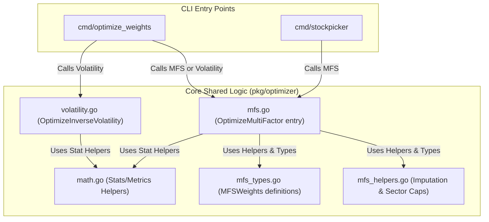

# Portfolio Weight Optimization Engine

This document explains the mathematical models, package structure, and configurations supported by the Go Mycase Weight Optimization Engine package (`pkg/optimizer`).

The core engine is shared and utilized by two distinct CLI entry points:
1. **[cmd/optimize_weights](file:///Users/raghavgarg/Projects/myGo/mycase/cmd/optimize_weights/main.go)**: Optimizes and rebalances an existing portfolio holding basket (protecting the source file as a "Golden Copy").
2. **[cmd/stockpicker](file:///Users/raghavgarg/Projects/myGo/mycase/cmd/stockpicker/main.go)**: Downloads index constituents dynamically, ranks them by Multi-Factor Score, and picks the top $N$ stocks.

---


## 1. Package Structure & Modularization

The `pkg/optimizer` package is organized into modular files:
* **[math.go](file:///Users/raghavgarg/Projects/myGo/mycase/pkg/optimizer/math.go)**: Contains statistical and math calculations (daily returns, standard deviation volatility, downside deviation, Nifty 50 covariance/alpha/beta, total returns, and drawdown Ulcer Index).
* **[mfs_types.go](file:///Users/raghavgarg/Projects/myGo/mycase/pkg/optimizer/mfs_types.go)**: Holds quantitative scoring types, such as the `MFSWeights` configuration struct.
* **[mfs_helpers.go](file:///Users/raghavgarg/Projects/myGo/mycase/pkg/optimizer/mfs_helpers.go)**: Modularized secondary routines:
  - `computeAverages`: For imputing missing metrics.
  - `enforceSectorCaps`: An iterative simplex projection logic enforcing sector weight limits.
* **[mfs.go](file:///Users/raghavgarg/Projects/myGo/mycase/pkg/optimizer/mfs.go)**: The core entry point for Multi-Factor Scoring optimization.
* **[volatility.go](file:///Users/raghavgarg/Projects/myGo/mycase/pkg/optimizer/volatility.go)**: Traditional Inverse-Volatility optimization.

---

## 2. Supported Optimization Methods

You can toggle between optimization strategies using the `-method` CLI flag.

### A. Inverse-Volatility Optimization (`-method volatility`)
Allocates portfolio weights inversely proportional to each asset's daily return volatility.
* **Formula**:
  $$w_i = \frac{1/\sigma_i}{\sum_{j=1}^{N} (1/\sigma_j)}$$
  where $\sigma_i$ is the sample standard deviation of daily returns for asset $i$ over the historical window (e.g., 3 months).
* **Limitations**: While risk-minimizing, it does not account for asset returns. It allocates disproportionately large weights ($\approx 95\%$) to low-risk defensive assets (like cash or liquid funds such as `LIQUIDCASE`), starves equity allocations, and ignores momentum.

### B. Multi-Factor Scoring (MFS) Optimization (Strategy-based CLI presets)
Upgrades the optimizer into a multi-factor ranking model. It calculates quantitative and fundamental factors for each asset, normalizes them, and builds a combined score to distribute weights.

#### Factors Implemented:
1. **Total Return (Momentum)**: Percentage return over the chosen historical window.
2. **Daily Volatility (Risk)**: Standard deviation of daily returns (inverted for scoring).
3. **Sharpe Ratio (Risk-Adjusted Return)**: Daily mean return divided by daily volatility.
4. **Sortino Ratio (Downside Risk-Adjusted Return)**: Daily mean return divided by daily downside volatility deviation.
5. **Beta (Systematic Market Risk)**: Systematic risk coefficient calculated against the Nifty 50 Index (`^NSEI`) (inverted for scoring).
6. **Alpha (Excess Return)**: Average excess daily return relative to Nifty 50.
7. **Treynor Ratio (Systematic Risk-Adjusted Return)**: Mean return divided by beta.
8. **Ulcer Index (Drawdown Duration and Depth)**: Measures depth and duration of price declines (inverted for scoring).
9. **ROE (Capital Efficiency)**: Return on equity.
10. **Forward P/E (Valuation)**: Lower Forward P/E gets ranked higher.
11. **PEG Ratio (Growth Valuation)**: Price/Earnings-to-Growth (inverted for scoring).
12. **Operating Margins (Profitability)**: Profitability margins.
13. **Price-to-Book (PB Ratio)**: (inverted for scoring).
14. **Net Debt to EBITDA (Solvency)**: (inverted for scoring).
15. **Market Cap (Size Headroom)**: Lower market caps are ranked higher to favor stocks with larger expansion potential.
16. **Insider Ownership (Alignment)**: Promoter and insider holding percentage.

#### Strategy Presets
The weights for these factors are loaded dynamically from [mfs.json](file:///Users/raghavgarg/Projects/myGo/mycase/config/mfs.json) based on the strategy name passed to the `-method` flag:

* **aggressive**: High exposure to returns and momentum (`"return": 0.40`).
* **balanced** (Default): Blended allocation (`"sharpe": 0.20`, `"sortino": 0.20`, `"alpha": 0.15`, `"return": 0.15`).
* **conservative**: High exposure to risk mitigation (`"volatility": 0.20`, `"ulcer": 0.15`, `"sortino": 0.25`).
* **multibagger**: Strict quality/growth selection focusing on ROE (20%), Margins (20%), PEG (20%), small Market Cap (15%), high Insider Stake (15%), and low Net Debt/EBITDA (10%).

#### Multibagger Pre-Filters (Stock Picker)
When the strategy is set to `"multibagger"`, the Stock Picker enforces **11 strict safety and corporate governance filters** before scoring:
1. **Size Limits:** Market Cap must be between ₹500 Crore and ₹50,000 Crore.
2. **Liquidity Limits:** Average Daily Volume (ADV) must exceed ₹1 Crore.
3. **Cash Flow Quality:** CFO must be > 0 and $CFO / PAT \ge 0.25$.
4. **Earnings Growth Trend:** Configured as disabled (`false` in config) to allow turnaround / cyclical recovery stories.
5. **Insider Stake:** Promoter holding must be $\ge$ 25%.
6. **200-SMA Uptrend Check:** Close must be $\ge$ 200-SMA.
7. **Pledge Cap:** Pledged promoter shares must be < 5%.
8. **Capital Efficiency:** ROCE must be $\ge$ 12% (latest or 3-Year average).
9. **Balance Sheet Leverage:** Debt-to-Equity must be < 1.5.
10. **Interest Coverage:** Interest coverage ratio must be > 3.0.
11. **CROIC:** Cash Return on Invested Capital must be $\ge$ 6%.

#### Sector Caps
To prevent portfolio concentration, the multibagger strategy enforces:
* **Sector Stock Cap:** Maximum of 4 stocks (or configured limit) from any single sector.
* **Sector Weight Cap:** Maximum of 25% cumulative weight per sector (enforced using iterative simplex projection in `enforceSectorCaps`).

Final weights are distributed proportionally to these scores. You can adjust the weights for any strategy (or create custom ones) directly inside `config/mfs.json`.

---

## 2. Golden Copy Protection Workflow

To protect your original configuration files (e.g. `data/myall.csv` or `data/aitheme.csv` with their original weights) from being overwritten during optimization, the engine implements automatic file redirection:

1. **Input**: You run the optimizer on a source file (e.g., `-file data/myall.csv`).
2. **Redirection**: The engine automatically writes the optimized results to a copy prefixed with `Optimize_` (e.g., `data/Optimize_myall.csv`), leaving the golden source file untouched.
3. **Execution In-Place**: If the input file name already begins with `Optimize_` (e.g., `data/Optimize_myall.csv`), it is overwritten in place.
4. **Promotion**: Once you are satisfied with the optimized weights, you can promote them by manually copying/renaming the `Optimize_` file back onto the golden source file.

---

## 3. CLI Usage & Advanced Configurations

The portfolio weight optimizer supports multiple flags to cap allocation risk and align with live portfolio state:

### Basic Optimization Examples
```bash
# Run Multi-Factor optimization (MFS) with balanced strategy preset (Default)
go run ./cmd/optimize_weights -file data/modularmicro.csv -method balanced

# Run MFS with aggressive strategy preset
go run ./cmd/optimize_weights -file data/modularmicro.csv -method aggressive

# Run traditional Inverse-Volatility optimization
go run ./cmd/optimize_weights -file data/modularmicro.csv -method volatility

# Optimize with custom duration range (e.g. 6 months)
go run ./cmd/optimize_weights -file data/modularmicro.csv -range 6mo
```

### Advanced Optimization Examples

#### A. Capping Maximum Weights (`-cap`)
To avoid single-stock concentration risk, you can cap the maximum allocation for any individual asset (e.g., maximum 12% or 15%):
```bash
# Optimize using balanced method, capping any single asset at 12% weight
go run ./cmd/optimize_weights -file data/microsmallcombine.csv -method balanced -cap 0.12

# Optimize using multibagger strategy, capping single asset weight at 15%
go run ./cmd/optimize_weights -file data/microsmallcombine.csv -method multibagger -cap 0.15
```

#### B. Golden Copy Liquidation Alignment (`-golden`)
Compare your new optimized selections with a live portfolio (the "Golden Copy"). Any ticker present in the golden copy that is not in the new selection is automatically given a weight of `0.0000` to trigger full liquidation:
```bash
# Optimize weights while flagging exited stocks from data/microsmall.csv as liquidation targets
go run ./cmd/optimize_weights -file data/microsmallcombine.csv \
  -method balanced \
  -cap 0.12 \
  -golden data/microsmall.csv
```

#### C. Manual Exclusions (`-remove`)
Explicitly exclude specific assets and assign them a `0.0` weight:
```bash
# Exclude specific cash or hedge assets
go run ./cmd/optimize_weights -file data/modularmicro.csv -remove NSE:LIQUIDCASE,NSE:GOLDBEES
```

---

## 3. Optimization Comparison (Example: Micro Theme)

| Ticker | Inverse-Volatility Weight | Multi-Factor Score Weight (MFS) | Description |
| :--- | :--- | :--- | :--- |
| **NSE:LIQUIDCASE** | **95.58%** | **17.65%** | Debt/Cash fund. Risk-minimized, but capped return. |
| **NSE:CGCL** | 0.68% | **24.24%** | Equity. Strong momentum, high alpha/Sharpe. |
| **NSE:PNCINFRA** | 0.69% | **21.90%** | Equity. Strong momentum, high alpha/Sharpe. |
| **NSE:KRBL** | 0.51% | 12.10% | Equity. Moderate volatility and risk-adjusted return. |

---

## 4. Index Stock Picker Tool (`cmd/stockpicker`)

The **Stock Picker** tool (`cmd/stockpicker/main.go`) is a separate CLI tool that fetches constituent companies of a major index, ranks them using the Multi-Factor Scoring (MFS) model, selects the top $N$ stocks, and formats a basket CSV portfolio.

### Features
* **Auto constituent fetch**: Downloads index constituent lists (Nifty 50, Nifty Next 50, Nifty Midcap 150, Nifty Smallcap 250) directly from `niftyindices.com`.
* **Parallel historical download**: Queries historical prices concurrently with a worker pool (limit 15 workers) to avoid rate limits.
* **Top N selection**: Selects the top $N$ stocks based on their Multi-Factor Score, re-normalizes their weights, and saves them to a new CSV file (e.g., `data/stockpicker_<index>_<method>.csv`).

### Usage Examples
```bash
# Pick the top 20 stocks from Nifty Smallcap 250 using the balanced strategy
go run ./cmd/stockpicker -index smallcap250 -method balanced -top 20

# Pick the top 15 stocks from Nifty Midcap 150 using the aggressive strategy
go run ./cmd/stockpicker -index midcap150 -method aggressive -top 15

# Pick the top 30 stocks from Nifty Next 50 using the conservative strategy
go run ./cmd/stockpicker -index niftynext50 -method conservative -top 30
```
