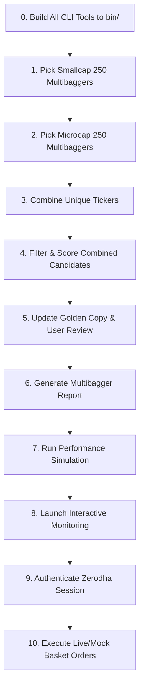

# Automated Stock Picking & Execution Pipeline

This document explains the unified automation pipeline runner implemented in `cmd/pipeline/main.go`. The pipeline systemizes the multi-step manual process of fetching, combining, scoring, reporting, simulating, and executing mycase baskets.

## Workflow Overview

The pipeline automates the 11-step flow shown below:



---

## Steps Executed Programmatically

### 0. Build Phase
Compiles all CLI target packages into the `bin/` directory before executing the steps.
```bash
go build -o bin/[target] cmd/[target]/main.go
```

### 1. Nifty Smallcap 250 Screening
Runs the compiled stock picker for `small250` constituents using the `multibagger` strategy to get the top 20 candidates.
```bash
./bin/stockpicker -index small250 -method multibagger -top 20
```

### 2. Nifty Microcap 250 Screening
Runs the compiled stock picker for `microcap250` constituents using the `multibagger` strategy to get the top 20 candidates.
```bash
./bin/stockpicker -index microcap250 -method multibagger -top 20
```

### 3. Constituent Combination
Combines unique tickers from both CSV files (`data/stockpicker_small250_multibagger.csv` and `data/stockpicker_microcap250_multibagger.csv`) and writes them into `data/microsmallcombine.csv`.

### 4. Second-Pass Selection (Final Top 20)
Processes the combined candidate list through the stock picker again using the `multibagger` strategy to narrow the combined 40 tickers down to the final top 20.
```bash
./bin/stockpicker -file data/microsmallcombine.csv -method multibagger -top 20
```

### 5. Golden Copy Promotion & Manual Review
Copies the finalized portfolio to `data/microsmall.csv` and prompts the user to review or manually adjust the golden copy if desired.

### 6. Portfolio Report Generation
Generates a comprehensive analysis report for the selected golden copy portfolio.
```bash
./bin/report -file data/microsmall.csv -method multibagger
```

### 7. Performance Simulation
Runs a backtest simulation. The script prompts you for the investment capital and purchase date (defaulting to `2026-05-15`).
```bash
./bin/performance -file data/microsmall.csv -capital [capital] -date [date]
```

### 8. Interactive Portfolio Monitoring
Starts the real-time simulation/monitoring tool in interactive terminal mode.
```bash
./bin/monitoring -file data/microsmall.csv -interactive
```

### 9. Zerodha Authentication Setup
Optionally starts the Kite API session authentication workflow if session credentials need renewal.
```bash
./bin/setup_auth
```

### 10. Basket Order Execution
Optionally triggers the live order execution/rebalancing engine.
```bash
./bin/basket --live -- microsmall
```

---

## How to Run

Execute the pipeline runner from the root of the project:
```bash
go run cmd/pipeline/main.go
```
Execute the pipeline runner for excuting trade only 
```bash
go run cmd/pipeline/main.go -exec-only
```
