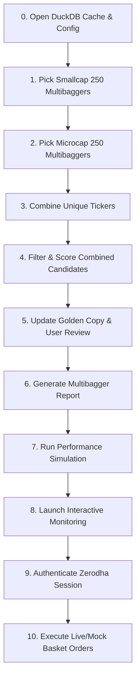

# Automated Stock Picking & Execution Pipeline

This document explains the unified automation pipeline runner implemented in [cmd/pipeline.go](file:///Users/raghavgarg/Projects/myGo/mycase/cmd/pipeline.go). The pipeline systemizes the multi-step manual process of fetching, combining, scoring, reporting, simulating, and executing mycase baskets.

## Workflow Overview

The pipeline automates the 11-step flow shown below:



---

## Steps Executed Programmatically

### 0. Initialization Phase
Opens the DuckDB persistent price cache at `data/cache.db` and loads configuration from `config/pipeline.yaml`.

### 1. Nifty Smallcap 250 Screening
Runs the stock picker for `small250` constituents using the `multibagger` strategy to get the top 20 candidates.

### 2. Nifty Microcap 250 Screening
Runs the stock picker for `microcap250` constituents using the `multibagger` strategy to get the top 20 candidates.

### 3. Constituent Combination
Combines unique tickers from both CSV files (`data/candidates/index_picks/small250_multibagger.csv` and `data/candidates/index_picks/microcap250_multibagger.csv`) into `data/candidates/temp/combine_microsmall.csv`.

### 4. Second-Pass Selection (Final Top 20)
Processes the combined candidate list through the stock picker again using the `multibagger` strategy to narrow the combined 40 tickers down to the final top 20.

### 5. Golden Copy Promotion & Manual Review
Promotes the finalized portfolio to `data/microsmall.csv` and prompts the user to review or manually adjust the golden copy if desired.

### 6. Portfolio Report Generation
Generates a comprehensive analysis report for the selected golden copy portfolio in `report/microsmall_multibagger/executions/`.

### 7. Performance Simulation
Runs a backtest simulation. The subcommand prompts you for the investment capital and purchase date (defaulting to `2026-01-01`).

### 8. Interactive Portfolio Monitoring
Starts the real-time simulation/monitoring tool in interactive terminal mode.

### 9. Zerodha Authentication Setup
Optionally starts the Kite API session authentication workflow if session credentials need renewal (`mycase auth`).

### 10. Basket Order Execution
Optionally triggers the live order execution/rebalancing engine (`mycase basket --live`).

---

## How to Run

Execute the pipeline runner using the single `mycase` binary:
```bash
./dist/mycase pipeline --config config/pipeline.yaml
```
To skip analysis and run execution/trades only:
```bash
./dist/mycase pipeline --config config/pipeline.yaml --exec-only
```
