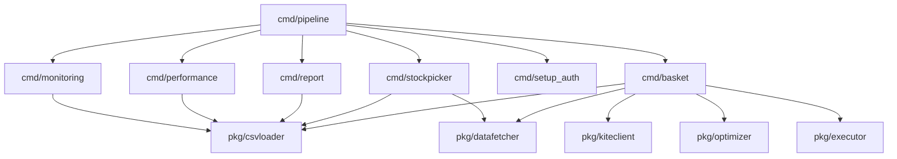
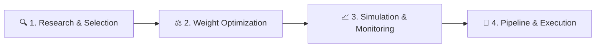

# Go Mycase Basket & Rebalancing Engine

This project is portfolio engine in Go (Golang). It communicates with the Zerodha Kite Connect API using the official SDK (`gokiteconnect/v4`), utilizes a native concurrent Yahoo Finance client to fetch real-time price quotes, and features a fully automated strategy-to-execution pipeline.

---

## Architectural Highlights

The project has been refactored into a highly modular, decoupled design where CLI tools only act as program entry points/orchestrators, and all business, representation, parsing, and execution operations are cleanly isolated into individual packages:



---

## Directory Structure & Package Overview

For a detailed breakdown of runtime data directories, report namespaces, backups, and output file naming conventions, see [filestructure.md](filestructure.md).

```
mycase/
├── cmd/
│   ├── pipeline/          # Automated pipeline runner orchestrating the entire strategy cycle
│   ├── stockpicker/       # Stock selection CLI based on financial strategies (e.g. multibagger)
│   ├── report/            # Portfolio explanation report generator
│   ├── performance/       # Historical performance simulator (backtesting)
│   ├── monitoring/        # Interactive portfolio monitoring tool
│   ├── holdings/          # CLI tool presenting segment-wise holdings snapshots
│   ├── optimize_weights/  # Weight optimization utility
│   ├── setup_auth/        # OAuth web callback to capture request tokens and generate credentials
│   └── basket/            # Main basket engine CLI (handling Fresh Buys and Rebalancing menu options)
├── pkg/
│   ├── config/            # Config parser structure definitions
│   ├── csvloader/         # Stream-based CSV parser and comparison/merging utilities
│   ├── datafetcher/       # Service orchestrator mapping quotes and holdings from live or mock streams
│   ├── executor/          # Order execution layer handling GTT, AMO, and Regular placements
│   ├── kiteclient/        # Unified Client loader and mockup instantiators
│   ├── market/            # Pure market-hour scheduling checks and limit-order slippage math
│   ├── monitoring/        # Domain logic for portfolio simulators and tracking
│   ├── optimizer/         # Capital optimization algorithms matching target allocations
│   ├── portfolio/         # Common domain entities (e.g. Holdings structures and sorting implementations)
│   ├── printer/           # Pure visual table output generator (PrintPreview, HoldingsSnapshots)
│   ├── stockpicker/       # Core stock selection rules, indices, and criteria
│   └── yfinance/          # Parallel quote query downloader handling NSE (.NS) and BSE (.BO) mapping
├── config/                # Configuration files (config.json, pipeline.yaml, etc.)
└── data/                  # Target CSV portfolios and cache (microsmall.csv, .cache/ NSE prices)
```

---

## Installation & Setup

1. **Install Dependencies**:
   Ensure you have Go installed on your system, then clean the module dependencies:
   ```bash
   go mod tidy
   ```

2. **Setup Credentials**:
   Run the interactive authentication tool to register your API Key, API Secret, and retrieve your dynamic `access_token` from Zerodha:
   ```bash
   go run ./cmd/setup_auth
   ```
   This will automatically update `config/config.json`.

---

## How to Run

### The Automated Pipeline (Recommended)
You can run the entire workflow—from fetching stock recommendations for multiple indices, combining them, updating the golden copy, validating performance, simulating monitoring, and executing live orders—using the pipeline tool:

1. **Configure parameters** in `config/pipeline.yaml` (e.g., indices, strategy, target golden copy, capital, tolerance, and buffer).
2. **Execute the pipeline**:
   ```bash
   go run cmd/pipeline/main.go -config config/pipeline.yaml
   ```

To skip the analysis/backtest steps and jump straight to authentication and live basket execution (useful if already run today):
```bash
go run cmd/pipeline/main.go -config config/pipeline.yaml -exec-only
```

---

### Running Individual Tools

For a complete lookup reference mapping individual standalone CLI commands to their Go automated pipeline runner equivalents and parameters, see [CommadTable.md](CommadTable.md).

#### 1. Stock Selection (Stock Picker)
Run stock picking on a configured index (e.g., `small250`) using a strategy (e.g., `multibagger`):
```bash
go run cmd/stockpicker/main.go -index small250 -method multibagger -top 20
```

#### 2. Portfolio Performance Simulation (Backtesting)
Simulate historical performance of your target CSV portfolio:
```bash
go run cmd/performance/main.go -file data/microsmall.csv -capital 100000 -date 2026-05-15
```

#### 3. Interactive Monitoring
Track and simulate daily portfolio behavior interactively:
```bash
go run cmd/monitoring/main.go -file data/microsmall.csv -interactive
```

#### 4. Holdings snapshot
View mock or live holdings:
```bash
go run ./cmd/holdings --live
```

#### 5. Live Basket Orders
Execute orders against your target portfolio:
```bash
go run ./cmd/basket --live -- microsmall
```

---

## Compilation

Build all standalone binaries inside the `bin/` folder at once:
```bash
# This is also run automatically by the pipeline tool
go build -o bin/pipeline ./cmd/pipeline
go build -o bin/stockpicker ./cmd/stockpicker
go build -o bin/report ./cmd/report
go build -o bin/performance ./cmd/performance
go build -o bin/monitoring ./cmd/monitoring
go build -o bin/holdings ./cmd/holdings
go build -o bin/setup_auth ./cmd/setup_auth
go build -o bin/basket ./cmd/basket
go build -o bin/optimize_weights ./cmd/optimize_weights
```

---

## 🗺️ Portfolio Lifecycle & Documentation Map

This section maps each documentation file to its stage in the portfolio management lifecycle:



### 🔍 Phase 1: Research & Selection
Identify, score, and rank potential growth candidates.
*   📄 [multibagger.md](multibagger.md) `[Strategy Blueprint]`
    *   *Details quantitative filters, quality checks, growth scoring parameters, and debt/leverage constraints used to define a multibagger stock.*
*   📄 [stockpicker.md](stockpicker.md) `[CLI Tool Reference]`
    *   *Details how the stock picker constituent selection tool downloads index lists, fetches metrics, and exports candidate pools.*
*   📄 [selection.md](selection.md) `[Stability Analysis]`
    *   *Focuses on quantitative dampening filters and rank stabilization algorithms that minimize portfolio churn.*

### ⚖️ Phase 2: Weight Optimization
Determine correct share allocations, capital routing, and portfolio balance.
*   📄 [optimizer.md](optimizer.md) `[Mathematical Models]`
    *   *Explains mathematical algorithms and heuristics for routing capital to optimize target portfolio weights.*
*   📄 [rebalance.md](rebalance.md) `[Rebalancing Guide]`
    *   *Examines portfolio rebalancing, drift calculations, trade configuration mechanics, and command-line execution interfaces.*
*   📄 [numberconfig.md](numberconfig.md) `[Parameters Reference]`
    *   *A centralized numerical catalog documenting all system constants, scoring weights, and strategy boundaries.*
*   📄 [mfs.md](mfs.md) `[Scoring Matrix Reference]`
    *   *Details the Multi-Factor Scoring (MFS) optimization framework, listing statistical/fundamental factors, normalization math, and strategic profiles.*

### 📈 Phase 3: Simulation & Monitoring
Validate strategies historically and track daily portfolio health.
*   📄 [performance.md](performance.md) `[Performance Simulator]`
    *   *Details the historical backtester engine used to calculate intraday and trailing portfolio gains starting from any customized date.*
*   📄 [monitoring.md](monitoring.md) `[Portfolio Monitoring]`
    *   *Covers the 4-Pillar monitoring policy for cutting declining stocks, keeping top performers, and running interactive monitoring simulators.*
*   📄 [report.md](report.md) `[Metrics Generator]`
    *   *Outlines how the explanation report generator fetches stock fundamentals and builds easy-to-read markdown metrics portfolios.*

### 🚀 Phase 4: Pipeline & Execution
Automate the entire lifecycle and submit orders live to your broker.
*   📄 [pipeline.md](pipeline.md) `[Orchestrator]`
    *   *Explains the automated pipeline system (`cmd/pipeline/main.go`) that links individual modules into a unified workflow.*
*   📄 [workflow_guide.md](workflow_guide.md) `[Operational Guide]`
    *   *Detailed execution protocol outlining the safe way to go from raw index selection up to live Zerodha Kite orders.*
*   📄 [MyCaseInGo.md](MyCaseInGo.md) `[Architecture Blueprint]`
    *   *Historical overview, code design patterns, decoupling approaches, and package mapping structures.*
*   📄 [productvision.md](productvision.md) `[System Roadmap]`
    *   *Roadmap highlighting future expansions, upcoming milestone phases, and technical directions.*
*   📄 [CommadTable.md](CommadTable.md) `[Command Reference]`
    *   *Reference mapping standalone CLI commands to their Go automated pipeline runner equivalents and required parameter alignments.*
*   📄 [filestructure.md](filestructure.md) `[File & Directory Guide]`
    *   *Detailed reference describing the workspace directory layout, naming conventions, backups, and strategy-first report namespacing.*


