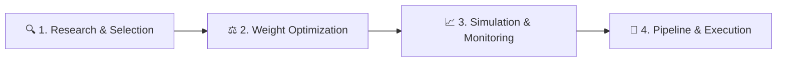

# Go Mycase Basket & Rebalancing Engine

This project is a high-performance portfolio engine written in Go (Golang). It communicates with the Zerodha Kite Connect API using a decoupled broker layer (`pkg/broker`), utilizes a native concurrent Yahoo Finance client with a DuckDB persistent quote cache (`pkg/cache`), features an automated strategy-to-execution pipeline, and includes a background drift monitoring daemon with Telegram/Discord alerts (`pkg/daemon`).

---

## Architectural Highlights

The project is structured around a single, unified CLI entrypoint (`main.go`) built with `urfave/cli/v3`. All subcommands (`cmd/*.go`) serve as thin flag-parsing and orchestration layers that delegate directly to domain packages inside `pkg/`:

```mermaid
graph TD
    Main[main.go / dist/mycase] --> SubCmds[cmd/ Subcommands]

    SubCmds --> P1[cmd/pipeline.go]
    SubCmds --> P2[cmd/pick.go]
    SubCmds --> P3[cmd/optimize.go]
    SubCmds --> P4[cmd/report.go]
    SubCmds --> P5[cmd/performance.go]
    SubCmds --> P6[cmd/monitor.go]
    SubCmds --> P7[cmd/basket.go]
    SubCmds --> P8[cmd/holdings.go]
    SubCmds --> P9[cmd/cache.go]
    SubCmds --> P10[cmd/daemon.go]
    SubCmds --> P11[cmd/auth.go]
    SubCmds --> P12[cmd/merge.go]

    SubCmds --> Broker[pkg/broker Zerodha & Mock]
    SubCmds --> Cache[pkg/cache DuckDB Storage]
    SubCmds --> Daemon[pkg/daemon & pkg/alert]
    SubCmds --> Costs[pkg/costs STT, Tax, Micro-Tx]
    SubCmds --> Picker[pkg/stockpicker & pkg/optimizer]
    SubCmds --> Perf[pkg/performance & pkg/monitoring]
```



---

## Directory Structure & Package Overview

For a detailed breakdown of runtime data directories, report namespaces, backups, and output file naming conventions, see [filestructure.md](filestructure.md). For system architecture details, see [architecture.md](architecture.md).

```
mycase/
├── main.go                     # Single CLI entrypoint initializing DuckDB cache & registering subcommands
├── Makefile                    # Targets for building, testing, cross-compiling, and linting
├── cmd/                        # CLI Subcommands (thin orchestration layer)
│   ├── auth.go                 # Zerodha Kite OAuth authentication launcher
│   ├── basket.go               # Order generator & execution CLI (with friction/cost filters)
│   ├── cache.go                # DuckDB price & fundamental cache management
│   ├── daemon.go               # Background drift monitoring daemon runner & installer
│   ├── holdings.go             # Active broker holdings snapshot printer
│   ├── merge.go                # CSV constituent merger tool
│   ├── monitor.go              # Interactive drift simulation & alert tool
│   ├── optimize.go             # Weight optimization & rebalancing CLI
│   ├── performance.go          # Historical portfolio valuation simulator
│   ├── pick.go                 # Fundamental & technical stock selection CLI
│   ├── pipeline.go             # Automated end-to-end pipeline runner
│   └── report.go               # Portfolio rationale & metrics report generator
├── pkg/                        # Core Domain & Business Logic
│   ├── alert/                  # Telegram bot, Discord webhook, and email alerters
│   ├── broker/                 # Unified Broker interface with Zerodha and Mock implementations
│   ├── cache/                  # DuckDB persistent price and fundamentals storage
│   ├── config/                 # YAML and JSON configuration parser structures
│   ├── costs/                  # Transaction cost calculation (STT, DP charges) & STCG/LTCG tax rules
│   ├── csvloader/              # Stream-based CSV parser and comparison/merging utilities
│   ├── daemon/                 # Drift monitoring background daemon loop
│   ├── datafetcher/            # Market data fetcher mapping live and mock quotes
│   ├── executor/               # Order placement coordinator
│   ├── kiteclient/             # Zerodha Kite client SDK wrapper
│   ├── market/                 # Market hours, IST schedule, and limit-order slippage utilities
│   ├── monitoring/             # Portfolio drift math & historical simulation engine
│   ├── optimizer/              # MFS, mean-variance, and cap-weights algorithms
│   ├── performance/            # Valuation engine & portfolio return analytics
│   ├── portfolio/              # Common domain entities (Holdings, Positions)
│   ├── printer/                # Visual console table generator
│   ├── report/                 # Portfolio heuristics and report generation
│   ├── selectiontracker/       # Candidate selection tracking
│   ├── stockpicker/            # Core stock selection rules, indices, and criteria
│   └── yfinance/               # Yahoo Finance client with DuckDB cache integration
├── config/                     # Configuration files (pipeline.yaml, mfs.json, themes.json, csvlinks.json)
├── data/                       # Target CSV portfolios, DuckDB cache (cache.db), and candidate picks
└── docs/                       # Comprehensive architectural & operational documentation
```

---

## Installation & Setup

1. **Install Dependencies & Build**:
   Ensure you have Go (1.26+) installed, then build the binary:
   ```bash
   make build
   ```
   This creates the single `dist/mycase` executable. You can also install it to `$GOPATH/bin` with:
   ```bash
   make install
   ```

2. **Setup Broker Credentials**:
   Run the interactive authentication tool to register your API Key, API Secret, and retrieve your dynamic `access_token` from Zerodha:
   ```bash
   ./dist/mycase auth
   ```
   This will automatically update `config/config.json`.

---

## How to Run

### The Automated Pipeline (Recommended)
You can run the entire workflow—from scanning indices, scoring stocks, optimizing allocations, generating comparison reports, simulating performance, and submitting live orders—using the pipeline command:

1. **Configure parameters** in `config/pipeline.yaml` (e.g., indices, strategy, target golden copy, capital, tolerance, and alert channels).
2. **Execute the pipeline**:
   ```bash
   ./dist/mycase pipeline --config config/pipeline.yaml
   ```

To skip analysis and jump straight to live order execution:
```bash
./dist/mycase pipeline --config config/pipeline.yaml --exec-only
```

---

### Running Individual Subcommands

For a complete reference mapping CLI subcommands to pipeline configuration options, see [CommadTable.md](CommadTable.md).

#### 1. Stock Selection (Stock Picker)
Run stock selection on an index (e.g., `small250`) using a strategy (e.g., `balanced`):
```bash
./dist/mycase pick --index small250 --method balanced --top 20
```

#### 2. Weight Optimization
Optimize portfolio weights using Multi-Factor Scoring (MFS) or weight capping:
```bash
./dist/mycase optimize --file data/microsmall.csv --strategy aggressive
```

#### 3. Portfolio Performance Simulation
Simulate historical performance of your target CSV portfolio:
```bash
./dist/mycase performance --file data/microsmall.csv --capital 100000 --date 2026-01-01
```

#### 4. Interactive Monitoring
Track and simulate daily portfolio behavior interactively:
```bash
./dist/mycase monitor --file data/microsmall.csv --interactive
```

#### 5. Holdings Snapshot
View mock or live broker holdings:
```bash
./dist/mycase holdings --live
```

#### 6. Live Basket Orders
Generate and execute orders against your target portfolio:
```bash
./dist/mycase basket --live -- microsmall
```

#### 7. DuckDB Price Cache Management
Inspect row counts or clear cached data:
```bash
./dist/mycase cache status
./dist/mycase cache clear --all
```

#### 8. Background Drift Monitoring Daemon
Check portfolio drift once or start background daemon:
```bash
./dist/mycase daemon check
./dist/mycase daemon start
```

---

## Compilation & Maintenance

Use the [`Makefile`](file:///Users/raghavgarg/Projects/myGo/mycase/Makefile) for standard tasks:

```bash
make build              # Build dist/mycase binary
make install            # Install to $GOPATH/bin
make test               # Run all unit tests across all packages
make test-race          # Run tests with race detector enabled
make test-coverage      # Run tests and generate interactive coverage.html report
make cleanup            # Run gofmt, go fix, go vet, staticcheck, and govulncheck
make clean              # Remove build artifacts
```

---

## 🗺️ Portfolio Lifecycle & Documentation Map

This section maps each documentation file to its stage in the portfolio management lifecycle:



### 🔍 Phase 1: Research & Selection
Identify, score, and rank potential growth candidates.
*   📄 [multibagger.md](multibagger.md) `[Strategy Blueprint]`
    *   *Details quantitative filters, quality checks, growth scoring parameters, and debt/leverage constraints used to define a multibagger stock.*
*   📄 [stockpicker.md](stockpicker.md) `[CLI Tool Reference]`
    *   *Details how the stock picker constituent selection tool downloads index lists, fetches metrics, and exports candidate pools.*
*   📄 [selection.md](selection.md) `[Stability Analysis]`
    *   *Focuses on quantitative dampening filters and rank stabilization algorithms that minimize portfolio churn.*

### ⚖️ Phase 2: Weight Optimization
Determine correct share allocations, capital routing, and portfolio balance.
*   📄 [optimizer.md](optimizer.md) `[Mathematical Models]`
    *   *Explains mathematical algorithms and heuristics for routing capital to optimize target portfolio weights.*
*   📄 [rebalance.md](rebalance.md) `[Rebalancing Guide]`
    *   *Examines portfolio rebalancing, drift calculations, trade configuration mechanics, and command-line execution interfaces.*
*   📄 [numberconfig.md](numberconfig.md) `[Parameters Reference]`
    *   *A centralized numerical catalog documenting all system constants, scoring weights, and strategy boundaries.*
*   📄 [mfs.md](mfs.md) `[Scoring Matrix Reference]`
    *   *Details the Multi-Factor Scoring (MFS) optimization framework, listing statistical/fundamental factors, normalization math, and strategic profiles.*

### 📈 Phase 3: Simulation & Monitoring
Validate strategies historically and track daily portfolio health.
*   📄 [performance.md](performance.md) `[Performance Simulator]`
    *   *Details the historical backtester engine used to calculate intraday and trailing portfolio gains starting from any customized date.*
*   📄 [monitoring.md](monitoring.md) `[Portfolio Monitoring]`
    *   *Covers the 4-Pillar monitoring policy for cutting declining stocks, keeping top performers, running interactive monitoring simulators, and configuring the drift daemon.*
*   📄 [report.md](report.md) `[Metrics Generator]`
    *   *Outlines how the explanation report generator fetches stock fundamentals and builds easy-to-read markdown metrics portfolios.*

### 🚀 Phase 4: Pipeline & Execution
Automate the entire lifecycle and submit orders live to your broker.
*   📄 [architecture.md](architecture.md) `[System Architecture]`
    *   *Deep dive into system package design, CLI subcommands, DuckDB cache schema, broker layer, and design decisions (D1–D7).*
*   📄 [refactor.md](refactor.md) `[Refactoring Roadmap & Progress]`
    *   *Complete record of refactoring phases R1–R6, commit history, test coverage expansion, and upcoming milestones (R7–R8).*
*   📄 [pipeline.md](pipeline.md) `[Orchestrator]`
    *   *Explains the automated pipeline subcommand (`mycase pipeline`) linking individual modules into a unified workflow.*
*   📄 [workflow_guide.md](workflow_guide.md) `[Operational Guide]`
    *   *Detailed execution protocol outlining the safe way to go from raw index selection up to live Zerodha Kite orders.*
*   📄 [MyCaseInGo.md](MyCaseInGo.md) `[Architecture Blueprint]`
    *   *Historical overview, code design patterns, decoupling approaches, and package mapping structures.*
*   📄 [productvision.md](productvision.md) `[System Roadmap]`
    *   *Roadmap highlighting future expansions, upcoming milestone phases, and technical directions.*
*   📄 [CommadTable.md](CommadTable.md) `[Command Reference]`
    *   *Reference mapping CLI subcommands to their automated pipeline runner equivalents and required parameter alignments.*
*   📄 [filestructure.md](filestructure.md) `[File & Directory Guide]`
    *   *Detailed reference describing workspace directory layout, naming conventions, backups, and strategy-first report namespacing.*

