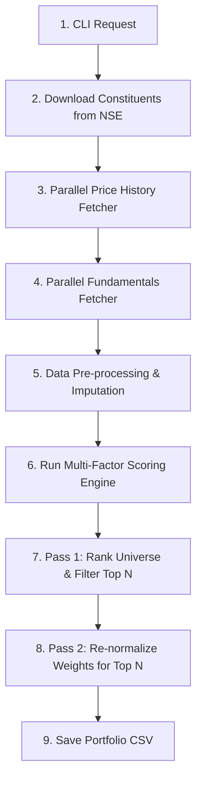

# Index Stock Picker Tool

The **Index Stock Picker** CLI tool (`cmd/stockpicker/main.go`) is a lightweight orchestrator that delegates core quantitative calculations, data fetching, and ranking tasks to the modular **`mycase/pkg/stockpicker`** package. It is designed to download stock constituent lists of major indices, fetch historical prices and fundamental metrics, rank them using a Multi-Factor Scoring (MFS) model, and extract a concentrated, optimized portfolio (e.g. top 20 stocks).

---

## 1. What We Achieved

* **Automated Data Pipeline**: Downloads live index constituent sheets directly from the web (NSE / Nifty Indices).
* **Large Universe Processing**: Fetches daily price histories and fundamental ratios concurrently in parallel worker pools to bypass API timeouts and limits.
* **Resilient Imputation**: Implements mean imputation to handle missing fundamental data on smaller cap stocks without skewing scores.
* **Risk-Return-Fundamental Selection**: Combines historical price performance (returns, volatility, Sharpe, Sortino, Alpha, Beta, Treynor, Ulcer) with key company valuation/efficiency metrics (PEG, ROE, Forward P/E, Operating Margins, P/B, Net Debt/EBITDA).
* **Normalized Portfolios**: Re-normalizes the selected top stock weights to sum to exactly `1.0000` (100%), generating a ready-to-run Mycase CSV file.

---

## 2. How We Pick Stocks (Step-by-Step Flow)



### Step 1: Downloading Index Constituents
Translates user flags (e.g. `-index microcap250`) to the constituent sheet download URL by loading mappings from [csvlinks.json](file:///Users/raghavgarg/Projects/myGo/mycase/config/csvlinks.json) and downloads the CSV file containing symbol lists directly from NSE/NiftyIndices.

### Step 2: Concurrently Fetching Historical Prices
Spawns 15 parallel Go worker routines to download historical daily closing prices (e.g. `3mo` range for scoring, `1y` range for displaying annual return) for the entire constituent list (up to 250 assets) using the public Yahoo Finance chart API.

### Step 3: Concurrently Fetching Fundamentals
To bypass authentication limits on Yahoo Finance's `quoteSummary` endpoint:
1. Performs a handshake request to `https://fc.yahoo.com` to retrieve session cookies.
2. Requests the query verification crumb from `https://query2.finance.yahoo.com/v1/test/getcrumb` using the session cookie.
3. Spawns 15 workers to query modules (`financialData`, `defaultKeyStatistics`, `summaryDetail`) for all tickers concurrently, passing the cookie-crumb combo.

### Step 4: Data Pre-processing & Imputation
To avoid penalizing or rewarding stocks with missing fundamental data (common for small/micro-cap stocks):
1. **Derived Metrics**: Calculates `Net Debt/EBITDA` = `(Total Debt - Total Cash) / EBITDA`. If EBITDA is 0 but the company has net debt, it assigns a high-risk penalty value (e.g., `99.0`).
2. **Mean Imputation**: Computes the average for each fundamental metric across all tickers that successfully returned valid data. If a ticker is missing a metric (value is zero or fetch failed), it is assigned the average.

### Step 5: Multi-Factor Scoring (MFS)
Each stock is evaluated across 14 criteria based on the strategy preset selected (loaded from [mfs.json](file:///Users/raghavgarg/Projects/myGo/mycase/config/mfs.json)).

#### Strategy Allocation Rationale:

##### Aggressive Allocation
```
Factor          Weight      Rationale
-------------------------------------------------------------------------
Sharpe           15.0%      Drop slightly to reduce overlap
Sortino          10.0%      Keep to protect against downside
Return           25.0%      Lower to prevent chasing past peaks
Alpha            15.0%      Modestly decrease historical weight
Volatility        5.0%      Maintain low penalty on risk
Beta              5.0%      Maintain low market sensitivity
Ulcer             0.0%      Keep excluded
PEG Ratio        15.0%      Focuses on cheap earnings growth
ROE              10.0%      Measures capital efficiency
-------------------------------------------------------------------------
Total           100.0%
```

##### Balanced Allocation
```
Factor          Weight      Rationale
-------------------------------------------------------------------------
Sharpe           15.0%      Reduce overlapping risk layers
Sortino          15.0%      Reduce overlapping risk layers
Return           15.0%      Maintain baseline yield focus
Alpha            10.0%      Drop to allocate room for quality
Volatility        5.0%      Cut weight; covered by Sharpe
Beta              5.0%      Cut weight; covered by Sharpe
Ulcer             5.0%      Keep for deep drawdown protection
Forward P/E      20.0%      Avoids overpaying for stocks
Operating Margins 10.0%     Screens for business stability
-------------------------------------------------------------------------
Total           100.0%
```

##### Conservative Allocation
```
Factor          Weight      Rationale
-------------------------------------------------------------------------
Sharpe           10.0%      Keep baseline risk/reward score
Sortino          20.0%      Lower slightly to free up room
Return            5.0%      Keep low emphasis on absolute gain
Alpha             5.0%      Keep low emphasis on beating market
Volatility       10.0%      Trim down; Sortino already handles this
Beta             10.0%      Trim down; Sortino already handles this
Ulcer            15.0%      Keep high to penalize bad drawdowns
P/B Ratio        15.0%      Filters for asset-backed safety
Net Debt/EBITDA  10.0%      Ensures company can pay its debt
-------------------------------------------------------------------------
Total           100.0%
```

* **Normalization**: Ratios are scaled between `0.0` (worst in current batch) and `1.0` (best in current batch) via min-max scaling.
* **Inversion Logic**: For metrics where a lower ratio is superior, the score is inverted (`1.0 - normalized`):
  * **Higher is Better** (Standard): Sharpe, Sortino, Return, Alpha, Treynor, ROE, Operating Margins.
  * **Lower is Better** (Inverted): Volatility, Beta, Ulcer Index, PEG Ratio, Forward P/E, P/B Ratio, Net Debt/EBITDA.

> [!NOTE]
> **Valuation Safeguards for Negative Metrics**
> In min-max scaling with inversion logic (Lower is Better), negative values (such as negative Forward P/E or PEG for unprofitable companies, or negative P/B for companies with negative equity) would mathematically receive a perfect score of `1.0`. To prevent the model from mistakenly favoring unprofitable or highly distressed companies, the data loader implements the following safeguards:
> - Negative Forward P/E is penalized to `999.0`.
> - Negative PEG Ratio is penalized to `99.0`.
> - Negative P/B Ratio is penalized to `99.0`.
> - Negative EBITDA (used in Net Debt/EBITDA calculation) results in a penalty ratio of `99.0`.
> This guarantees that unprofitable or distressed assets get scaled to a score of `0.0` for their respective valuation/solvency factors.

### Step 6: Two-Pass Optimization
* **Pass 1**: Scores and ranks the entire constituent list, selecting the top $N$ stocks (filtered by the `-top` flag).
* **Pass 2**: Runs the Multi-Factor Optimizer again on *only* those $N$ selected stocks so that the resulting weights scale proportionally and sum to exactly `1.0000` (100%).

---

## 3. The Multibagger Strategy (Premium Screener)

The **Multibagger Strategy** (`-method multibagger`) is a high-conviction growth strategy designed to identify micro-cap and small-cap stocks entering their high-growth, hyper-efficiency, and technical markup phases. Unlike traditional factor scoring (which ranks all stocks relatively), the Multibagger strategy applies a set of **absolute structural hard filters** that candidates must pass before entering the scoring phase.

### A. Core Mathematical & Technical Hard Filters

#### 1. Sales Growth Accelerator
* **Rule**: TTM Revenue Growth must exceed the 3-Year Revenue CAGR.
* **Math**:
  $$\text{3-Year CAGR} = \left(\frac{\text{Current Year Revenue}}{\text{Revenue 3 Years Ago}}\right)^{1/3} - 1$$
  $$\text{TTM Growth} = \left(\frac{\text{TTM Revenue}}{\text{Comparative Base Revenue}}\right) - 1$$
  *(Note: If the TTM period is within 2% of the current year's annual revenue, the base is set to the previous year to prevent overlapping periods).*
* **Rationale**: Detects a positive growth inflection where recent quarterly/TTM performance is outstripping historical trend lines.

#### 2. Asset Turnover & CapEx Inflection (Operating Leverage)
* **Rule**: Asset Turnover must expand YoY, while absolute Capital Expenditures (CapEx) stabilizes or shrinks ($\le 15\%$ YoY growth).
* **Math**:
  $$\text{Asset Turnover} = \frac{\text{Total Revenue}}{\text{Net Property, Plant and Equipment (Net PPE)}}$$
  $$\text{CapEx Change \%} = \frac{|\text{CapEx}_{\text{latest}}| - |\text{CapEx}_{\text{previous}}|}{|\text{CapEx}_{\text{previous}}|} \times 100.0$$
* **Rationale**: Screens for companies that have completed heavy capital investment cycles (CapEx is flat or falling) and are now successfully converting those assets into fresh sales (Asset Turnover is rising), unleashing massive operating leverage.

#### 3. Working Capital Efficiency (Days Sales Outstanding)
* **Rule**: Days Sales Outstanding (DSO) must be flat or improving (latest DSO < previous DSO or latest DSO < DSO 2 years ago).
* **Math**:
  $$\text{DSO} = \frac{\text{Accounts Receivable}}{\text{Total Revenue}} \times 365$$
* **Rationale**: Ensures sales acceleration is not driven by extending loose credit terms. Falling DSO proves high collections efficiency and strong cash generation.

#### 4. Stage 2 Markup & Institutional Breakout
* **Rule**: Stock price must be $\ge$ 200-SMA, and must exhibit at least one institutional volume breakout day in the last 60 trading days.
* **Technical Definition**:
  - The latest close must be above the 200-day Simple Moving Average (Stage 2 markup).
  - Inside the last 60 days, there must be at least one green day (Close $\ge$ Open or Close $\ge$ Previous Close) where volume is $\ge$ 2.0x the average volume of all red days in that same window.
* **Rationale**: Confirms smart money accumulation is actively underway and prevents buying dead-money consolidation patterns.

---

### B. Qualitative "Scuttlebutt" Overlay
Once the quantitative screener selects the top multibagger candidates, the tool prints a mandatory qualitative audit prompt checklist. Investors are instructed to manually inspect:
1. **Earnings Call Transcripts**: Verify if management has hit guidance over the last 4 quarters and if they guide for margin expansions.
2. **Annual Reports (MD&A section)**: Verify if the Total Addressable Market (TAM) is growing $>15\%$ YoY, and check for strategic business pivots.
3. **Shareholder Trends**: Inspect if institutional and promoter shareholdings are rising QoQ.

---

## 4. How to Run

Run the stockpicker subcommand (`mycase pick`):

```bash
# Pick the top 10 stocks from Nifty Microcap 250 using the aggressive strategy preset
./dist/mycase pick -index microcap250 -method aggressive -top 10

# Pick the top 20 stocks from a custom list of tickers using the balanced strategy preset
./dist/mycase pick -file data/microsmall.csv -method balanced -top 20

# Pick the top 30 stocks from Nifty Next 50 using the conservative strategy preset
./dist/mycase pick -index niftynext50 -method conservative -top 30
```

### Supported Flags:
* `-index`: Select index constituent sheet (e.g., `microcap250`, `smallcap250`, `midcap150`, `nifty50`, `niftynext50`).
* `-file`: Path to a custom CSV file containing tickers (takes precedence over `-index`). The CSV file must contain a `ticker` or `symbol` column. Tickers can be prefixed with `NSE:` or `BSE:`; if not, the `NSE:` prefix is added automatically.
* `-method`: Weighting strategy mapped to [mfs.json](file:///Users/raghavgarg/Projects/myGo/mycase/config/mfs.json) presets (`balanced`, `aggressive`, `conservative`).
* `-top`: Number of top stocks to extract (default `20`).
* `-range`: Historical price window for risk-return calculation (default `3mo`).

### Output Portfolios:
The output is saved automatically inside the `data/` directory:
* For index-based picking: `data/stockpicker_<index>_<method>.csv`
* For file-based picking: `data/stockpicker_<file_basename>_<method>.csv`

---

## 5. Modular Code Architecture

The stockpicker codebase is structured modularly to isolate concerns, facilitate unit testing, and keep the main entry point extremely lightweight:

* **[cmd/stockpicker/main.go](file:///Users/raghavgarg/Projects/myGo/mycase/cmd/stockpicker/main.go)**: Lightweight entry point (~120 lines). Handles parsing of CLI flags and orchestrates the stockpicker execution pipeline.
* **[pkg/stockpicker/types.go](file:///Users/raghavgarg/Projects/myGo/mycase/pkg/stockpicker/types.go)**: Defines all configuration options, metadata types, and intermediate stat collectors.
* **[pkg/stockpicker/loader.go](file:///Users/raghavgarg/Projects/myGo/mycase/pkg/stockpicker/loader.go)**: Handles data retrieval, including parsing local custom CSV sheets, downloading live constituent files from NSE, concurrently fetching historical stock prices with worker pools, and aligning time series charts.
* **[pkg/stockpicker/filters.go](file:///Users/raghavgarg/Projects/myGo/mycase/pkg/stockpicker/filters.go)**: Handles safety and fundamental checks. Features a single-asset evaluator (`isEligible()`) that checks size, liquidity, debt structures, cash flows, and ROCE metrics.
* **[pkg/stockpicker/scoring.go](file:///Users/raghavgarg/Projects/myGo/mycase/pkg/stockpicker/scoring.go)**: Implements MFS relative scoring and normalizations, sector caps allocation, and multibagger scoring algorithms.
* **[pkg/stockpicker/io.go](file:///Users/raghavgarg/Projects/myGo/mycase/pkg/stockpicker/io.go)**: Formats and displays output comparison summaries, checklists, scuttlebutt overlays, and writes results to CSV portfolio files.
* **[pkg/stockpicker/stockpicker_test.go](file:///Users/raghavgarg/Projects/myGo/mycase/pkg/stockpicker/stockpicker_test.go)**: Full unit test coverage for individual components such as moving averages, relative math normalizations, local file loading, and eligibility filters.

