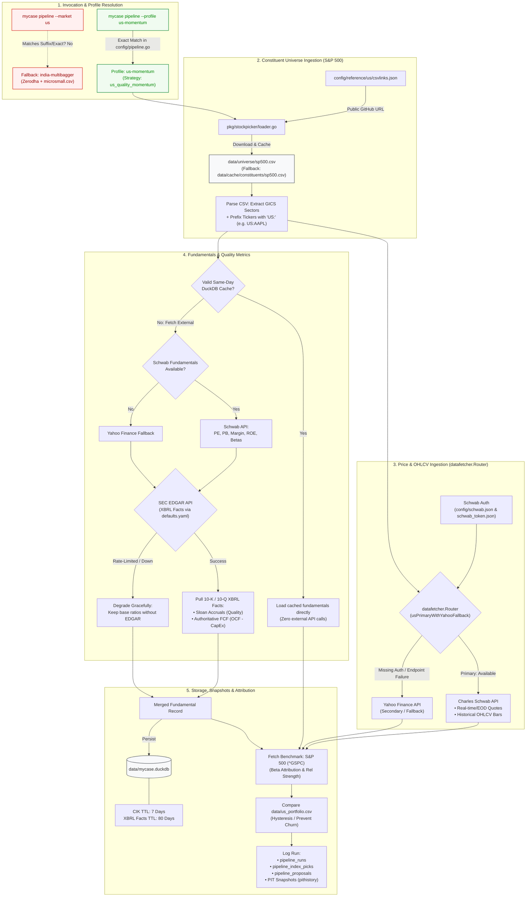

# US Market Pipeline Execution & Data Ingestion Flow

This document details the end-to-end data ingestion, scoring, and persistence lifecycle when executing the US Market pipeline (`us-momentum`).

---

## Stage Breakdown

| Stage | Component / Source | Details & Fallbacks |
|---|---|---|
| **1. Profile Resolution** | [cmd/pipeline.go](file:///Users/raghavgarg/Projects/myGo/mycase/cmd/pipeline.go) | Run with `--profile us-momentum`. `--market us` does not suffix-match `us-momentum` and falls back to `india-multibagger`. |
| **2. Constituents** | [pkg/stockpicker/loader.go](file:///Users/raghavgarg/Projects/myGo/mycase/pkg/stockpicker/loader.go) | Fetches S&P 500 CSV via [config/reference/us/csvlinks.json](file:///Users/raghavgarg/Projects/myGo/mycase/config/reference/us/csvlinks.json). Caches to `data/universe/sp500.csv` and tags tickers as `US:<SYMBOL>`. |
| **3. Quotes & Prices** | [pkg/datafetcher/router.go](file:///Users/raghavgarg/Projects/myGo/mycase/pkg/datafetcher/router.go) | Primary: Charles Schwab API (`config/schwab.json`, `config/schwab_token.json`). Degrades to Yahoo Finance if unauthenticated or down. |
| **4. Fundamentals** | Schwab + SEC EDGAR XBRL | Primary ratios from Schwab. Authoritative cash flows (OCF, CapEx, Sloan Accruals) pulled from SEC EDGAR. Cached to avoid redundant calls. |
| **5. Audit & State** | DuckDB (`data/mycase.duckdb`) | Stores runs, index picks, proposals, benchmark attribution (`^GSPC`), and evaluates drift vs `data/us_portfolio.csv`. |