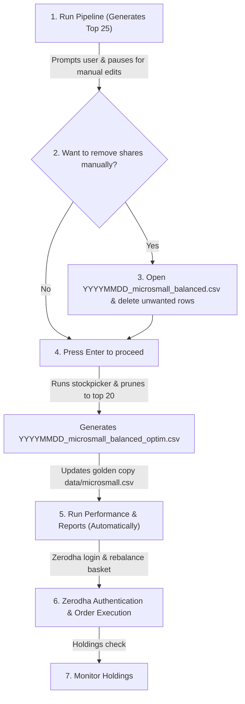

# Mycase Execution Pipeline & Workflow Guide

This document outlines the structured workflows to go from index selection to broker order execution with Zerodha Kite, highlighting both the **Automated Pipeline** and the equivalent **Individual CLI Command** execution strategies. Both execution paths yield consistent results, but standalone commands offer advanced flexibility for customizing parameters.

---

## 1. Automated Pipeline Workflow (Recommended)

The Go automated pipeline runner (`cmd/pipeline`) orchestrates the entire flow. It automatically builds dependencies, cleans stale caches, performs multi-index compilation, prompts for manual curation, updates the golden copy, generates reports, runs simulations, and triggers order execution.



### Step-by-Step Integrated Operations

To run the entire integrated workflow, execute the pipeline runner:
```bash
go run cmd/pipeline/main.go -config config/pipeline.yaml
```

#### Step 1: Combining Constituents & Selection
The pipeline automatically compiles constituents from the configured indices, ranks them using strategy scoring, and picks the **top 25** candidates (Top N + 5). 
* **Output Proposal File**: `data/candidates/proposals/YYYYMMDD_microsmall_balanced.csv`

#### Step 2: Curation Prompt (Interactive Pause)
The pipeline will pause and prompt you:
```
Would you like to manually remove shares from the proposal before finalizing? (y/n, default: n):
```
* **If you choose `y`**:
  1. Open the generated proposal file in your editor (e.g. `data/candidates/proposals/YYYYMMDD_microsmall_balanced.csv`).
  2. Delete the rows of any stocks you do not wish to invest in. Save the file.
  3. Return to the terminal and press **Enter** to continue.
* **If you choose `n` (default)**:
  1. Press **Enter** in the terminal to proceed directly.

#### Step 3: Automated Stockpicker Selection & Pruning
The pipeline runs `stockpicker` on the curated file to:
* Re-run strategy scoring on the remaining candidates.
* Select the **top 20** highest-scoring stocks (applying sector caps and hysteresis buffer zone checks).
* Re-optimize weights for the top 20 assets and apply rebalancing bands.
* Save the finalized optimized list to `data/candidates/proposals/YYYYMMDD_microsmall_balanced_optim.csv`.

#### Step 4: Golden Copy Overwrite & Final Reports
The pipeline displays a comparison report of the final 20 optimized shares against your active golden copy and prompts to overwrite `data/microsmall.csv` (select `y`). Once confirmed, the pipeline automatically:
1. Generates the selection rationale report.
2. Runs historical performance backtest simulations.
3. Runs historical portfolio monitoring drift simulations.

#### Step 5: Zerodha Authentication & Order Execution
The pipeline prompts you to authenticate your Zerodha session and execute the basket rebalance order. 
* Select `y` to log in and confirm orders in your Zerodha Kite broker interface.

#### Step 6: Verify and Check Holdings
Run the holdings command to monitor live status:
```bash
go run cmd/holdings/main.go
```

---

## 2. Individual CLI Commands Workflow (Flexible Setup)

If you need to deviate from pipeline defaults—such as using custom lookback ranges, customizing capital allocations, simulating older starting dates, or executing specific modules independently—you can run each step using individual CLI tools.

Here is the exact step-by-step mapping of the pipeline to individual CLI commands:

### Step 1: Run Individual Index Picks
Fetch and score index constituents individually (the `-out` flag is optional; by default, output paths will automatically fall back to the correct pipeline folders):
```bash
# Run stockpicker on microcap250
go run cmd/stockpicker/main.go \
  -index microcap250 \
  -method balanced \
  -top 20 \
  -skip-scuttlebutt \
  -golden data/microsmall.csv

# Run stockpicker on small250
go run cmd/stockpicker/main.go \
  -index small250 \
  -method balanced \
  -top 20 \
  -skip-scuttlebutt \
  -golden data/microsmall.csv
```
* **Advanced Command Customization**:
  * `-range`: Historical lookback range (`3mo` [default], `6mo`, `1y`)
  * `-top`: Number of top stocks to pick (default `20`)
  * `-rebalance-tolerance`: Rebalancing weight tolerance percentage band (e.g. `0.10` for 10% drift band)
  * `-hysteresis-buffer`: Hysteresis rank buffer tolerance (default `5` ranks)
  * `-out`: Custom path to save the output CSV portfolio file (optional; defaults to `data/candidates/index_picks/[index]_[method].csv`)

### Step 2: Combine Candidates (For Multi-Index portfolios)
If using multiple indices, combine their CSV candidate selections to merge unique tickers using the merge utility:
```bash
go run scripts/merge.go combine \
  data/candidates/temp/combine_microsmall.csv \
  data/candidates/index_picks/microcap250_balanced.csv \
  data/candidates/index_picks/small250_balanced.csv
```

### Step 3: Combined Selection (Generates Top 25 Proposal)
Run `stockpicker` on the combined candidate list to generate the initial proposal of $N+5$ candidates:
```bash
go run cmd/stockpicker/main.go \
  -file data/candidates/temp/combine_microsmall.csv \
  -method balanced \
  -top 25 \
  -golden data/microsmall.csv \
  -name microsmall
```
*(By default, writes to: `data/candidates/proposals/YYYYMMDD_microsmall_balanced.csv`)*

### Step 4: Curation (Manual Removal)
Open the generated file (e.g., `data/candidates/proposals/YYYYMMDD_microsmall_balanced.csv`) in an editor and delete the rows of any unwanted tickers, saving the file.

### Step 5: Final Selection & Weight Optimization
Run `stockpicker` on the curated file to prune to the top 20 assets, compute optimal weights, and output to the optimized path:
```bash
go run cmd/stockpicker/main.go \
  -file data/candidates/proposals/YYYYMMDD_microsmall_balanced.csv \
  -method balanced \
  -top 20 \
  -golden data/microsmall.csv \
  -name microsmall \
  -out data/candidates/proposals/YYYYMMDD_microsmall_balanced_optim.csv
```

### Step 6: Update Golden Copy (With Exit Logic)
To overwrite the active golden copy (`data/microsmall.csv`) with the new optimized selection while keeping exited stocks at `0.0000` weight (crucial to trigger Zerodha sell orders):
* Option A (Recommended): Use the standalone merge utility to perform the sync with automatic exit detection:
  ```bash
  go run scripts/merge.go \
    data/candidates/proposals/YYYYMMDD_microsmall_balanced_optim.csv \
    data/microsmall.csv
  ```
* Option B: Run the normal pipeline (`go run cmd/pipeline/main.go`), which automatically handles comparison reports, backups, and file merges interactively.

### Step 7: Generate Selection Explanation Reports
```bash
go run cmd/report/main.go -file data/microsmall.csv -method balanced
```
* **Output Path**: `report/microsmall_balanced/executions/YYYYMMDD_03_portfolio_report.txt`

### Step 8: Simulate Historical Backtest
```bash
go run cmd/performance/main.go \
  -file data/microsmall.csv \
  -capital 100000 \
  -date 2026-01-01 \
  -time 09:30
```
* **Advanced Command Customization**:
  * `-capital`: Initial investment capital (default `100000.0`)
  * `-date`: Backtest buy starting date in `YYYY-MM-DD` or `YYYYMMDD` format
  * `-time`: Buy execute timestamp `HH:MM` on the starting day (default `09:30`)

### Step 9: Simulate Portfolio Monitoring & Alerts
```bash
go run cmd/monitoring/main.go -file data/microsmall.csv -interactive -strategy balanced -date 2026-01-01
```
* **Advanced Command Customization**:
  * `-style`: Policy preset (`moderate` [default], `hyper-aggressive`, `passive`)
  * `-strategy`: Weighting strategy preset (`balanced`, `aggressive`, `conservative`, `multibagger`)
  * `-date`: Custom date to track policy alerts and indicators from

### Step 10: Zerodha Authentication
Run the authentication service to renew your Zerodha session:
```bash
go run cmd/setup_auth/main.go
```

### Step 11: Execute Orders in Zerodha
Compute buy/sell shares and execute order basket in Zerodha Kite:
```bash
# Dry Run / Mock Mode:
go run cmd/basket/main.go -- microsmall

# Live Execution Mode:
go run cmd/basket/main.go --live -- microsmall
```

### Step 12: View Live Holdings
View live holdings categorized by portfolio groups:
```bash
go run cmd/holdings/main.go --live
```

